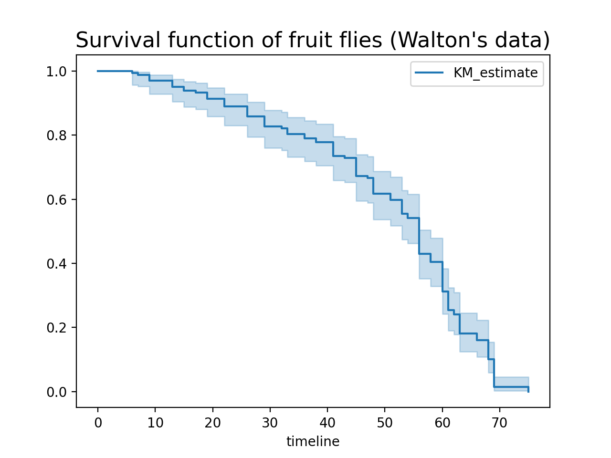

# Federated Survival Analysis with Flower and KaplanMeierFitter

This is an introductory example of **federated survival analysis** using [Flower](https://flower.ai/)
and [lifelines](https://lifelines.readthedocs.io/en/stable/index.html) library.

The aim of this example is to estimate the survival function using the
[Kaplan-Meier Estimate](https://en.wikipedia.org/wiki/Kaplan%E2%80%93Meier_estimator) implemented in
lifelines library (see [KaplanMeierFitter](https://lifelines.readthedocs.io/en/stable/fitters/univariate/KaplanMeierFitter.html#lifelines.fitters.kaplan_meier_fitter.KaplanMeierFitter)). The distributed/federated aspect of this example
is the data sending to the server. You can think of it as a federated analytics example. However, it's worth noting that this procedure violates privacy since the raw data is exchanged.

Finally, many other estimators beyond KaplanMeierFitter can be used:
AalenJohansenFitter, GeneralizedGammaFitter, LogLogisticFitter,
SplineFitter, and WeibullFitter.

We also use the [NatualPartitioner](https://flower.ai/docs/datasets/ref-api/flwr_datasets.partitioner.NaturalIdPartitioner.html#flwr_datasets.partitioner.NaturalIdPartitioner) from [Flower Datasets](https://flower.ai/docs/datasets/) to divide the data according to
the group it comes from therefore to simulate the division that might occur.

<p style="text-align:center;">

</p>

## Set up the project

### Clone the project

Start by cloning the example project:

```shell
$ git clone --depth=1 https://github.com/adap/flower.git _tmp \
        && mv _tmp/examples/federated-kaplan-meier-fitter . \
        && rm -rf _tmp \
        && cd federated-kaplan-meier-fitter
```

This will create a new directory called `federated-kaplan-meier-fitter` with the following structure:

```shell
federated-kaplan-meier-fitter
├── examplefmk
│   ├── __init__.py
│   ├── client_app.py   # Defines your ClientApp
│   ├── server_app.py   # Defines your ServerApp
│   └── task.py         # Defines your model, training and data loading
├── pyproject.toml      # Project metadata like dependencies and configs
└── README.md
```

### Install dependencies and project

Install the dependencies defined in `pyproject.toml` as well as the `examplefmk` package.

```bash
pip install -e .
```

## Run the project

You can run your Flower project in both _simulation_ and _deployment_ mode without making changes to the code. If you are starting with Flower, we recommend you using the _simulation_ mode as it requires fewer components to be launched manually. By default, `flwr run` will make use of the Simulation Engine.

### Run with the Simulation Engine

```bash
flwr run .
```

You can also override some of the settings for your `ClientApp` and `ServerApp` defined in `pyproject.toml`. For example:

```bash
flwr run . --run-config "num-server-rounds=5"
```

You can also check that the results match the centralized version.

```shell
$ python3 centralized.py
```

### Run with the Deployment Engine

Follow this [how-to guide](https://flower.ai/docs/framework/how-to-run-flower-with-deployment-engine.html) to run the same app in this example but with Flower's Deployment Engine. After that, you might be intersted in setting up [secure TLS-enabled communications](https://flower.ai/docs/framework/how-to-enable-tls-connections.html) and [SuperNode authentication](https://flower.ai/docs/framework/how-to-authenticate-supernodes.html) in your federation.

If you are already familiar with how the Deployment Engine works, you may want to learn how to run it using Docker. Check out the [Flower with Docker](https://flower.ai/docs/framework/docker/index.html) documentation.
