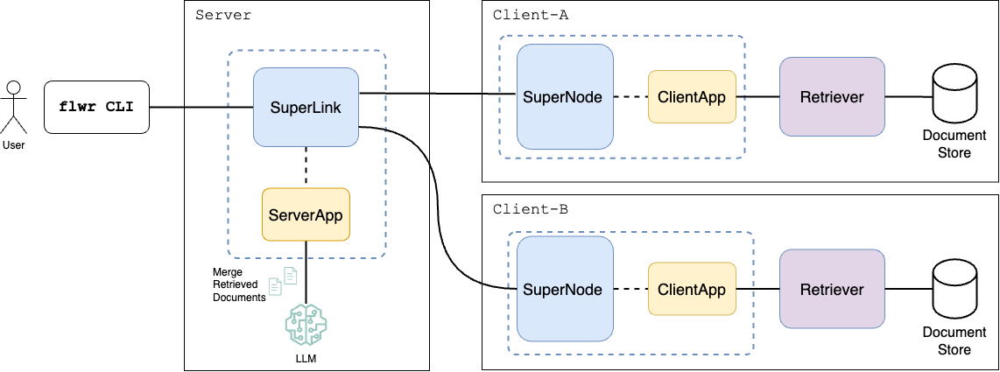

# Federated Retrieval Augmented Generation (FedRAG)

Large Language Models (LLMs) benefit from Retrieval Augmented Generation (RAG) pipelines, which ground their responses
in external data to improve performance. However, organizations often store data in isolated data silos, constraining
classical RAG approaches that rely on centralized data access. By combining Federated Learning with RAG we can query
data across distributed silos without the need to centrally aggregate data, while respecting data privacy.

> [!NOTE]
> This example uses Flower's Message API which remains a preview feature and subject to change.
> Both `ClientApp` and `ServerApp` operate directly on the [Message](https://flower.ai/docs/framework/ref-api/flwr.common.Message.html)
> and [RecordDict](https://flower.ai/docs/framework/ref-api/flwr.common.RecordDict.html) objects.

## Advanced FedRAG Examples

This example provides the building blocks to develop more advanced Federated RAG pipelines, such as enhancing domain-specific
fine-tuned LLMs [[1]](#ref1), using confidential compute environments for secure document re-ranking and LLM inference
[[2]](#ref2), and applying collaborative ANN searches on encrypted data with homomorphic encryption
and multiplicative caching for improved performance [[3]](#ref3).

## FedRAG Pipeline Overview

The figure below demonstrates an overview of the Federated RAG pipeline.



Given a user query, the server broadcasts the query to each client. Every client retrieves the relevant (top-k)
documents related to the given query and sends them back to the server. The server merges and ranks the retrieved
documents and passes the re-ranked documents as context to the augmented query prompt submitted to the LLM.

## Setup the Example

### System Prerequisites

Depending on whether you are running on macOS, RHEL, Debian please make sure
that the following packages are already installed in your system `wget`, `git-lfs`.

<details>
<summary> Installation instructions for different OS </summary>

```
# wget is used to download .tar files from the Web
# git-lfs is used to download large files from the Hugging Face respository

# macOS
brew install wget   
brew install git-lfs

# RHEL
yum install wget   
yum install git-lfs

# Ubuntu/Debian
apt install wget
apt install git-lfs
 
# Windows
# If you are on Windows, it is highly recommended to make use of WSL with Ubuntu to run your Flower apps. 
# Then, you can install the packages using the above Ubuntu commands.
# Extra tip: with WSL you can also make use of the NVIDIA GPU in your Windows host.
 
# enable Git LFS in your Git environment
# (holds for all systems)
git lfs install
```

</details>

### Clone the Example

Start by cloning the example project:

```shell
git clone --depth=1 https://github.com/adap/flower.git _tmp \
        && mv _tmp/examples/fedrag . \
        && rm -rf _tmp \
        && cd fedrag
```

This will create a new directory called `fedrag`.

### Install Dependencies

To install all dependencies required to run the example, from the top-level `fedrag` directory execute the following command:

```bash
pip install -e .
```

### Download & Index Corpus

Before you run the Flower engine, please make sure you have downloaded the corpus we need for document retrieval
and created the respective document indices. To accomplish this, run the following helper bash script:

```bash
./data/prepare.sh
```

By default, the above script will download the `Textbooks` and `StatPearls` corpora and create an index
for each corpus using the first `100` chunks (documents). The processed data will be downloaded under the `data/corpus`
directory. The total required disk space for all the documents of `Textbooks` and `StatPearls` is around `3GBs`.

To download all corpora and create an index for all files, please run the following command:

```bash
./data/prepare.sh --datasets "pubmed" "statpearls" "textbooks" "wikipedia" --index_num_chunks 0
```

The total disk space for the all documents of all four corpora is around `120GBs`.

> [!NOTE]
> Please note that for each corpus, its corresponding index might need exactly the same disk space as the documents being indexed.

For an individualized breakdown of the disk space, number of documents, number of snippets, and the domain of each
corpus, please refer to the [README.md](data/README.md) file under the `data` directory.

For more details regarding how each corpus is downloaded and how the corresponding index is created,
please read the section below as well the previously referenced [README.md](data/README.md).

All corpora used in this work were derived from the MedRAG toolkit [[4]](#ref4).

## Run with Simulation Engine

This example is designed to run with two virtual clients. Let's first locate the Flower Configuration file and modify one of the existing connections to make use of two nodes.

Locate your Flower configuration file by running:

```shell
flwr config list
```

```console
# Example output:
Flower Config file: /path/to/your/.flwr/config.toml
SuperLink connections:
 supergrid
 local (default)
```

Modify the `local` connection so it has two supernodes:

```TOML
[superlink.local]
options.num-supernodes = 2
```

From the top-level directory for this example, launch the simulation:

```bash
flwr run .
```

> [!TIP]
> Check the [Simulation Engine documentation](https://flower.ai/docs/framework/how-to-run-simulations.html) to learn more about Flower simulations and how to optimize them.

## Expected Results

At the end of execution you should see a message in the console that will show the name of
each QA dataset (`pubmedqa`, `bioasq`), the total number of evaluated questions, total number
of answered questions, accuracy, and the mean wall-clock execution time for all answered questions.

For instance, the returned result would look like follows:

| **QA Dataset** | **#Questions** | **#Answered** | **Accuracy** | **Time (secs)** |
| :------------: | :------------: | :-----------: | :----------: | :-------------: |
|    PubMedQA    |       10       |       8       |     0.53     |      6.03       |
|     BioASQ     |       10       |       9       |     0.61     |      5.83       |

## FedRAG Pipeline Description

### Corpus, Indices & Benchmark Datasets

**Corpus.** The example supports the following corpora for document retrieval:

1. PubMed
2. Textbooks
3. StatPearls
4. Wikipedia

By default, the example uses the `Textbooks` and `StatPearls` corpora.

> [!NOTE]
> The example uses by default the `Textbooks` and `StatPearls` corpora to demonstrate the FedRAG pipeline,
> because the number of documents for `PubMed` and `Wikipedia` are extremely large and downloading and index creation
> can take a lot of time. Please see the instructions [README.md](data/README.md) file on how to
> download the rest of the corpora.

**Index.** For document indexing and retrieval, the example uses the [FAISS](https://github.com/facebookresearch/faiss)
library.

> [!NOTE]
> The example creates by default an index using the first 100 downloaded chunks (i.e., 100 documents).
> We do so in order to quickly create an index for each corpus and bootstrap the example.
> If you want to create an index for all files, please set the `index_num_chunks` flag to `0`.

**QA Datasets.** For QA benchmarking, the example supports the following benchmark datasets:

1. PubMedQA
2. BioASQ
3. MMLU
4. MedQA
5. MedMCQA

By default, the example will evaluate the first `10` questions of the `PubMedQA` and `BioASQ` QA datasets.
To evaluate all the questions from the benchmark dataset, you can disable or comment out the `server-qa-num`
value in the `pyproject.toml` file.

Please see also the section below on how to enable more QA datasets.
All the curated QA benchmark datasets are downloaded from the [MIRAGE](https://github.com/Teddy-XiongGZ/MIRAGE) benchmark [1].

For more details regarding corpus downloading, pre-processing, and indexing steps,
please read the [README.md](../fedrag/data/README.md) file under the `data` directory.

### Document Retrieval and Merge

**Retrieval.** The clients use their local FAISS index to retrieve documents from their local document store.
The `k-nn` value defined in the `[tool.flwr.app.config]` section of the `pyproject.yaml` file controls how many
documents will be retrieved by each client and sent back to the server. The current implementation of document retrieval
for the FAISS index is built with `IndexIVFFlat` and uses the `faiss.METRIC_L2` metric, which means that the lower
the score of a retrieved document the better, since L2 Distance measures dissimilarity.

**Merge.** Once documents and their associated retrieval scores are received by the server, the server merges the retrieved
documents into a single ranked list, either by sorting the documents based on the retrieval score; the lower the score the
more relevant the document is to the query, since we are using the `L2` Euclidean distance. Alternatively, you can use
the simple yet effective Reciprocal Rank Fusion (RRF) method [[5]](#ref5). To smooth ranking differences during merging, using RRF,
you can change the `k-rrf`value defined in the `[tool.flwr.app.config]` section of the `pyproject.yaml` file. Even though
this is a simple merging technique, you should feel free to extend this and define other merging approaches,
such as using a Re-Ranker model.

> [!NOTE]
> If you set `k-rrf=0` then only the retrieval score is considering when merging the retrieved documents,
> while if you set `k-rrf>0` then the retrieved documents are merged using the RRF method.

### Pipeline Configuration

The current example uses the Message API to carry out the communication between the server and the clients. For every
question in the benchmark QA dataset, the server submits the question (query) once to each client and the clients
retrieve the related documents from their respective local document store. Therefore, the server needs only one round
of communication for each question. The properties that are directly related to the execution of the FedRAG application
can be found under the `[tool.flwr.app.config]` section in the `pyproject.yaml` file. These are:

```yaml
server-qa-datasets = ... # the datasets that the server will use to evaluate the FedRAG pipeline
server-qa-num = ... # how many questions should be evaluated per benchmark dataset 
clients-corpus-names = ... # the corpus held by each client participating in the federation environment
k-rrf = ... # the value of the reciprocal rank fusion used by the server to merge the retrieved documents
k-nn = ... # the value of the k nearest neighbors (top-k) documents retrieved at each client and server after merge
server-llm-hfpath = ... # the Hugging Face name/path of the LLM model used by the server to execute the RAG query
```

By default, the current example uses the following two corpora `Textbooks, StatPearls` distributed
across 2 clients, with each client holding one corpus (out of the two). For QA evaluation, the server submits
questions from the following two benchmark QA datasets: `PubMedQA, BioASQ`. For the values
of `k-rrf` and `k-nn`, we use `60` and `8` respectively and for the LLM hosted at the server we use HF's
SmolLM model (`HuggingFaceTB/SmolLM2-1.7B-Instruct`) because for Llama models, we need first to accept the terms.

Specifically, the default values are set as:

```yaml
server-qa-datasets = "pubmedqa|bioasq"
server-qa-num = 10
clients-corpus-names = "Textbooks|StatPearls"
k-rrf = 60
k-nn = 8
server-llm-hfpath = "HuggingFaceTB/SmolLM2-1.7B-Instruct"
```

> [!NOTE]
> The vertical bar in the value of the `server-qa-datasets` is used to pass the name of multiple benchmark
> datasets. Analogously, the vertical bar in the value of the `clients-corpus-names` is used to assign each corpus
> to each client in a Round-Robin fashion, e.g., `Textbooks -> Client 1, StatPearls -> Client 2,  Textbooks-> Client 3,  StatPearls -> Client 4, Textbooks -> Client 5, etc ...`

Based on the computing resources you will use to run the example, please feel free to modify the Hugging Face model path
`server-llm-hfpath` and use a larger model to execute the RAG query. Moreover, if you like, you can perform or introduce
another merging operation at the server-side over the retrieved documents instead of using the simple RRF approach.

### Enable GPU

Given that the clients do not need to use the GPU to perform the retrieval of the documents from the document store,
it is recommended to enable GPU access only at the server side, since this will allow the server to load the LLM into
the GPU and execute the RAG queries much faster. To do so, you need to set the following property to `true`:

```
server-llm-use-gpu = "true"
```

If you also want to use a GPU at the client-side, you need to set the following property to a positive fractional number,
for instance to `0.1`.

```
options.backend.client-resources.num-gpus = 0.1
```

## References

1. <a id="ref1"></a> Jung, Jincheol, Hongju Jeong, and Eui-Nam Huh. "Federated Learning and RAG Integration: A Scalable Approach for Medical Large Language Models." arXiv preprint arXiv:2412.13720 (2024).

2. <a id="ref2"></a> Addison, Parker, Minh-Tuan H. Nguyen, Tomislav Medan, Jinali Shah, Mohammad T. Manzari, Brendan McElrone, Laksh Lalwani, Aboli More, Smita Sharma, Holger R. Roth, Isaac Yang, Chester Chen, Daguang Xu, Yan Cheng, Andrew Feng, and Ziyue Xu. "C-FedRAG: A Confidential Federated Retrieval-Augmented Generation System." arXiv preprint arXiv:2412.13163 (2024).

3. <a id="ref3"></a> Zhao, Dongfang. "FRAG: Toward Federated Vector Database Management for Collaborative and Secure Retrieval-Augmented Generation." arXiv preprint arXiv:2410.13272 (2024).

4. <a id="ref4"></a> Xiong, Guangzhi, Qiao Jin, Zhiyong Lu, and Aidong Zhang. "Benchmarking retrieval-augmented generation for medicine." In Findings of the Association for Computational Linguistics ACL 2024, pp. 6233-6251. 2024.

5. <a id="ref5"></a> Cormack, Gordon V., Charles LA Clarke, and Stefan Buettcher. "Reciprocal rank fusion outperforms condorcet and individual rank learning methods." In Proceedings of the 32nd international ACM SIGIR conference on Research and development in information retrieval, pp. 758-759. 2009.
