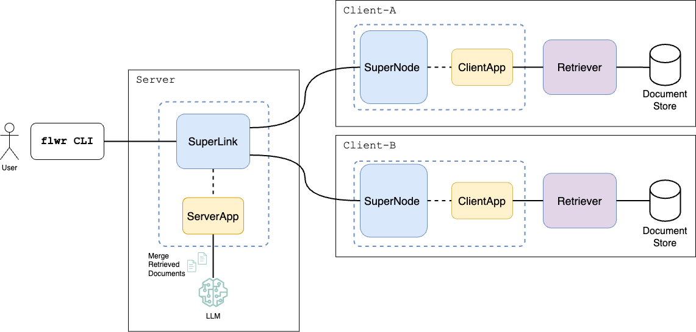

# Federated Retrieval Augmented Generation (FedRAG)

Large Language Models (LLMs) benefit from Retrieval Augmented Generation (RAG) pipelines, which ground their responses
in external data to improve performance. However, organizations often store data in isolated data silos, constraining
classical RAG approaches that rely on centralized data access. By combining Federated Learning with RAG we can query
data across distributed silos without the need to centrally aggregate data, while respecting data privacy.

> \[!NOTE\] This example uses Flower's Message API which remains a preview feature and subject to change.
> Both `ClientApp` and `ServerApp` operate directly on the [Message](https://flower.ai/docs/framework/ref-api/flwr.common.Message.html)
> and [RecordSet](https://flower.ai/docs/framework/ref-api/flwr.common.RecordSet.html) objects.

## FedRAG Pipeline Overview

The Figure below demonstrates an overview of the Federated RAG pipeline.


Given a user query, the server broadcasts the query to each client. Every client retrieves the relevant (top-k)
documents related to the given query and sends them back to the server. The server merges and ranks the retrieved
documents and passes the re-ranked documents as context to the augmented query prompt submitted to the LLM.

> \[!CAUTION\] To make this example fully secure and private, the documents retrieved at each client need to be shared
> through [secure layers](https://flower.ai/docs/framework/how-to-enable-tls-connections.html) and all server operations
> (e.g., document merge, RAG query execution) need to run inside a Confidential Compute (CC) environment.

# Run Example

## System Prerequisites

Depending on whether you are running on MacOS, Ubuntu or other Linux-based OS, please
make sure that the following packages are already installed in your system:

```
brew/yum/apt-get install wget  # to donwload .tar files from the Web 
brew/yum/apt-get install git-lfs  # to download large files from the HuggingFace respository      
git lfs install  # enable Git LFS in your Git environment
```

## Install Dependencies

To install all dependencies required to run the example, please execute the following command inside the current directory:

```bash
pip install -e .
```

## Download & Index Corpus

Before you run the Flower engine, please make sure how have downloaded the corpus we need for document retrieval
and created the respective document indices. To accomplish this, run the following helper bash script:

```bash
bash ./fedrag/data/prepare.sh
```

By default, the above script will download the `Textbooks` and `StatPearls` corpora and create an index
on top of each corpus using the first 100 chunks.

To download all corpora and create an index on top of all files,
please run the following command:

```bash
bash ./fedrag/data/prepare.sh --datasets "pubmed" "statpearls" "textbooks" "wikipedia" --index_num_chunks 0
```

For more information regarding corpus downloading and index creation, please read the section below
and the [README.md](./fedrag/data/README.md) file under the `data` directory.

## Run with the Simulation Engine

Once inside the `fedrag` directory, please use `flwr run .` to run a local simulation:

```bash
flwr run .
```

# Expected Results

At the end of execution you should see a message in the console that will show the name of
each QA dataset (`pubmedqa`, `bioasq`), the total number of evaluated questions, total number
of answered questions, accuracy, and the mean wall-clock execution time for all answered questions.

For instance, the returned result would look like follows:

| **QA Dataset** | **#Questions** | **#Answered** | **Accuracy** | **Time (secs)** |
| :------------: | :------------: | :-----------: | :----------: | :-------------: |
|    PubMedQA    |       10       |       8       |     0.53     |      6.03       |
|     BioASQ     |       10       |       9       |     0.61     |      5.83       |

# FedRAG Pipeline Description

## Corpus, Indices & Benchmark Datasets

**Corpus.** The example supports the following corpora for document retrieval:

1. PubMed
2. Textbooks
3. StatPearls
4. Wikipedia

By default, the example uses the `Textbooks` and `StatPearls` corpora.

> \[!NOTE\] The example uses by default the `Textbooks` and `StatPearls` corpora to demonstrate the FedRAG pipeline,
> because the number of documents for `PubMed` and `Wikipedia` are extremely large and downloading and index creation
> can take a lot of time. Please see the instructions [README.md](./fedrag/data/README.md) file on how to
> download the rest of the corpora.

**Index.** For document indexing and retrieval, the example uses the [FAISS](https://github.com/facebookresearch/faiss)
library.

> \[!NOTE\] The example creates by default an index using 100 chunks (i.e., 100 files). We do so in order to quickly
> create an index for each corpus and bootstrap the example. If you want to create an index on top of all files,
> please set the `index_num_chunks` flag to `0`.

**QA Datasets.** For QA benchmarking, the example supports the following benchmark datasets:

1. PubMedQA
2. BioASQ
3. MMLU
4. MedQA
5. MedMCQA

By default, the example will evaluate the first `10` questions of the `PubMedQA` and `BioASQ` QA datasets.
To evaluate all the questions from the benchmark dataset, you can disable or comment out the `server-qa-num`
value in the `pyproject.toml` file.

Please see also the section below on how to enable more QA datasets.
All the curated QA benchmark datasets are downloaded from the [MIRAGE](https://github.com/Teddy-XiongGZ/MIRAGE) toolkit.

For more details regarding corpus downloading, pre-processing, and indexing steps,
please read the [README.md](./fedrag/data/README.md) file under the `data` directory.

## Document Retrieval and Merge

**Retrieval.** The clients use their local FAISS index to retrieve documents from their local document store.
The `k-nn` value defined in the `[tool.flwr.app.config]` section of the `pyproject.yaml` file controls how many
documents will be retrieved by each client and sent back to the server. The current implementation of document retrieval
for the FAISS index is built with `IndexIVFFlat` and uses the `faiss.METRIC_L2` metric, which means that the lower
the score of a retrieved document the better, since L2 Distance measures dissimilarity.

**Merge.** Once documents and their associated retrieval scores are received by the server, the server merges the retrieved
documents into a single ranked list, either by sorting the documents based on the retrieval score; the lower the score the
more relevant the document is to the query, since we are using the `L2` Euclidean distance. Alternatively, you can use
the simple yet effective Reciprocal Rank Fusion (RRF) method. To smooth ranking differences during merging, using RRF,
you can change the `k-rrf`value defined in the `[tool.flwr.app.config]` section of the `pyproject.yaml` file. Even though
this is a simple merging technique, you should feel free to extend this and define other merging approaches,
such as using a Re-Ranker model.

> \[!NOTE\] If you set `k-rrf=0` then only the retrieval score is considering when merging the retrieved documents,
> while if you set `k-rrf>0` then the retrieved documents are merged using the RRF method.

## Pipeline Configuration

The current example uses the Message API to carry out the communication between the server and the clients. For every
question in the benchmark QA dataset, the server submits the question (query) once to each client and the clients
retrieve the related documents from their respective local document store. Therefore, the server needs only one round
of communication for each question. The properties that are directly related to the execution of the FedRAG application
can be found under the `[tool.flwr.app.config]` section in the `pyproject.yaml` file. These are:

```yaml
server-qa-datasets = ... # the datasets that the server will use to evaluate the FedRAG pipeline
server-qa-num = ... # how many questions should be evaluated per benchmark dataset 
clients-corpus-names = ... # the corpus held by each client participating in the federation environment
k-rrf = ... # the value of the reciprocal rank fusion used by the server to merge the retrieved documents
k-nn = ... # the value of the k nearest neighbors (top-k) documents retrieved at each client and server after merge
server-llm-hfpath = ... # the HuggingFace name/path of the LLM model used by the server to execute the RAG query
```

By default, the current example uses the following two corpora `Textbooks, StatPearls` distributed
across 2 clients, with each client holding one corpus (out of the two). For QA evaluation, the server submits
questions from the following two benchmark QA datasets: `PubMedQA, BioASQ`. For the values
of k-rrf and k-nn, we use `60` and `8` respectively and for the LLM hosted at the server we use the
`meta-llama/Llama-3.2-1B-Instruct` model.

Specifically, the default values are set as:

```yaml
server-qa-datasets = "pubmedqa|bioasq"
server-qa-num = 10
clients-corpus-names = "Textbooks|StatPearls"
k-rrf = 60
k-nn = 8
server-llm-hfpath = "meta-llama/Llama-3.2-1B-Instruct"
```

> \[!NOTE\] The vertical bar in the value of the `server-qa-datasets` is used to pass the name of multiple benchmark
> datasets. Analogously, the vertical bar in the value of the `clients-corpus-names` is used to assign each corpus
> to each client in a Round-Robin fashion, e.g., `Textbooks -> Client 1, StatPearls -> Client 2,  Textbooks-> Client 3,  StatPearls -> Client 4, Textbooks -> Client 5, etc ...`

Based on the computing resources you will use to run the example, please feel free to modify the HuggingFace model path
`server-llm-hfpath` and use a larger model to execute the RAG query. Moreover, if you would like to perform or introduce
another merging operation at the server-side over the retrieved documents, and not use the simple RRF approach.
