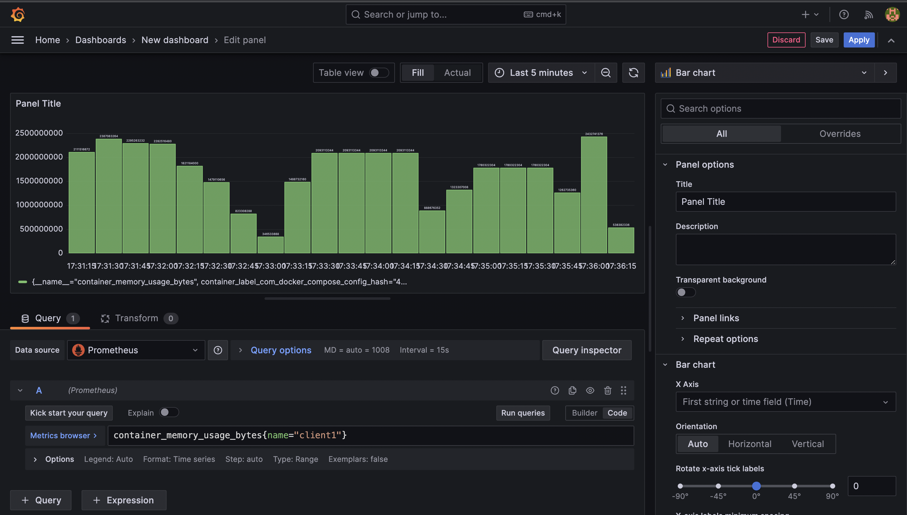

# Leveraging Flower and Docker for  Device Heterogeneity Management in Federated Learning


## Introduction
In this example, we tackle device heterogeneity in federated learning, arising from differences in memory and CPU capabilities across devices. This diversity affects training efficiency and inclusivity. Our strategy includes simulating this heterogeneity by setting CPU and memory limits in a Docker setup, using a custom docker compose generator script. This approach creates a varied training environment and enables us to develop strategies to manage these disparities effectively.


## Handling Device Heterogeneity
1. **System Metrics Access**:
   - Effective management of device heterogeneity begins with monitoring system metrics of each container. We integrate the following services to achieve this:
     - **Cadvisor**: Collects comprehensive metrics from each Docker container.
     - **Prometheus**: Using `prometheus.yaml` for configuration, it scrapes data from Cadvisor at scheduled intervals, serving as a robust time-series database. Users can access the Prometheus UI at `http://localhost:9090` to create and run queries using PromQL, allowing for detailed insight into container performance.

2. **Mitigating Heterogeneity**:
   - In this basic use case, we address device heterogeneity by establishing rules tailored to each container's system capabilities. This involves modifying training parameters, such as batch sizes and learning rates, based on each device's memory capacity and CPU availability. These settings are specified in the `client_configs` array in the `create_docker_compose` script. For example:

```python
client_configs = [
    {'mem_limit': '3g', 'batch_size': 32,  "cpus": 3.5, 'learning_rate': 0.001},
    {'mem_limit': '4g', 'batch_size': 64,  "cpus": 3, 'learning_rate': 0.02},
    {'mem_limit': '5g', 'batch_size': 128, "cpus": 2.5, 'learning_rate': 0.09},
    {'mem_limit': '6g', 'batch_size': 256, "cpus": 1, 'learning_rate': 0.15}
]
```


## Installation and Setup
To get the project up and running, follow these steps:

### Prerequisites
Before starting, ensure the following prerequisites are met:

- **Docker Installation**: Docker must be installed and the Docker daemon running on your server. If you don't already have Docker installed, you can get [installation instructions for your specific Linux distribution from Docker](https://docs.docker.com/engine/install/).


### Step 1: Configure Docker Compose
1. **Generate Docker Compose File**: 
   - Execute the following command to run the `helpers/generate_docker_compose.py` script. This script creates the docker-compose configuration needed to set up the environment.
     ```bash
     python helpers/generate_docker_compose.py
     ```
   - Within the script, specify the number of clients (`total_clients`), the number of training rounds (`number_of_rounds`), and resource limitations for each client in the `client_configs` array.

### Step 2: Build and Launch Containers
1. **Execute Initialization Script**: 
   - Run the `docker_init.sh` script to build the Docker images and start the Docker Compose process. Use the following command:
     ```bash
     ./docker_init.sh
     ```
   
2. **Services Startup**: 
   - The script will launch several services as defined in your `docker-compose.yml` file:
     - **Monitoring Services**: Prometheus for metrics collection, Cadvisor for container monitoring, and Grafana for data visualization.
     - **Flower Federated Learning Environment**: The Flower server and client containers are initialized and start running.
   - After launching the services, verify that all Docker containers are running correctly by executing the `docker ps` command. Here's an example output:
     ```bash
     ➜  ~ docker ps
     CONTAINER ID   IMAGE                               COMMAND                  CREATED          STATUS                   PORTS                                            NAMES
     72063c8968d3   flower-via-docker-compose-client3   "python client.py --…"   12 minutes ago   Up 13 seconds            0.0.0.0:6003->6003/tcp                           client3
     77ca59fc42e6   flower-via-docker-compose-client2   "python client.py --…"   12 minutes ago   Up 13 seconds            0.0.0.0:6002->6002/tcp                           client2
     2dc33f0b4ef6   flower-via-docker-compose-client1   "python client.py --…"   12 minutes ago   Up 13 seconds            0.0.0.0:6001->6001/tcp                           client1
     8d87f3655476   flower-via-docker-compose-server    "python server.py --…"   12 minutes ago   Up 13 seconds            0.0.0.0:6000->6000/tcp, 0.0.0.0:8265->8265/tcp   server
     dbcd8cf1faf1   grafana/grafana:latest              "/run.sh --config=/e…"   12 minutes ago   Up 5 minutes             0.0.0.0:3000->3000/tcp                           grafana
     80c4a599b2a3   prom/prometheus:latest              "/bin/prometheus --c…"   12 minutes ago   Up 5 minutes             0.0.0.0:9090->9090/tcp                           prometheus
     169880ab80bd   gcr.io/cadvisor/cadvisor:v0.47.0    "/usr/bin/cadvisor -…"   12 minutes ago   Up 5 minutes (healthy)   0.0.0.0:8080->8080/tcp                           cadvisor
     ```

3. **Begin Training Process**: 
   - The federated learning training automatically begins once all client containers are successfully connected to the Flower server. This synchronizes the learning process across all participating clients.

By following these steps, you will have a fully functional federated learning environment with device heterogeneity and monitoring capabilities.


## Monitoring with Grafana
1. **Access and Customize Grafana Dashboard**:
   - Visit `http://localhost:3000` to enter Grafana.
   - Connect to Prometheus at `http://host.docker.internal:9090` as the data source.
   - Use Grafana's intuitive interface to create dashboards that visually represent key performance metrics, facilitating an in-depth understanding of device behavior and performance in the federated learning process.
2. **Grafana Dashboard Example**:
Below is an example of a Grafana dashboard showing a histogram of memory usage for a specific client-container:





This histogram offers a visual representation of the container's memory usage over time, highlighting the contrast in resource utilization between training and non-training periods. As evident from the graph, there are noticeable differences in memory consumption during active training phases compared to times when the container is not engaged in training.

## Conclusion
This project serves as a foundational example of managing device heterogeneity within the federated learning context, employing the Flower framework alongside Docker, Prometheus, and Grafana. It's designed to be a starting point for users to explore and further adapt to the complexities of device heterogeneity in federated learning environments.
