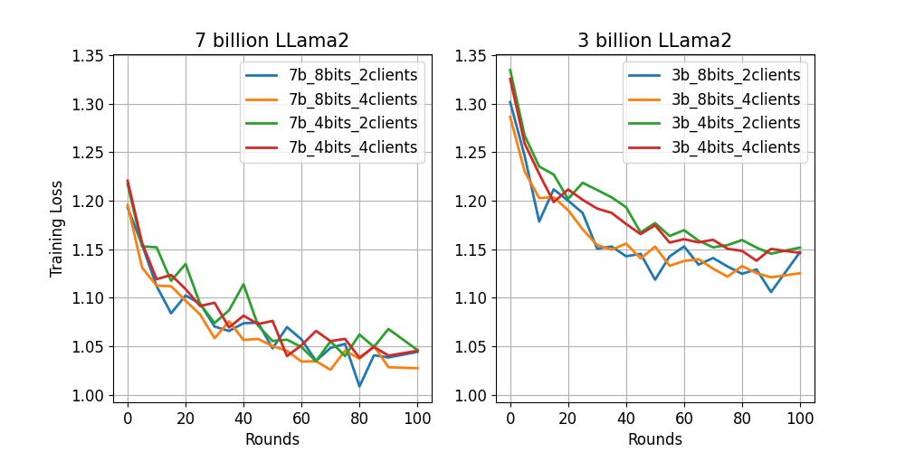

# FlowerTune LLM: Federated LLM Fine-tuning with Flower

Large language models (LLMs), which have been trained on vast amounts of publicly accessible data, have shown remarkable effectiveness in a wide range of areas.
However, despite the fact that more data typically leads to improved performance, there is a concerning prospect that the supply of high-quality public data will deplete within a few years.
Federated LLM training could unlock access to an endless pool of distributed private data by allowing multiple data owners to collaboratively train a shared model without the need to exchange raw data.

This introductory example conducts federated instruction tuning with pretrained [OpenLLaMA](https://huggingface.co/openlm-research) models on [Alpaca-GPT4](https://huggingface.co/datasets/vicgalle/alpaca-gpt4) dataset.
We implement FlowerTune LLM by integrating a bundle of techniques: 1) We use [Flower Datasets](https://flower.dev/docs/datasets/) to download, partition and preprocess the dataset. 2) The fine-tuning is done using the [🤗PEFT](https://huggingface.co/docs/peft/en/index) library. 3) We use Flower's Simulation Engine to simulate the LLM fine-tuning process in federated way,
which allows users to perform the training on a single GPU.

## Set up the project

Start by cloning the example project:

```shell
git clone --depth=1 https://github.com/adap/flower.git _tmp \
        && mv _tmp/examples/flowertune-llm . \
        && rm -rf _tmp \
        && cd flowertune-llm
```

This will create a new directory called `flowertune-llm` with the following structure:

```shell
flowertune-llm
├── flowertune_llm
│   ├── __init__.py
│   ├── client_app.py   # Defines your ClientApp
│   ├── server_app.py   # Defines your ServerApp
│   ├── dataset.py      # Defines your dataset and tokenizer
│   └── models.py       # Defines your models
│   
├── pyproject.toml      # Project metadata like dependencies and configs
├── test.py             # Test pre-trained model
└── README.md
```

### Install dependencies and project

Install the dependencies defined in `pyproject.toml` as well as the `flowertune_llm` package.

```bash
pip install -e .
```

## Run the project

You can run your Flower project in both _simulation_ and _deployment_ mode without making changes to the code. If you are starting with Flower, we recommend you using the _simulation_ mode as it requires fewer components to be launched manually. By default, `flwr run` will make use of the Simulation Engine.

> [!NOTE]
> In this version of the example, **client-side training is disabled** to allow
> aggregation-only runs. Dataset/tokenizer work is skipped, and the example focuses
> on layer-wise model aggregation.

### Run with the Simulation Engine

> [!NOTE]
> Check the [Simulation Engine documentation](https://flower.ai/docs/framework/how-to-run-simulations.html) to learn more about Flower simulations and how to optimize them.

```bash
flwr run .
```

This command will run FL simulations with a 4-bit [OpenLLaMA 3Bv2](https://huggingface.co/openlm-research/open_llama_3b_v2) model involving 2 clients per rounds for 100 FL rounds. You can override configuration parameters directly from the command line. Below are a few settings you might want to test:

```bash
# Use OpenLLaMA-7B instead of 3B and 8-bits quantization
flwr run . --run-config "model.name='openlm-research/open_llama_7b_v2' model.quantization=8"

# Run for 50 rounds but increasing the fraction of clients that participate per round to 25%
flwr run . --run-config "num-server-rounds=50 strategy.fraction-train=0.25"
```

### Run with the Deployment Engine

Follow this [how-to guide](https://flower.ai/docs/framework/how-to-run-flower-with-deployment-engine.html) to run the same app in this example but with Flower's Deployment Engine. After that, you might be intersted in setting up [secure TLS-enabled communications](https://flower.ai/docs/framework/how-to-enable-tls-connections.html) and [SuperNode authentication](https://flower.ai/docs/framework/how-to-authenticate-supernodes.html) in your federation.

If you are already familiar with how the Deployment Engine works, you may want to learn how to run it using Docker. Check out the [Flower with Docker](https://flower.ai/docs/framework/docker/index.html) documentation.

### 70B Aggregation-Only (Deployment Engine)

This mode is intended to validate that a 70B model can be aggregated layer-by-layer
without client-side training. Use the Deployment Engine to run multiple nodes/GPUs.

Example run config (float16, no training steps):

```bash
flwr run . \
  --run-config "model.name='meta-llama/Llama-3.1-70B-Instruct' model.device-map='cpu' model.quantization=0 train.training-arguments.max-steps=0 profile.enabled=true model.dtype='float16'"
```

### Aggregation Memory Experiment

To compare memory usage between layer-wise aggregation and all-at-once aggregation,
run the same setup twice with different `aggregation.mode` values:

```bash
flwr run . --run-config "aggregation.mode='layerwise'"
flwr run . --run-config "aggregation.mode='all_at_once'"
```

You can also target the base model ID if available in your environment:
`meta-llama/Meta-Llama-3.1-70B`.

### Profiling

To enable profiling for a run:

```bash
flwr run . --run-config "profile.enabled=true"
```

Then use the new CLI command to display a summary:

```bash
flwr profile <run_id>
```

## Expected results



As expected, OpenLLaMA-7B model works better than its 3B version with lower training loss. With the hyperparameters tested, the 8-bit model seems to deliver lower training loss for the smaller 3B model compared to its 4-bit version.

## VRAM consumption

| Models | 7-billion (8-bit) | 7-billion (4-bit) | 3-billion (8-bit) | 3-billion (4-bit) |
| :----: | :---------------: | :---------------: | :---------------: | :---------------: |
|  VRAM  |     ~22.00 GB     |     ~16.50 GB     |     ~13.50 GB     |     ~10.60 GB     |

We make use of the [bitsandbytes](https://huggingface.co/docs/bitsandbytes/main/en/index) library in conjunction with [PEFT](https://huggingface.co/docs/peft/en/index) to derive LLMs that can be fine-tuned efficiently.
The above table shows the VRAM consumption per client for the different models considered in this example.
You can adjust the CPU/GPU resources you assign to each of the clients based on your device.
For example, it is easy to train 2 concurrent clients on each GPU (24 GB VRAM) if you choose 3-billion (4-bit) model.
Assigning 50% of the GPU's VRAM to each client by setting `options.backend.clientapp-gpus = 0.5` under `[tool.flwr.federations.local-simulation]` in `pyproject.toml`.

## Test with your Questions

We provide a script to test your trained model by passing your specified questions. For example:

```bash
python test.py --peft-path=/path/to/trained-model-dir/ \
    --question="What is the ideal 1-day plan in London?"
```

An answer generated from federated trained 7-billion (8-bit) OpenLLaMA model:

```
Great choice. 
London has so much to offer, and you can really soak up all the sights and sounds in just a single day. 
Here's a suggested itinerary for you. 
Start your day off with a hearty breakfast at an authentic British diner. 
Then head to the iconic Big Ben and the Houses of Parliament to learn about the history of the city. 
Next, make your way to Westminster Abbey to see the many historical monuments and memorials. 
From there, cross the river Thames to the Tower of London, which is home to the Crown Jewels of England and Scotland. 
Finally, end your day with a relaxing visit to the London Eye, the tallest Ferris wheel in Europe, for a beautiful view of the city.
```

The [`Vicuna`](https://huggingface.co/lmsys/vicuna-13b-v1.1) template we used in this example is for a chat assistant.
The generated answer is expected to be a multi-turn conversations. Feel free to try more interesting questions!
