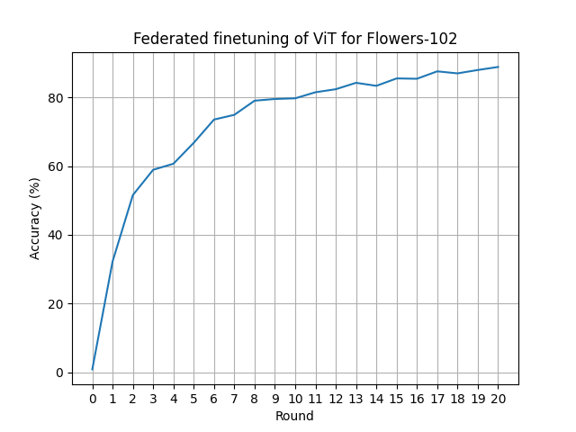

# Federated Finetuning of a Vision Transformer with Flower

This example shows how to use Flower's Simulation Engine to federate the finetuning of a Vision Transformer ([ViT-Base-16](https://pytorch.org/vision/main/models/generated/torchvision.models.vit_b_16.html#torchvision.models.vit_b_16)) that has been pretrained on ImageNet. To keep things simple we'll be finetuning it to [Oxford Flower-102](https://www.robots.ox.ac.uk/~vgg/data/flowers/102/index.html) datasset, creating 20 partitions using [Flower Datasets](https://flower.ai/docs/datasets/). We'll be finetuning just the exit `head` of the ViT, this means that the training is not that costly and each client requires just ~1GB of VRAM (for a batch size of 32 images) if you choose to use a GPU.

## Set up the project

### Clone the project

Start by cloning the example project:

```shell
git clone --depth=1 https://github.com/adap/flower.git _tmp \
        && mv _tmp/examples/flowertune-vit . \
        && rm -rf _tmp \
        && cd flowertune-vit
```

This will create a new directory called `flowertune-vit` with the following structure:

```shell
flowertune-vit
├── vitexample
│   ├── __init__.py
│   ├── client_app.py   # Defines your ClientApp
│   ├── server_app.py   # Defines your ServerApp
│   └── task.py         # Defines your model, training and data loading
├── pyproject.toml      # Project metadata like dependencies and configs
└── README.md
```

### Install dependencies and project

Install the dependencies defined in `pyproject.toml` as well as the `vitexample` package.

```bash
pip install -e .
```

## Run the project

You can run your Flower project in both _simulation_ and _deployment_ mode without making changes to the code. If you are starting with Flower, we recommend you using the _simulation_ mode as it requires fewer components to be launched manually. By default, `flwr run` will make use of the Simulation Engine.

### Run with the Simulation Engine

> [!TIP]
> This example runs faster when the `ClientApp`s have access to a GPU. If your system has one, you can make use of it by configuring the `backend.client-resources` component in `pyproject.toml`. If you want to try running the example with GPU right away, use the `local-simulation-gpu` federation as shown below. Check the [Simulation Engine documentation](https://flower.ai/docs/framework/how-to-run-simulations.html) to learn more about Flower simulations and how to optimize them.

```bash
# Run with the default federation (CPU only)
flwr run .
```

You can also override some of the settings for your `ClientApp` and `ServerApp` defined in `pyproject.toml`. For example:

```bash
flwr run . --run-config "num-server-rounds=5 batch-size=64"
```

Run the project in the `local-simulation-gpu` federation that gives CPU and GPU resources to each `ClientApp`. By default, at most 5x`ClientApp` will run in parallel in the available GPU. You can tweak the degree of parallelism by adjusting the settings of this federation in the `pyproject.toml`.

```bash
# Run with the `local-simulation-gpu` federation
flwr run . local-simulation-gpu
```



Running the example as-is on an RTX 3090Ti should take ~15s/round running 5 clients in parallel (plus the _global model_ during centralized evaluation stages) in a single GPU. Note that more clients could fit in VRAM, but since the GPU utilization is high (99%-100%) we are probably better off not doing that (at least in this case).

```bash
+---------------------------------------------------------------------------------------+
| NVIDIA-SMI 535.161.07             Driver Version: 535.161.07   CUDA Version: 12.2     |
|-----------------------------------------+----------------------+----------------------+
| GPU  Name                 Persistence-M | Bus-Id        Disp.A | Volatile Uncorr. ECC |
| Fan  Temp   Perf          Pwr:Usage/Cap |         Memory-Usage | GPU-Util  Compute M. |
|                                         |                      |               MIG M. |
|=========================================+======================+======================|
|   0  NVIDIA GeForce RTX 3090 Ti     Off | 00000000:0B:00.0 Off |                  Off |
| 44%   74C    P2             441W / 450W |   7266MiB / 24564MiB |    100%      Default |
|                                         |                      |                  N/A |
+-----------------------------------------+----------------------+----------------------+

+---------------------------------------------------------------------------------------+
| Processes:                                                                            |
|  GPU   GI   CI        PID   Type   Process name                            GPU Memory |
|        ID   ID                                                             Usage      |
|=======================================================================================|
|    0   N/A  N/A    173812      C   python                                     1966MiB |
|    0   N/A  N/A    174510      C   ray::ClientAppActor.run                    1056MiB |
|    0   N/A  N/A    174512      C   ray::ClientAppActor.run                    1056MiB |
|    0   N/A  N/A    174513      C   ray::ClientAppActor.run                    1056MiB |
|    0   N/A  N/A    174514      C   ray::ClientAppActor.run                    1056MiB |
|    0   N/A  N/A    174516      C   ray::ClientAppActor.run                    1056MiB |
+---------------------------------------------------------------------------------------+
```

### Run with the Deployment Engine

Follow this [how-to guide](https://flower.ai/docs/framework/how-to-run-flower-with-deployment-engine.html) to run the same app in this example but with Flower's Deployment Engine. After that, you might be intersted in setting up [secure TLS-enabled communications](https://flower.ai/docs/framework/how-to-enable-tls-connections.html) and [SuperNode authentication](https://flower.ai/docs/framework/how-to-authenticate-supernodes.html) in your federation.

If you are already familiar with how the Deployment Engine works, you may want to learn how to run it using Docker. Check out the [Flower with Docker](https://flower.ai/docs/framework/docker/index.html) documentation.
