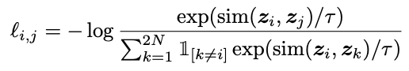
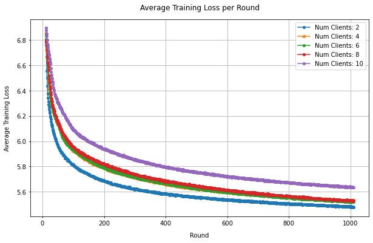

# Federated Self-Supervised Learning for Image Domain

Self-supervised learning (SSL) is a learning paradigm that provides supervisory signals when learning from large-scale and unlabeled datasets by generating synthetic pseudo-labels - thus avoiding the need for ground-truth annotations. It's employed in areas like computer vision, NLP, and audio signal processing with vast unlabeled data collections. Contrastive learning (a discriminative SSL method) has recently gained traction in SSL, particularly for pretext tasks like representation learning. 

Contrastive SSL methods for visual representation learning employ data augmentations that modify the vector values of the training images while maintaining the inherent information (e.g., adding Gaussian noise to an image of a dog such that the dog is still clearly visible). Augmented images generated by applying different augmentations to the same image are noted as positive pairs since these images are intended to convey the same information. Images augmented from different training images form negative pairs. The intention here is to encourage similar latent representations for positive pairs and discourage similarity between negative pairs. The contrastive loss function(shown below) employs a softmax and similarity metric to do just that.

<p align="center">
  
</p>


In this example, we implement SimCLR: A Simple Framework for Contrastive Learning of Visual Representations. SimCLR uses image augmentations(random croppings, adding gaussian noise, horizontal inversions, etc.) to generate positively paired data, where positive pairs result from different random augmentations of the same image. Here, negative pairs are made between images transformed from different source images. The normalized temperature-scaled cross entropy (NT-Xent) loss function above encourages similarity between positive pairs and dissimilarity between negative pairs, where cosine similarity is used to compute the similarity between the latent representation vectors. In short, SimCLR consists of an encoder network - in our case, we use ResNet50 - and a projection head that projects encoded representations to a lower dimensional space where the contrastive loss is applied.

We train SimCLR on the CIFAR-10 training dataset in a self-supervised fashion in an FL setting and evaluate the final global model on the CIFAR-10 test set after completing all FL rounds. 


## Environment Setup

Start by cloning the code example. We prepared a single-line command that you can copy into your shell which will checkout the example for you:

```shell
git clone --depth=1 https://github.com/adap/flower.git && mv flower/examples/pytorch-federated-self-supervised-learning . && rm -rf flower && cd pytorch-federated-self-supervised-learning
```

This will create a new directory called `pytorch-federated-self-supervised-learning` containing the following files:


```
pytorch-federated-self-supervised-learning
├── pytorch-federated-self-supervised-learning
│   ├── __init__.py
│   ├── client_app.py   # Defines your ClientApp
│   ├── server_app.py   # Defines your ServerApp
│   ├── model.py        # Defines loss, transforms, and PyTorch models
│   └── utils.py        # Defines auxiliary functions for this example
├── pyproject.toml      # Project metadata like dependencies and configs
└── README.md
```


### Installing dependencies

Project dependencies are defined in `pyproject.toml`. Install them with:

```shell
pip install -e .
```

## Run the project

You can run your Flower project in both _simulation_ and _deployment_ modes without changing the code. If you are starting with Flower, we recommend using the _simulation_ mode as it requires fewer components to be launched manually. By default, `flwr run` will make use of the Simulation Engine.

### Run with the Simulation Engine

```bash
flwr run .
```

### Run with the Deployment Engine

> \[!NOTE\]
> An update to this example will show how to run this Flower application with the Deployment Engine and TLS certificates, or with Docker.


## Expected Results

<p align="center">
  
</p>

The graph above shows average client loss durin self-supervised local training. The quality of an SSL model can be obtained by stacking a linear predictor upon the encoder to evaluate the quality of the encoder representations. During the final evaluation of our global SimCLR model, we discard the projection head and stack a linear predictor upon the trained encoder, which is then trained for 20 epochs over the training set while freezing encoder weights. Freezing the encoder weights ensures the information richness of the latent representations is reflective of the SSL training alone. The results below reflect the top-1 accuracies of the test set after self-supervised FL training and supervised training of the linear predictor.


| Number of Clients | Test Set Accuracy |
|-------------------|-------------------|
| 2                 | 74.27%            |
| 4                 | 72.84%            |
| 6                 | 70.79%            |
| 8                 | 67.51%            |
| 10                | 66.31%            |
