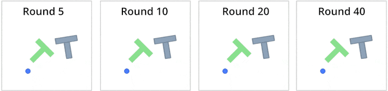

# Federated Learning with Hugging Face LeRobot and Flower (Quickstart Example)

This is an introductory example to using [🤗LeRobot](https://huggingface.co/lerobot) with [🌼Flower](https://flower.ai/). It demonstrates that it is feasible to collaboratively train a robotics AI model in remote environments with their local data and then aggregated it in a shared model.

In this example, we will federate the training of a [Diffusion](https://arxiv.org/abs/2303.04137) policy on the [PushT](https://huggingface.co/datasets/lerobot/pusht/tree/v1.3) dataset. The data will be downloaded and partitioned using [Flower Datasets](https://flower.ai/docs/datasets/). This example runs best when a GPU is available.



## Set up the project

### Clone the project

Start by cloning the example project. We prepared a single-line command that you can copy into your shell which will checkout the example for you:

```shell
git clone --depth=1 https://github.com/adap/flower.git _tmp \
		&& mv _tmp/examples/quickstart-lerobot . \
		&& rm -rf _tmp && cd quickstart-lerobot
```

This will create a new directory called `quickstart-lerobot` containing the following files:

```shell
quickstart-lerobot
├── lerobot_example
│   ├── __init__.py
│   ├── client_app.py   # Defines your ClientApp
│   ├── server_app.py   # Defines your ServerApp
│   ├── task.py         # Defines your model, training and data loading
│   ├── lerobot_federated_dataset.py   # Defines the dataset
│   └── configs/		# configuration files
│ 		├── env/        	# gym environment config
│   	├── policy/			# policy config
│   	└── default.yaml 	# default config settings
│
├── pyproject.toml      # Project metadata like dependencies and configs
└── README.md
```

### Install dependencies and project

Install the dependencies defined in `pyproject.toml` as well as the `lerobot_example` package.

```bash
pip install -e .
```

### Choose training parameters

You can leave the default parameters for an initial quick test. It will run for 50 rounds sampling 4 clients per round. However for best results, total number of training rounds should be at least 100,000. You can achieve this for example by setting `num-server-rounds=500` and `local_epochs=200` in the `pyproject.toml`.

## Run the Example

You can run your Flower project in both _simulation_ and _deployment_ mode without making changes to the code. If you are starting with Flower, we recommend you using the _simulation_ mode as it requires fewer components to be launched manually. By default, `flwr run` will make use of the Simulation Engine. You can read more about how the Simulation Engine work [in the documentation](https://flower.ai/docs/framework/how-to-run-simulations.html).

### Run with the Simulation Engine

> [!TIP]
> This example runs faster when the `ClientApp`s have access to a GPU. If your system has one, you can make use of it by configuring the `backend.client-resources` component in your Flower Configuration. Check the [Simulation Engine documentation](https://flower.ai/docs/framework/how-to-run-simulations.html) to learn more about Flower simulations and how to optimize them.

```bash
# Run with the default federation (CPU only)
flwr run .
```

You can add a new connection in your Flower Configuration (find if via `flwr config list`):

```TOML
[superlink.local-gpu]
options.num-supernodes = 10
options.backend.client-resources.num-cpus = 4 # each ClientApp assumes to use 4CPUs
options.backend.client-resources.num-gpus = 0.5 # at most 2 ClientApp will run in a given GPU (lower it to increase parallelism)
```

And then run the app

```bash
# Run with the `local-gpu` settings
flwr run . local-gpu
```

You can also override some of the settings for your `ClientApp` and `ServerApp` defined in `pyproject.toml`. For example

```bash
flwr run . local-gpu --run-config "num-server-rounds=5 fraction-fit=0.1"
```

### Result output

Results of training steps for each client and server logs will be under the `outputs/` directory. For each run there will be a subdirectory corresponding to the date and time of the run. For example:

```shell
outputs/date_time/
├── evaluate  # Each subdirectory contains .mp4 renders generated by clients
│   ├── round_5	# Evaluations in a given round
│	│   ├── client_3
│	│	...	└── rollout_20241207-105418.mp4 # render .mp4 for client at a given round
│	│	└── client_1
│   ...
│   └── round_n   	# local client model checkpoint
└── global_model # Each subdirectory contains the global model of a round
	├── round_1
	...
	└── round_n
```

### Run with the Deployment Engine

Follow this [how-to guide](https://flower.ai/docs/framework/how-to-run-flower-with-deployment-engine.html) to run the same app in this example but with Flower's Deployment Engine. After that, you might be intersted in setting up [secure TLS-enabled communications](https://flower.ai/docs/framework/how-to-enable-tls-connections.html) and [SuperNode authentication](https://flower.ai/docs/framework/how-to-authenticate-supernodes.html) in your federation.

If you are already familiar with how the Deployment Engine works, you may want to learn how to run it using Docker. Check out the [Flower with Docker](https://flower.ai/docs/framework/docker/index.html) documentation.
