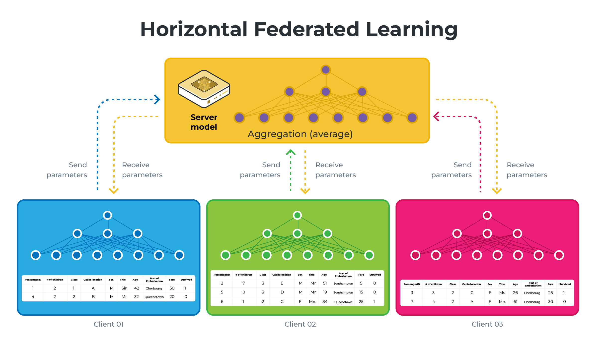

# Vertical Federated Learning with Flower

This example will showcase how you can perform Vertical Federated Learning using
Flower. We'll be using the [Titanic dataset](https://www.kaggle.com/competitions/titanic/data)
to train simple regression models for binary classification. We will go into
more details below, but the main idea of Vertical Federated Learning is that
each client is holding different feature sets of the same dataset and that the
server is holding the labels of this dataset.

|                       | Horizontal Federated Learning (HFL or just FL)                                                                                                                                                         | Vertical Federated Learning (VFL)                                                                                                                                                                                                                                                                                                                                   |
| --------------------- | ------------------------------------------------------------------------------------------------------------------------------------------------------------------------------------------------------ | ------------------------------------------------------------------------------------------------------------------------------------------------------------------------------------------------------------------------------------------------------------------------------------------------------------------------------------------------------------------- |
| Data Distribution     | Clients have different data instances but share the same feature space. Think of different hospitals having different patients' data (samples) but recording the same types of information (features). | Each client holds different features for the same instances. Imagine different institutions holding various tests or measurements for the same group of patients.                                                                                                                                                                                                   |
| Model Training        | Each client trains a model on their local data, which contains all the feature columns for its samples.                                                                                                | Clients train models on their respective features without having access to the complete feature set. Each model only sees a vertical slice of the data (hence the name 'Vertical').                                                                                                                                                                                 |
| Aggregation           | The server aggregates these local models by averaging the parameters or gradients to update a global model.                                                                                            | The server aggregates the updates such as gradients or parameters, which are then used to update the global model. However, since each client sees only a part of the features, the server typically has a more complex role, sometimes needing to coordinate more sophisticated aggregation strategies that may involve secure multi-party computation techniques. |
| Privacy Consideration | The raw data stays on the client's side, only model updates are shared, which helps in maintaining privacy.                                                                                            | VFL is designed to ensure that no participant can access the complete feature set of any sample, thereby preserving the privacy of data.                                                                                                                                                                                                                            |

|               HFL               |               VFL               |
| :-----------------------------: | :-----------------------------: |
|  |  |

Those diagrams illustrate HFL vs VFL using a simplified version of what we will be building in this example. Note that on the VFL side, the server holds the labels (the `Survived` column) and will be the only one capable of performing evaluation.

## Set up the project

### Clone the project

Start by cloning the example project:

```shell
git clone --depth=1 https://github.com/adap/flower.git _tmp \
        && mv _tmp/examples/vertical-fl . \
        && rm -rf _tmp \
        && cd vertical-fl
```

This will create a new directory called `vertical-fl` with the following structure:
following files:

```shell
vertical-fl
├── vertical_fl
│   ├── __init__.py
│   ├── client_app.py   # Defines your ClientApp
│   ├── server_app.py   # Defines your ServerApp
│   ├── strategy.py     # Defines your Strategy
│   └── task.py         # Defines your model, training and data loading
├── pyproject.toml      # Project metadata like dependencies and configs
├── data/train.csv
└── README.md
```

### Install dependencies and project

Install the dependencies defined in `pyproject.toml` as well as the `mlxexample` package.

```bash
pip install -e .
```

## Run the project

You can run your Flower project in both _simulation_ and _deployment_ mode without making changes to the code. If you are starting with Flower, we recommend you using the _simulation_ mode as it requires fewer components to be launched manually. By default, `flwr run` will make use of the Simulation Engine.

### Run with the Simulation Engine

> [!NOTE]
> Check the [Simulation Engine documentation](https://flower.ai/docs/framework/how-to-run-simulations.html) to learn more about Flower simulations and how to optimize them.

```bash
flwr run .
```

You can also override some of the settings for your `ClientApp` and `ServerApp` defined in `pyproject.toml`. For example:

```bash
flwr run . --run-config "num-server-rounds=5 learning-rate=0.05"
```

### Run with the Deployment Engine

Follow this [how-to guide](https://flower.ai/docs/framework/how-to-run-flower-with-deployment-engine.html) to run the same app in this example but with Flower's Deployment Engine. After that, you might be intersted in setting up [secure TLS-enabled communications](https://flower.ai/docs/framework/how-to-enable-tls-connections.html) and [SuperNode authentication](https://flower.ai/docs/framework/how-to-authenticate-supernodes.html) in your federation.

If you are already familiar with how the Deployment Engine works, you may want to learn how to run it using Docker. Check out the [Flower with Docker](https://flower.ai/docs/framework/docker/index.html) documentation.
