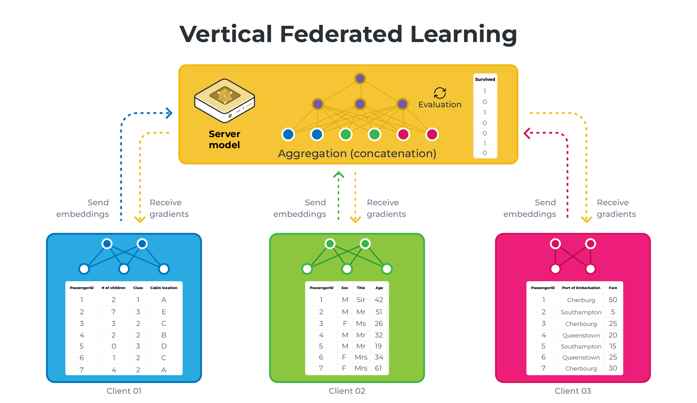

# Vertical Federated Learning example

This example will showcase how you can perform Vertical Federated Learning using
Flower. We'll be using the [Titanic dataset](https://www.kaggle.com/competitions/titanic/data)
to train simple regression models for binary classification. We will go into
more details below, but the main idea of Vertical Federated Learning is that
each client is holding different feature sets of the same dataset and that the
server is holding the labels of this dataset.

## Project Setup

Start by cloning the example project. We prepared a single-line command that you
can copy into your shell which will checkout the example for you:

```shell
git clone --depth=1 https://github.com/adap/flower.git _tmp && mv _tmp/examples/vertical-fl . && rm -rf _tmp && cd vertical-fl
```

This will create a new directory called `vertical-fl` containing the
following files:

```shell
-- pyproject.toml
-- requirements.txt
-- _static/data/train.csv
-- client.py
-- plot.py
-- simulation.py
-- strategy.py
-- task.py
-- README.md
```

### Installing Dependencies

Project dependencies (such as `torch` and `flwr`) are defined in
`pyproject.toml` and `requirements.txt`. We recommend
[Poetry](https://python-poetry.org/docs/) to install those dependencies and
manage your virtual environment ([Poetry
installation](https://python-poetry.org/docs/#installation)) or
[pip](https://pip.pypa.io/en/latest/development/), but feel free to use a
different way of installing dependencies and managing virtual environments if
you have other preferences.

#### Poetry

```shell
poetry install
poetry shell
```

Poetry will install all your dependencies in a newly created virtual
environment. To verify that everything works correctly you can run the following
command:

```shell
poetry run python3 -c "import flwr"
```

If you don't see any errors you're good to go!

#### pip

Write the command below in your terminal to install the dependencies according
to the configuration file requirements.txt.

```shell
pip install -r requirements.txt
```

## Usage

Once everything is installed, you can just run:

```shell
poetry run python3 simulation.py
```

for `poetry`, otherwise just run:

```shell
python3 simulation.py
```

This will start the Vertical FL training for 1000 rounds with 3 clients.
Eventhough the number of rounds is quite high, this should only take a few
seconds to run as the model is very small.

## Explanations

### Vertical FL vs Horizontal FL

|                       | Horizontal Federated Learning (HFL or just FL)                                                                                                                                                           | Vertical Federated Learning (VFL)                                                                                                                                                                                                                                                                                                                                        |
| --------------------- | -------------------------------------------------------------------------------------------------------------------------------------------------------------------------------------------------------- | ------------------------------------------------------------------------------------------------------------------------------------------------------------------------------------------------------------------------------------------------------------------------------------------------------------------------------------------------------------------------ |
| Data Distribution     | Clients have different data instances but share the same feature space.  Think of different hospitals having different patients' data (samples)  but recording the same types of information (features). | Each client holds different features for the same instances.  Imagine different institutions holding various tests or  measurements for the same group of patients.                                                                                                                                                                                                      |
| Model Training        | Each client trains a model on their local data,  which contains all the feature columns for its samples.                                                                                                 | Clients train models on their respective features without  having access to the complete feature set.  Each model only sees a vertical slice of the data (hence the name 'Vertical').                                                                                                                                                                                    |
| Aggregation           | The server aggregates these local models by averaging  the parameters or gradients to update a global model.                                                                                             | The server aggregates the updates such as gradients or parameters,  which are then used to update the global model.  However, since each client sees only a part of the features,  the server typically has a more complex role,  sometimes needing to coordinate more sophisticated aggregation strategies  that may involve secure multi-party computation techniques. |
| Privacy Consideration | The raw data stays on the client's side, only model updates are shared,  which helps in maintaining privacy.                                                                                             | VFL is designed to ensure that no participant can access  the complete feature set of any sample,  thereby preserving the privacy of data.                                                                                                                                                                                                                               |

|               HFL               |               VFL               |
| :-----------------------------: | :-----------------------------: |
|  |  |

Those diagrams illustrate HFL vs VFL using a simplified version of what we will be building in this example. Note that on the VFL side, the server holds the labels (the `Survived` column) and will be the only one capable of performing evaluation.

### Data

#### About

The Titanic Survival dataset is a popular dataset used to predict passenger survival on
the Titanic based on various features.

You can see an exhaustive list of the features over on [Kaggle](https://www.kaggle.com/competitions/titanic/data).

The data is stored as a CSV file in `_static/data/train.csv`, it contains 892
samples with labels.

#### Preprocessing

In `task.py`, you'll find the preprocessing functions we'll apply to our data:

- Passengers are grouped by age: 'Child' for 10 years and under,
  'Adult' for ages between 11 and 40, and 'Elderly' for those over 40. If the age
  isn't listed, we'll label it as 'Unknown'.

  ```python
    def _bin_age(age_series):
        bins = [-np.inf, 10, 40, np.inf]
        labels = ["Child", "Adult", "Elderly"]
        return (
            pd.cut(age_series, bins=bins, labels=labels, right=True)
            .astype(str)
            .replace("nan", "Unknown")
        )
  ```

- We pull out titles from passengers' names to help our model
  understand social status and family roles, simplifying rare titles into a single
  'Rare' category and converting any French titles to their English equivalents.

  ```python
    def _extract_title(name_series):
        titles = name_series.str.extract(" ([A-Za-z]+)\.", expand=False)
        rare_titles = {
            "Lady",
            "Countess",
            "Capt",
            "Col",
            "Don",
            "Dr",
            "Major",
            "Rev",
            "Sir",
            "Jonkheer",
            "Dona",
        }
        titles = titles.replace(list(rare_titles), "Rare")
        titles = titles.replace({"Mlle": "Miss", "Ms": "Miss", "Mme": "Mrs"})
        return titles
  ```

- The first letter of each cabin number is used to identify the
  cabin area, with any missing entries marked as 'Unknown'. This could provide
  insight into the passenger's location on the ship.

- We remove features like 'PassengerId', 'Name', and
  'Ticket' that won't be necessary for our model's predictions.

- Lastly, we convert categorical data points such as 'Sex',
  'Pclass', 'Embarked', 'Title', 'Cabin', and the binned 'Age' into One-Hot
  encodings.

  ```python
    def _create_features(df):
        # Convert 'Age' to numeric, coercing errors to NaN
        df["Age"] = pd.to_numeric(df["Age"], errors="coerce")
        df["Age"] = _bin_age(df["Age"])
        df["Cabin"] = df["Cabin"].str[0].fillna("Unknown")
        df["Title"] = _extract_title(df["Name"])
        df.drop(columns=["PassengerId", "Name", "Ticket"], inplace=True)
        all_keywords = set(df.columns)
        df = pd.get_dummies(
            df, columns=["Sex", "Pclass", "Embarked", "Title", "Cabin", "Age"]
        )
        return df, all_keywords
  ```

#### Partitioning

In `task.py`, we also partition our data for our 3 clients to mirror real-life
collaborations where different organizations hold different feature sets:

```python
def _partition_data(df, all_keywords):
    partitions = []
    keywords_sets = [{"Parch", "Cabin", "Pclass"}, {"Sex", "Title"}]
    keywords_sets.append(all_keywords - keywords_sets[0] - keywords_sets[1])

    for keywords in keywords_sets:
        partitions.append(
            df[
                list(
                    {
                        col
                        for col in df.columns
                        for kw in keywords
                        if kw in col or "Survived" in col
                    }
                )
            ]
        )

    return partitions
```

Client 1: This client looks at family connections and accommodations, working
with features like the number of parents and children each passenger had on
board ('Parch'), the cabin number ('Cabin'), and the ticket class ('Pclass').

Client 2: Here, the focus is on personal attributes. This client examines the
passengers' gender ('Sex') and societal roles as indicated by their titles
('Title').

Client 3: The final client handles the rest of the data that the first two don't
see. This includes the remaining features that give a broader view of the
passengers' information.

Each client is going to train their models on their own unique data without any
idea of the passengers' survival outcomes, which we're trying to predict.

Once all clients have done their part, we combine their insights to form a
comprehensive understanding, just as if different organizations were pooling
their knowledge while keeping their data private. This is the essence of
Vertical Federated Learning: separate but together, each contributing to a
collective intelligence without sharing sensitive information.

Note that our final data processing function looks like that:

```python
def get_partitions_and_label():
    df = pd.read_csv("_static/data/train.csv")
    processed_df = df.dropna(subset=["Embarked", "Fare"]).copy()
    processed_df, all_keywords = _create_features(processed_df)
    raw_partitions = _partition_data(processed_df, all_keywords)

    partitions = []
    for partition in raw_partitions:
        partitions.append(partition.drop("Survived", axis=1))
    return partitions, processed_df["Survived"].values
```

This returns the 3 partitions for our clients and the labels for our server.

### Models

#### Clients

Each client's model is a neural network designed to operate on a distinct subset
of features held by a client. In this example we will use simple linear
regression models.

```python
class ClientModel(nn.Module):
    def __init__(self, input_size):
        super(ClientModel, self).__init__()
        self.fc = nn.Linear(input_size, 4)

    def forward(self, x):
        return self.fc(x)
```

The `input_size` corresponds to the number of features each client has, and this
model maps those features to a 4-dimensional latent space. The outputs are
essentially feature embeddings that capture the patterns within each client's
data slice. These embeddings are then ready to be sent to the server for further
processing.

#### Server

The server's model acts as the central aggregator in the VFL system. It's also a
neural network but with a slightly different architecture tailored to its role
in aggregating the client models' outputs.

```python
class ServerModel(nn.Module):
    def __init__(self):
        super(ServerModel, self).__init__()
        self.fc = nn.Linear(12, 1)
        self.sigmoid = nn.Sigmoid()

    def forward(self, x):
        x = self.fc(x)
        return self.sigmoid(x)
```

It comprises a single linear layer that accepts the concatenated outputs from
all client models as its input. The number of inputs to this layer equals the
total number of outputs from the client models (3 x 4 = 12). After processing
these inputs, the linear layer's output is passed through a sigmoid activation
function (`nn.Sigmoid()`), which maps the result to a `(0, 1)` range, providing
a probability score indicative of the likelihood of survival.

### Strategy

The strategy we will write to perform the aggregation will inherit from `FedAvg`
and set the following additional attributes:

```python
self.model = ServerModel(12)
self.initial_parameters = ndarrays_to_parameters(
    [val.cpu().numpy() for _, val in self.model.state_dict().items()]
)
self.optimizer = optim.SGD(self.model.parameters(), lr=0.01)
self.criterion = nn.BCELoss()
self.label = torch.tensor(labels).float().unsqueeze(1)
```

With `labels` given as an argument to the strategy.

We then redefine the `aggregate_fit` method:

```python
def aggregate_fit(
    self,
    rnd,
    results,
    failures,
):
    # Do not aggregate if there are failures and failures are not accepted
    if not self.accept_failures and failures:
        return None, {}

    # Convert results
    embedding_results = [
        torch.from_numpy(parameters_to_ndarrays(fit_res.parameters)[0])
        for _, fit_res in results
    ]
    embeddings_aggregated = torch.cat(embedding_results, dim=1)
    embedding_server = embeddings_aggregated.detach().requires_grad_()
    output = self.model(embedding_server)
    loss = self.criterion(output, self.label)
    loss.backward()

    self.optimizer.step()
    self.optimizer.zero_grad()

    grads = embedding_server.grad.split([4, 4, 4], dim=1)
    np_grads = [grad.numpy() for grad in grads]
    parameters_aggregated = ndarrays_to_parameters(np_grads)

    with torch.no_grad():
        correct = 0
        output = self.model(embedding_server)
        predicted = (output > 0.5).float()

        correct += (predicted == self.label).sum().item()

        accuracy = correct / len(self.label) * 100

    metrics_aggregated = {"accuracy": accuracy}

    return parameters_aggregated, metrics_aggregated
```

This is where all the magic happens. We first convert the `np.array`s that we
received from our clients to `tensor`s, before concatenating the 3 embeddings
together. This means that we go from 3 tensors of size `(892, 4)` to 1 tensor of
size `(892, 12)`. The combined embeddings are fed through the server model to
get the prediction output. The loss between the predicted output and the actual
labels is calculated. Backward propagation is then performed to calculate the
gradients, which are used to update the server model's parameters.

The optimizer updates the server model's parameters based on the calculated
gradients, and the gradients are reset to zero to prepare for the next round of
aggregation.

The gradients from the server model's embedding layer are then split according
to the size of the output from each client model (assuming equal size for
simplicity here), ready to be sent back to the respective client models.

Finally, with no gradient calculation needed, the model's predictions are
compared to the true labels to calculate the accuracy of the model after the
update.

Note that this `aggregate_fit` function returns gradients instead of trained
weights. This is because, in this setting, sharing gradients allows each
participant to benefit from the collective feedback gathered from the entire
pool of data without the need to align their different feature spaces (trained
weights are directly tied to specific features of the dataset but not gradients,
which are just a measure of the sensitivity of the loss function to changes in
the model's parameters). This shared feedback, encapsulated in the gradients,
guides each participant's model to adjust and improve, achieving optimization
not just based on its own data but also leveraging insights from the entire
network's data.

We do not need to return parameters here because updates are completed locally
in VFL. But the server should still send the gradients back to all clients to
let them continue the back prop and update their local model. In Flower, the
parameters returned by `aggregate_fit` will be stored and sent to
`Client.evaluate` via `configure_fit`. So we take advantage of this and return
our gradients in `aggregate_fit` so that they'll be sent to `Client.evaluate` as
`parameters`. That's also why we can obtain gradients from the `parameters`
argument in `Client.evaluate` (see next section).

The last thing we have to do is to redefine the `aggregate_evaluate` function to
disable distributed evaluation (as the clients do not hold any labels to test
their local models).

```python
def aggregate_evaluate(
    self,
    rnd,
    results,
    failures,
):
    return None, {}
```

### Client class and function

Our `FlowerClient` class is going to be quite straight forward.

```python
class FlowerClient(fl.client.NumPyClient):
    def __init__(self, cid, data):
        self.cid = cid
        self.train = torch.tensor(StandardScaler().fit_transform(data)).float()
        self.model = ClientModel(input_size=self.train.shape[1])
        self.optimizer = torch.optim.SGD(self.model.parameters(), lr=0.01)
        self.embedding = self.model(self.train)

    def get_parameters(self, config):
        pass

    def fit(self, parameters, config):
        self.embedding = self.model(self.train)
        return [self.embedding.detach().numpy()], 1, {}

    def evaluate(self, parameters, config):
        self.model.zero_grad()
        self.embedding.backward(torch.from_numpy(parameters[int(self.cid)]))
        self.optimizer.step()
        return None
```

After defining our model and data attributes (respectively `self.model` and
`self.train`), we define our `fit` function as such: the `self.model(self.train)`
performs a forward pass using the client's local training data (`self.train`).
This generates the embeddings (feature representations) for the data. To conform
with the return type of the `fit` function, we need to return a list of
`np.array`s (hence the conversion), the number of samples, which won't be used
on the server side, so we just return 1, and then an empty dict.

For the `evaluate` function, we perform our model's backward pass using the
gradients sent by the server and then update our local model's parameters based
on those new gradients. Note that the `loss` and `num_examples` we return in our
evaluate function are bogus, as they won't be used on the server side.

The `client_fn` we will use in our `start_simulation` function to generate our 3
clients will be very basic:

```python3
partitions, label = get_partitions_and_label()

def client_fn(cid):
    return FlowerClient(cid, partitions[int(cid)]).to_client()
```

We pass a `client_id` and its corresponding partition to each client.

### Evaluation

Please note that we do not perform distributed evaluation. This is because only
the server holds some labels to compare the results to. This is why the only
evaluation we perform is on the server side.

In this example, we use the `FlowerClient` `evaluate` function for
backpropagation instead of using it for evaluation. We do this because we know
that the `evaluate` function of the clients will be called after the fit
function. This allows us to aggregate our models in `aggregate_fit` and then
send them back to the clients using this `evaluate` function and perform the
backpropagation. This is not done for evaluation, hence why we return `None` in
the `aggregate_evaluate` function of the strategy.

### Starting the simulation

Putting everything together, to start our simulation we use the following
function:

```python
hist = fl.simulation.start_simulation(
    client_fn=client_fn,
    num_clients=3,
    config=fl.server.ServerConfig(num_rounds=1000),
    strategy=Strategy(label),
)
```

As mentioned before, we train for 1000 rounds but it should still last only
a few seconds.

Note that we store the results of the simulation into `hist`, this will allow us
to use the `plot.py` file to plot the accuracy as a function of the number of
rounds.

## Results

Here we can observe the results after 1000 rounds:


