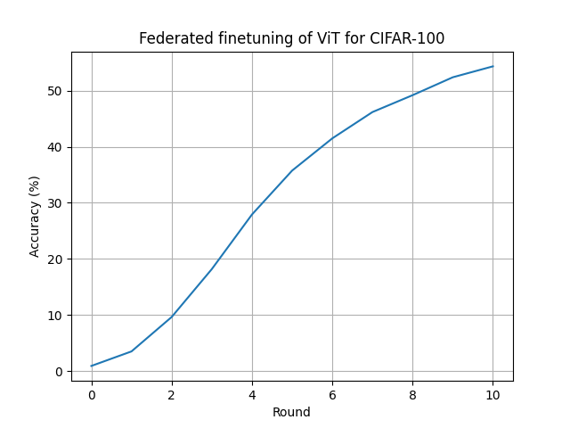

# Federated finetuning of a ViT

This example shows how to use Flower's Simulation Engine to federate the finetuning of a Vision Transformer ([ViT-Base-16](https://pytorch.org/vision/main/models/generated/torchvision.models.vit_b_16.html#torchvision.models.vit_b_16)) that has been pretrained on ImageNet. To keep things simple we'll be finetuning it to CIFAR-100, creating 20 partitions using [Flower-datasets](https://flower.ai/docs/datasets/). We'll be finetuning just the exit `head` of the ViT, this means that the training is not that costly and each client requires just ~1.5GB of VRAM (for a batch size of 64 images).

## Running the example

If you haven't cloned the Flower repository already you might want to clone code example and discard the rest. We prepared a single-line command that you can copy into your shell which will checkout the example for you:

```shell
git clone --depth=1 https://github.com/adap/flower.git && mv flower/examples/vit-finetune . && rm -rf flower && cd vit-finetune
```

This will create a new directory called `simulation-pytorch` containing the following files:

```
-- README.md         <- Your're reading this right now
-- main.py           <- Main file that launches the simulation
-- client.py         <- Contains Flower client code and ClientApp
-- server.py         <- Contains Flower server code and ServerApp
-- model.py          <- Defines model and train/eval functions
-- dataset.py        <- Downloads, partitions and processes dataset
-- pyproject.toml    <- Example dependencies
-- requirements.txt  <- Example dependencies
```

### Installing Dependencies

Project dependencies (such as `torch` and `flwr`) are defined in `pyproject.toml` and `requirements.txt`. We recommend [Poetry](https://python-poetry.org/docs/) to install those dependencies and manage your virtual environment ([Poetry installation](https://python-poetry.org/docs/#installation)) or [pip](https://pip.pypa.io/en/latest/development/), but feel free to use a different way of installing dependencies and managing virtual environments if you have other preferences.

#### Poetry

```shell
poetry install
poetry shell
```

#### pip

With an activated environemnt, install the dependencies for this example:

```shell
pip install -r requirements.txt
```

### Run with `start_simulation()`

Running the example is quite straightforward. You can control the number of rounds `--num-rounds` (which defaults to 10).

```bash
python main.py
```




Running the example as-is on an RTX 3090Ti should take ~1min/round running 4 clients in parallel (plus the _global model_ during centralized evaluation stages) in a single GPU. Note that more clients could fit in VRAM, but since the GPU utilization is high (99%-100%) we are probably better off not doing that (at least in this case).

You can adjust the `client_resources` passed to `start_simulation()` so more/less clients run at the same time in the GPU. Take a look at the [Documentation](https://flower.ai/docs/framework/how-to-run-simulations.html) for more details on how you can customise your simulation.

```bash

+---------------------------------------------------------------------------------------+
| NVIDIA-SMI 535.161.07             Driver Version: 535.161.07   CUDA Version: 12.2     |
|-----------------------------------------+----------------------+----------------------+
| GPU  Name                 Persistence-M | Bus-Id        Disp.A | Volatile Uncorr. ECC |
| Fan  Temp   Perf          Pwr:Usage/Cap |         Memory-Usage | GPU-Util  Compute M. |
|                                         |                      |               MIG M. |
|=========================================+======================+======================|
|   0  NVIDIA GeForce RTX 3090 Ti     Off | 00000000:0B:00.0 Off |                  Off |
| 59%   82C    P2             444W / 450W |   8127MiB / 24564MiB |    100%      Default |
|                                         |                      |                  N/A |
+-----------------------------------------+----------------------+----------------------+

+---------------------------------------------------------------------------------------+
| Processes:                                                                            |
|  GPU   GI   CI        PID   Type   Process name                            GPU Memory |
|        ID   ID                                                             Usage      |
|=======================================================================================|
|    0   N/A  N/A     30741      C   python                                     1966MiB |
|    0   N/A  N/A     31419      C   ray::DefaultActor.run                      1536MiB |
|    0   N/A  N/A     31420      C   ray::DefaultActor.run                      1536MiB |
|    0   N/A  N/A     31421      C   ray::DefaultActor.run                      1536MiB |
|    0   N/A  N/A     31422      C   ray::DefaultActor.run                      1536MiB |
+---------------------------------------------------------------------------------------+
```


### Run with Flower Next (preview)

```bash
flower-simulation --client-app=client:app --server-app=server:app --num-supernodes=20 \
    --backend-config='{"client_resources": {"num_cpus":4, "num_gpus":0.25}}'
```