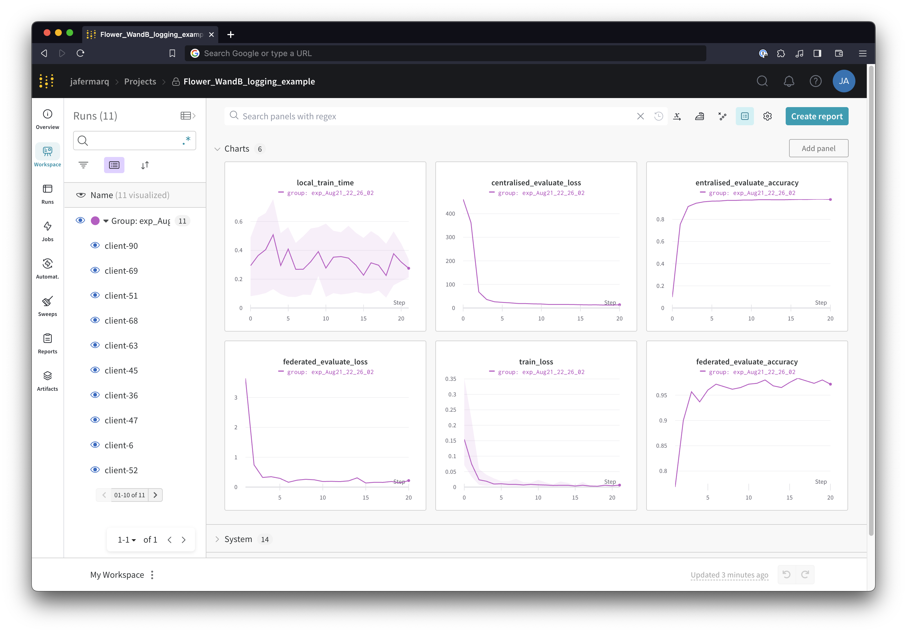

# Logging FL progress with W&B

This example shows you how to use [Weight&Biases](https://wandb.ai/site) in your Flower FL projects to track statistics on the server side such as the performance of the global model at each round. It also shows how clientsw could connect to the same W&B project so they can directly log non-sensitive information. This can be helpful during prototyping stages to gain better insights on how your FL algorithm and model operate.

This example can be run by making use of either Flower's `EdgeClientEngine` (i.e. separately launching the server and clients, each other interfacing via gRCP) or with Flower's `VirtualClientEngine` (i.e. by running `sim.py`).

This example assumes you have a W&B account. When you run the code for the first time, you'll be prompted to either create one or "associate" your current machine to your account.

This example would generate a project view on your W&B dashboard similar to the one below


## Running the example

Start by cloning the code example. We prepared a single-line command that you can copy into your shell which will checkout the example for you:

```shell
git clone --depth=1 https://github.com/adap/flower.git && mv flower/examples/wandb-logging . && rm -rf flower && cd wandb-logging
```

This will create a new directory called `wandb-logging` containing the following files:

```
-- README.md       <- Your're reading this right now
-- client.py       <- Exclusive client-side logic
-- server.py       <- Exclusive server-side logic
-- utils.py        <- Common elements for server and client.
-- sim.py          <- Example code for Flower simulation
-- pyproject.toml  <- Example dependencies
-- requirements.txt  <- Example dependencies
```

### Installing Dependencies

Project dependencies (such as `torch` and `flwr`) are defined in `pyproject.toml` and `requirements.txt`. We recommend [Poetry](https://python-poetry.org/docs/) to install those dependencies and manage your virtual environment ([Poetry installation](https://python-poetry.org/docs/#installation)) or [pip](https://pip.pypa.io/en/latest/development/), but feel free to use a different way of installing dependencies and managing virtual environments if you have other preferences.

#### Poetry

```shell
poetry install
poetry shell
```

Poetry will install all your dependencies in a newly created virtual environment. To verify that everything works correctly you can run the following command:

```shell
poetry run python -c "import flwr"
```

If you don't see any errors you're good to go!

#### pip

Write the command below in your terminal to install the dependencies according to the configuration file requirements.txt.

```shell
pip install -r requirements.txt
```

### Run Federated Learning Example


#### With the EdgeClientEngine

On different terminals, first run the server, then run at least two clients:
```bash
poetry run python server.py

# on another terminal
poetry run python clietn.py # run at least two (yes, on separate terminals)
```
We provide you with a script `run.sh` that will spawn a server and five client for you. You can run it as follows:
```bash
poetry run bash run.sh
```

#### With the VirtualClientEngine

Run the simulation from a single command:
```bash
poetry run python sim.py
```
