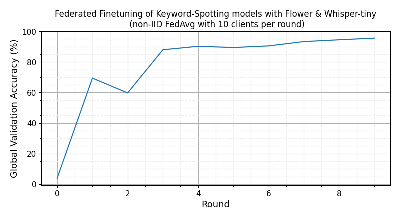

# On-device Federated Finetuning for Speech Classification

This example demonstrates how to, from a pre-trained [Whisper](https://openai.com/research/whisper) model, finetune it for the downstream task of keyword spotting. We'll be implementing a federated downstream finetuning pipeline using Flower involving a total of 100 clients. As for the downstream dataset, we'll be using the [Google Speech Commands](https://huggingface.co/datasets/google/speech_commands) dataset for keyword spotting. We'll take the encoder part of the [Whisper-tiny](https://huggingface.co/openai/whisper-tiny) model, freeze its parameters, and learn a lightweight classification (\<800K parameters !!) head to correctly classify a spoken word.


This example can be run in three modes:

- **Centralized training**: the standard way of training ML models, where all the data is available to the node doing the finetuning.
- **Federated Learning**: the better way of doing ML, where a model is finetuned collaboratively by nodes (i.e. clients), each using their own data. These clients can run:
  - in _simulation_ mode: a client is an ephemeral Python process with a portion of the system resources assigned to it.
  - in _on-device_ mode: clients are detached entities and each can run on a different device.

## Set up the project

### Clone the project

Start by cloning the example project:

```shell
git clone --depth=1 https://github.com/adap/flower.git _tmp \
        && mv _tmp/examples/whisper-federated-finetuning  . \
        && rm -rf _tmp \
        && cd whisper-federated-finetuning 
```

This will create a new directory called `whisper-federated-finetuning` containing the following files:

```shell
whisper-federated-finetuning
├── whisper_example
│   ├── __init__.py
│   ├── client_app.py   # Defines your ClientApp
│   ├── server_app.py   # Defines your ServerApp
│   ├── model.py        # Defines the model and training functions
│   └── dataset.py      # Defines your dataset and its processing
├── centralized.py      # Centralized version of this example
├── preprocess.py       # A utility script to preprocess all partitions
├── pyproject.toml      # Project metadata like dependencies and configs
└── README.md
```

> [!NOTE]
> This example can be run in different ways, please refer to the corresponding section for further instructions.

### Install dependencies and project

In a new Python environment, install the dependencies defined in `pyproject.toml` as well as the `whisper_example` package.

```bash
pip install -e .
```

## Centralized Training

> [!TIP]
> This section describes how to finetune `Whisper-tiny` for keyword spotting without making use of Federated Learning. This means that the whole training set is available at any point and therefore it is in its entirety to finetune the model each epoch. Skip to the next section if you want to jump straight into how to run `Whisper-tiny` with Flower!

Then run centralized training as follows. Please note that the first time you run the code, the `SpeechCommnads` dataset will be downloaded and pre-processed using 🤗 API (which takes a little while -- approx 40min -- and is cached in `~/.cache/huggingface/datasets/speechcommands` wiht a footprint of ~83GB). Subsequent runs shouldn't require this preprocessing.

```bash
python centralized.py --compile # don't use `--compile` flag if you are using pytorch < 2.0

# The script will save a checkpoint of the classifier head after each epoch
# These checkpoints followo the naming style: `classifier_<val_accuracy>.pt`

# You can load a checkpoint by passing it like this:
python centralized.py --checkpoint <my_checkpoint>.pt
```

Within 2 epochs you should see a validation accuracy of over 95%. On an RTX 3090Ti each epoch takes ~3min30sec. The final test set consistently reaches 97%+. Below is the log you should expect to see:

```bash
...
classifier_head_params = 781964
Initial (loss, acc): loss = 0.04124763025785586, accuracy = 0.03215788419154478
Epoch: 0
100%|████████████████████████| 84928/84928 [03:05<00:00, 456.93it/s, avg_loss=0.7269, avg_acc=0.8282]
VALIDATION ---> loss = 0.0051703976778501234, accuracy = 0.9319775596072931
Epoch: 1
100%|████████████████████████| 84928/84928 [03:07<00:00, 454.06it/s, avg_loss=0.1588, avg_acc=0.9629]
VALIDATION ---> loss = 0.003613288299632327, accuracy = 0.943097575636145
Epoch: 2
100%|████████████████████████| 84928/84928 [03:06<00:00, 454.16it/s, avg_loss=0.1208, avg_acc=0.9675]
VALIDATION ---> loss = 0.0022978041400064466, accuracy = 0.9610298537367261
Training done...
Evaluating test set. Loading best model
TEST ---> loss = 0.001703281509680464, accuracy = 0.9740286298568507
```

## Run the project

Centralized training is ok but in many settings it cannot be realised. Primarily because the training data must remain distributed (i.e. on the client side) and cannot be aggregated into a single node (e.g. your server). With [Flower](https://flower.ai/) we can easily design a federated finetuning pipeline by which clients locally train the classification head on their data, before communicating it to a central server. There, the updates sent by the clients get aggregated and re-distributed among clients for another round of FL. This process is repeated until convergence. Note that, unlike the encoder part of the Whisper model, the classification head is incredibly lightweight (just 780K parameters), adding little communication costs as a result.

There are a total of 2112 speakers in the `train` partition, which is the one we'll use in FL.

```python
from datasets import load_dataset
sc_train = load_dataset("speech_commands", "v0.02", split="train", token=False)
print(sc_train)
# Dataset({
#     features: ['file', 'audio', 'label', 'is_unknown', 'speaker_id', 'utterance_id'],
#     num_rows: 84848
# })

# The training set is comprised of ~85K 1-second audio clips from 2112 individual speakers
ids = set(sc_train['speaker_id'])
print(len(ids))
# 2113  # <--- +1 since a "None" speaker is included (for clips to construct the _silence_ training examples)
```

In this example, we use the [GroupedNaturalIdPartitioner](https://flower.ai/docs/datasets/ref-api/flwr_datasets.partitioner.GroupedNaturalIdPartitioner.html) from [Flower Datasets](https://flower.ai/docs/datasets/index.html) to partition the SpeepCommands dataset based on `speaker_id`. We will create groups of 5 speakers, this will result in a total of 422 groups, each representing a node/client in the federation.. Each `speaker_id` is only present in a single group. You can think of each group as an individual Federated Learning _node_ that contains several users/speakers. One way to think about this is to view each client as an office with several people working there, each interacting with the Keyword spotting system.


The resulting data partitions are not equal-sized (which is what you'd often find in practice in the real world) because not all `speaker_id` contributed the same amount of audio clips when the [Speech Commands Dataset](https://arxiv.org/abs/1804.03209) was created. If we make a bar plot showing the amount of data each client/node has this is the result.


> [!NOTE]
> You can make create this plot or adjust it by running the [visualize_labels](visualize_labels.ipynb) notebook. It makes use of Flower Dataset's [visualization tools](https://flower.ai/docs/datasets/tutorial-visualize-label-distribution.html).

An overview of the FL pipeline built with Flower for this example is illustrated above.

1. At the start of a round, the `ServerApp` communicates the weights of classification head to a fraction of the nodes.
2. The `ClientApp` in each node, using a frozen pre-trained Whisper encoder, trains the classification head using its own data samples.
3. Once on-site training is completed, each node sends back the (now updated) classification head to the `ServerApp`.
4. The Flower `ServerApp` aggregates (via [FedAvg](https://flower.ai/docs/framework/ref-api/flwr.serverapp.strategy.FedAvg.html) -- but you can [choose any other strategy](https://flower.ai/docs/framework/ref-api/flwr.serverapp.strategy.html), or implement your own!) the classification heads in order to obtain a new _global_ classification head. This head will be shared with nodes in the next round.

You can run your Flower project in both _simulation_ and _deployment_ mode without making changes to the code. If you are starting with Flower, we recommend you using the _simulation_ mode as it requires fewer components to be launched manually. By default, `flwr run` will make use of the Simulation Engine.

### Run with the Simulation Engine

The run is defined in the `pyproject.toml` which: specifies the paths to `ClientApp` and `ServerApp` as well as their parameterization with configs in the `[tool.flwr.app.config]` block. Before launching our simulation, we need to define a `SuperLink Connection` in the `Flower Configuration`. To do this, let's first locate the Flower Configuration file and then edit it.

1. Locate the Flower Configuration file:

```bash
flwr config list
# Flower Config file: /path/to/your/.flwr/config.toml
# SuperLink connections:
#  supergrid
#  local (default)
```

2. Edit the `local` configuration so it looks like the following.

```TOML
[superlink.flowertune]
options.num-supernodes = 422 # we are grouping 2112 speakers into groups of 5
options.backend.client-resources.num-cpus = 4
options.backend.client-resources.num-gpus = 0.0
options.backend.init-args.log-to-driver = false # set to true to enable all logs from simulation engine
```

> [!NOTE]
> By default, it will run on CPU only. On a MacBook Pro M2, running 3 rounds of Flower FL should take ~10 min. Assuming the dataset has already been downloaded. Running on GPU is recommended. Read more about how Flower Simulations work and how to make them use the GPU in [the documentation](https://flower.ai/docs/framework/how-to-run-simulations.html).

```shell
# Run with default settings (21 clients per round out of 422)
flwr run .
```

You can expect a summary at then showing federated metrics (i.e. the average training accuracy and loss across clients sampled in a round) looking like this:

```shell
INFO :      [SUMMARY]
INFO :      Run finished 3 round(s) in 564.50s
INFO :          History (metrics, distributed, fit):
INFO :          {'train_accuracy': [(1, 0.637721849625075),
INFO :                              (2, 0.8666815319504736),
INFO :                              (3, 0.8912498749526644)],
INFO :           'train_loss': [(1, 4.049714171341712),
INFO :                          (2, 1.8473016127565092),
INFO :                          (3, 2.5116721350250693)]}
INFO :
```

To run your `ClientApps` on GPU, you'll need to define a new SuperLink connection in your Flower Configuration file that assigns GPU resources to your virtual clients. Check how to do this in the [Flower Simulation documentation](https://flower.ai/docs/framework/main/en/how-to-run-simulations.html#defining-clientapp-resources).

You can also override some of the settings for your `ClientApp` and `ServerApp` defined in `pyproject.toml`. For example:

```bash
# Runs for 10 rounds and sampling 20% of the clients in each round
flwr run . --run-config "num-server-rounds=10 fraction-fit=0.2"
```

With just 5 FL rounds, the global model should be reaching ~97% validation accuracy. A test accuracy of 96% can be reached with 10 rounds of FL training using the default hyperparameters. On an RTX 3090Ti, each round takes ~40-50s depending on the amount of data the clients selected in a round have.

Run on GPU with central evaluation activated and for 10 rounds by passing `--run-config "central-eval=true num-server-rounds=10"` to your `flwr run` command.



> [!TIP]
> If you find this federated setup not that challenging, try reducing the sizes of the groups created by the `GroupedNaturalIdPartitioner`. That will increase the number of individual clients/nodes in the federation.

### Run with the Deployment Engine

> [!NOTE]
> The steps here outline the very few changes you need to make to the code provided in this example to run with the Deployment Engine instead of with the Simulation Engine. For a beginners guide on how the Deployment Engine works, please check the [Run Flower with the Deployment Engine](https://flower.ai/docs/framework/how-to-run-flower-with-deployment-engine.html) guide. That guide will introduce how to enable secure TLS and node authentication.

Running the exact same FL pipeline as in the simulation setting can be done without requiring any change to the `ServerApp` design. For the `ClientApp` we need to slightly adjust the logic that loads the dataset. While in simulations we want to dynamically make a Python process to _behave_ like a particular client by loading its corresponding partition, in deployment mode we want the same client process (linked to a single `SuperNode`) to always use its own dataset that lives locally in the machine running the `SuperNode`.

An obvious first step would be to generate N data partitions and assing each to a different `SuperNode`. Let's start with this step by means of the `preprocess.py` script. These are the steps we'll follow:

1. Extract and save two partitions from the dataset. Each will be assigned to a different `SuperNode`.
2. Modify the `train` function in `client_app.py` so it directly loads the partition specified when launching the `SuperNode`.
3. Copy the generate partition to the machine where the `SuperNode` is going to be executed.

**1. Save a data partition**

Run twice the following command, each time indicating a different partition id. Each time you run it a directory in the form `partition_<id>` will be created.

```shell
python preprocess.py --partition-id=5
```

**2. Adjust `client_fn`**

Rename the `partition-id` key with something more meaningful such as `local-dataset` in file `whisper_example/client_app.py` and replace the call to `load_data` with `load_data_from_disk`. This will make your `ClientApp` use the dataset you point your `SuperNode` to when launching it:

```python
from whisper_example.dataset import load_data_from_disk

@app.train()
def train(msg: Message, context: Context):

    # ...
    # partition_id = context.node_config["partition-id"] # disable
    local_data = context.node_config["local-data"]  # new line

    # keep the same

    # replace the `load_data` lines with this
    partition = load_data_from_disk(local_data)
```

**3. Make data available to the SuperNode**

You will need to copy the generated directory in step 1 to the machine that will run the `SuperNode`. You can use, for example, the [`scp`](https://linuxize.com/post/how-to-use-scp-command-to-securely-transfer-files/) in order to do that.

With steps 1-3 completed, you are ready to run Federated Whisper finetuning with Flower's Deployment Eninge. To connect a `SuperNode` to an existing federation (i.e. a running `SuperLink`) you'd do it like this assuming all the python dependencies (i.e. `flwr`, `transformers`, `torch` are installed -- see `pyproject.toml`) in the Python environment of the machine where you are launching the `SuperNode` from:

```shell
flower-supernode --superlink="<SUPERLINK-IP>:9092" \
                 --node-config="local-data='<path/to/local/partition>'"
```

**4. Run your whipser app**

First, ensure you have a SuperLink connection defined in your Flower Configuration file. You can locate this file via `flwr config list`. Open it and create a new connection if you don't have it already. For example:

```toml
[superlink.remote]
address = '127.0.0.1:9093' # IP:9093 of your superlink (assumed localhost superlink)
insecure = true # Check the documentation to setup with SSL
```

Once your `SuperNodes` are connected to the `SuperLink`, start the run via `flwr run`, but this time point it to the `remote` connection:

```shell
flwr run . remote
```

### Federated Finetuning on Raspberry Pi

To launch a Flower `SuperNode` on a Raspberry Pi you'd typically follow the same steps you do on any other machine you'd like to connect to a federation.

First, ensure your Rasberry Pi has been setup correctly. You'll need either a Rasbperry Pi 4 or 5. Using the code as-is, RAM usage on the Raspberry Pi does not exceed 1.5GB. Note that unlike in the previous sections of this example, clients for Raspberry Pi work better when using PyTorch 1.13.1 (or earlier versions to PyTorch 2.0 in general).

> [!TIP]
> Follow the `Setup your Pi` section in the [examples/embedded-devices](https://github.com/adap/flower/tree/main/examples/embedded-devices#setting-up-a-raspberry-pi) example to set it up if you haven't done so already.

Second, generate and copy the a single data partition to your raspbery pi. Do so from your development machine (e.g. your laptop) as shown earlier in the [Run with the Deployment Engine](#run-with-the-deployment-engine) section.

Finally, assuming you have a `SuperLink` running on a machine (e.g. your laptop) and which can be reached by your Raspberry Pi (e.g. because they are in the same network), launch the `SuperNode` as shown earlier:

```shell
flower-supernode --superlink="<SUPERLINK-IP>:9092" \
                 --node-config="local-data='<path/to/local/partition>'"
```
