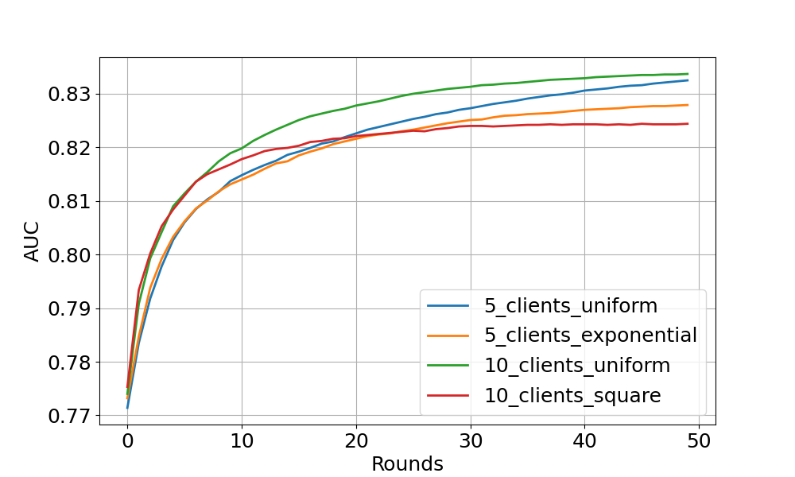

# Flower Example using XGBoost (Comprehensive)

This example demonstrates a comprehensive federated learning setup using Flower with XGBoost.
We use [HIGGS](https://archive.ics.uci.edu/dataset/280/higgs) dataset to perform a binary classification task.
It differs from the [xgboost-quickstart](https://github.com/adap/flower/tree/main/examples/xgboost-quickstart) example in the following ways:

- Arguments parsers of server and clients for hyperparameters selection.
- Customised FL settings.
- Customised number of partitions.
- Customised partitioner type (uniform, linear, square, exponential).
- Centralised/distributed evaluation.
- Bagging/cyclic training methods.

## Project Setup

Start by cloning the example project. We prepared a single-line command that you can copy into your shell which will checkout the example for you:

```shell
git clone --depth=1 https://github.com/adap/flower.git && mv flower/examples/xgboost-comprehensive . && rm -rf flower && cd xgboost-comprehensive
```

This will create a new directory called `xgboost-comprehensive` containing the following files:

```
-- README.md         <- Your're reading this right now
-- server.py         <- Defines the server-side logic
-- client.py         <- Defines the client-side logic
-- dataset.py        <- Defines the functions of data loading and partitioning
-- utils.py          <- Defines the arguments parser for clients and server
-- run_bagging.sh    <- Commands to run bagging experiments
-- run_cyclic.sh     <- Commands to run cyclic experiments
-- pyproject.toml    <- Example dependencies (if you use Poetry)
-- requirements.txt  <- Example dependencies
```

### Installing Dependencies

Project dependencies (such as `xgboost` and `flwr`) are defined in `pyproject.toml` and `requirements.txt`. We recommend [Poetry](https://python-poetry.org/docs/) to install those dependencies and manage your virtual environment ([Poetry installation](https://python-poetry.org/docs/#installation)) or [pip](https://pip.pypa.io/en/latest/development/), but feel free to use a different way of installing dependencies and managing virtual environments if you have other preferences.

#### Poetry

```shell
poetry install
poetry shell
```

Poetry will install all your dependencies in a newly created virtual environment. To verify that everything works correctly you can run the following command:

```shell
poetry run python3 -c "import flwr"
```

If you don't see any errors you're good to go!

#### pip

Write the command below in your terminal to install the dependencies according to the configuration file requirements.txt.

```shell
pip install -r requirements.txt
```

## Run Federated Learning with XGBoost and Flower

We have two scripts to run bagging and cyclic (client-by-client) experiments.
The included `run_bagging.sh` or `run_cyclic.sh` will start the Flower server (using `server.py`),
sleep for 15 seconds to ensure that the server is up,
and then start 5 Flower clients (using `client.py`) with a small subset of the data from exponential partition distribution.
You can simply start everything in a terminal as follows:

```shell
poetry run ./run_bagging.sh
```
Or
```shell
poetry run ./run_cyclic.sh
```

The script starts processes in the background so that you don't have to open eleven terminal windows.
If you experiment with the code example and something goes wrong, simply using `CTRL + C` on Linux (or `CMD + C` on macOS) wouldn't normally kill all these processes,
which is why the script ends with `trap "trap - SIGTERM && kill -- -$$" SIGINT SIGTERM EXIT` and `wait`.
This simply allows you to stop the experiment using `CTRL + C` (or `CMD + C`).
If you change the script and anything goes wrong you can still use `killall python` (or `killall python3`)
to kill all background processes (or a more specific command if you have other Python processes running that you don't want to kill).

You can also manually run `poetry run python3 server.py --train-method=bagging/cyclic --pool-size=N --num-clients-per-round=N`
and `poetry run python3 client.py --train-method=bagging/cyclic --node-id=NODE_ID --num-partitions=N` for as many clients as you want,
but you have to make sure that each command is run in a different terminal window (or a different computer on the network).

In addition, we provide more options to customise the experimental settings, including data partitioning and centralised/distributed evaluation (see `utils.py`).
Look at the [code](https://github.com/adap/flower/tree/main/examples/xgboost-comprehensive)
and [tutorial](https://flower.dev/docs/framework/tutorial-quickstart-xgboost.html) for a detailed explanation.

### Expected Experimental Results

#### Bagging aggregation experiment



The figure above shows the centralised tested AUC performance over FL rounds on 4 experimental settings.
One can see that all settings obtain stable performance boost over FL rounds (especially noticeable at the start of training).
As expected, uniform client distribution shows higher AUC values (beyond 83% at the end) than square/exponential setup.
Feel free to explore more interesting experiments by yourself!
