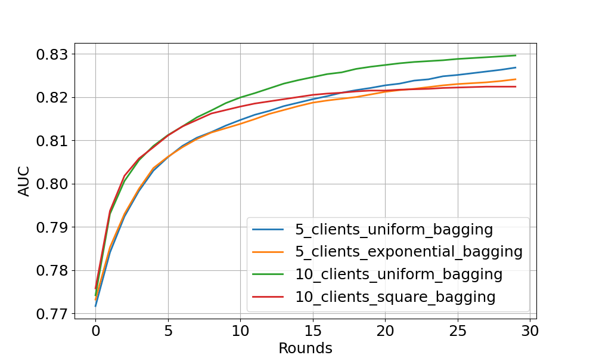
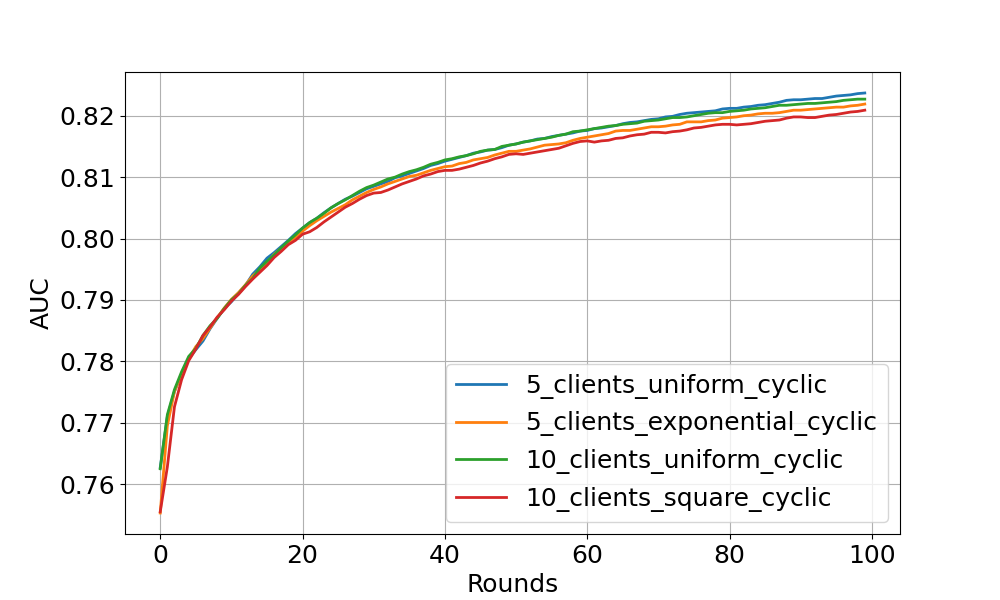

# Flower Example using XGBoost (Comprehensive)

This example demonstrates a comprehensive federated learning setup using Flower with XGBoost.
We use [HIGGS](https://archive.ics.uci.edu/dataset/280/higgs) dataset to perform a binary classification task. This examples uses [Flower Datasets](https://flower.ai/docs/datasets/) to retrieve, partition and preprocess the data for each Flower client.
It differs from the [xgboost-quickstart](https://github.com/adap/flower/tree/main/examples/xgboost-quickstart) example in the following ways:

- Arguments parsers of server and clients for hyperparameters selection.
- Customised FL settings.
- Customised number of partitions.
- Customised partitioner type (uniform, linear, square, exponential).
- Centralised/distributed evaluation.
- Bagging/cyclic training methods.
- You can run it with Flower Simulation

## Training Strategies

This example provides two training strategies, **bagging aggregation** and **cyclic training**.

### Bagging Aggregation

Bagging (bootstrap) aggregation is an ensemble meta-algorithm in machine learning,
used for enhancing the stability and accuracy of machine learning algorithms.
Here, we leverage this algorithm for XGBoost trees.

Specifically, each client is treated as a bootstrap by random subsampling (data partitioning in FL).
At each FL round, all clients boost a number of trees (in this example, 1 tree) based on the local bootstrap samples.
Then, the clients' trees are aggregated on the server, and concatenates them to the global model from previous round.
The aggregated tree ensemble is regarded as a new global model.

This way, let's consider a scenario with M clients.
Given FL round R, the bagging models consist of (M * R) trees.

### Cyclic Training

Cyclic XGBoost training performs FL in a client-by-client fashion.
Instead of aggregating multiple clients,
there is only one single client participating in the training per round in the cyclic training scenario.
The trained local XGBoost trees will be passed to the next client as an initialised model for next round's boosting.

## Project Setup

Start by cloning the example project. We prepared a single-line command that you can copy into your shell which will checkout the example for you:

```shell
git clone --depth=1 https://github.com/adap/flower.git && mv flower/examples/xgboost-comprehensive . && rm -rf flower && cd xgboost-comprehensive
```

This will create a new directory called `xgboost-comprehensive` containing the following files:

```
-- README.md         <- Your're reading this right now
-- server.py         <- Defines the server-side logic
-- client.py         <- Defines the client-side logic
-- dataset.py        <- Defines the functions of data loading and partitioning
-- utils.py          <- Defines the arguments parser and hyper-parameters
-- client_utils.py   <- Defines the client utility functions
-- server_utils.py   <- Defines the server utility functions
-- sim.py            <- Example of using Flower simulation
-- run_bagging.sh    <- Commands to run bagging experiments
-- run_cyclic.sh     <- Commands to run cyclic experiments
-- pyproject.toml    <- Example dependencies (if you use Poetry)
-- requirements.txt  <- Example dependencies
```

### Installing Dependencies

Project dependencies (such as `xgboost` and `flwr`) are defined in `pyproject.toml` and `requirements.txt`. We recommend [Poetry](https://python-poetry.org/docs/) to install those dependencies and manage your virtual environment ([Poetry installation](https://python-poetry.org/docs/#installation)) or [pip](https://pip.pypa.io/en/latest/development/), but feel free to use a different way of installing dependencies and managing virtual environments if you have other preferences.

#### Poetry

```shell
poetry install
poetry shell
```

Poetry will install all your dependencies in a newly created virtual environment. To verify that everything works correctly you can run the following command:

```shell
poetry run python -c "import flwr"
```

If you don't see any errors you're good to go!

#### pip

Write the command below in your terminal to install the dependencies according to the configuration file requirements.txt.

```shell
pip install -r requirements.txt
```

## Run Federated Learning with XGBoost and Flower

You can run this example in two ways: either by manually launching the server, and then several clients that connect to it; or by launching a Flower simulation. Both run the same workload, yielding identical results. The former is ideal for deployments on different machines, while the latter makes it easy to simulate large client cohorts in a resource-aware manner. You can read more about how Flower Simulation works in the [Documentation](https://flower.ai/docs/framework/how-to-run-simulations.html). The commands shown below assume you have activated your environment (if you decide to use Poetry, you can activate it via `poetry shell`).

### Independent Client/Server Setup

We have two scripts to run bagging and cyclic (client-by-client) experiments.
The included `run_bagging.sh` or `run_cyclic.sh` will start the Flower server (using `server.py`),
sleep for 15 seconds to ensure that the server is up,
and then start 5 Flower clients (using `client.py`) with a small subset of the data from exponential partition distribution.

You can simply start everything in a terminal as follows:

```shell
./run_bagging.sh
```

Or

```shell
./run_cyclic.sh
```

The script starts processes in the background so that you don't have to open six terminal windows.

You can also run the example without the scripts. First, launch the server:

```bash
python server.py --train-method=bagging/cyclic --pool-size=N --num-clients-per-round=N
```

Then run at least two clients (each on a new terminal or computer in your network) passing different `PARTITION_ID` and all using the same `N` (denoting the total number of clients or data partitions):

```bash
python client.py --train-method=bagging/cyclic --partition-id=PARTITION_ID --num-partitions=N
```

### Flower Simulation Setup

We also provide an example code (`sim.py`) to use the simulation capabilities of Flower to simulate federated XGBoost training on either a single machine or a cluster of machines. With default arguments, each client will use 2 CPUs.

To run bagging aggregation with 5 clients for 30 rounds evaluated on centralised test set:

```shell
python sim.py --train-method=bagging --pool-size=5 --num-clients-per-round=5 --num-rounds=30 --centralised-eval
```

To run cyclic training with 5 clients for 30 rounds evaluated on centralised test set:

```shell
python sim.py --train-method=cyclic --pool-size=5 --num-rounds=30 --centralised-eval-client
```

In addition, we provide more options to customise the experimental settings, including data partitioning and centralised/distributed evaluation (see `utils.py`).
Check the [tutorial](https://flower.ai/docs/framework/tutorial-quickstart-xgboost.html) for a detailed explanation.

### Expected Experimental Results

#### Bagging aggregation experiment



The figure above shows the centralised tested AUC performance over FL rounds with bagging aggregation strategy on 4 experimental settings.
One can see that all settings obtain stable performance boost over FL rounds (especially noticeable at the start of training).
As expected, uniform client distribution shows higher AUC values than square/exponential setup.

#### Cyclic training experiment



This figure shows the cyclic training results on centralised test set.
The models with cyclic training requires more rounds to converge
because only a single client participate in the training per round.

Feel free to explore more interesting experiments by yourself !
