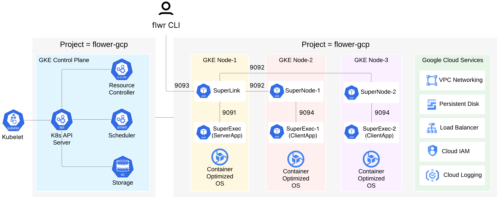

:og:description: A step-by-step guide to learn how to create, deploy and run a Flower app on the Google Cloud Platform (GCP) using the Google Kubernetes Engine (GKE).
.. meta::
    :description: A step-by-step guide to learn how to create, deploy and run a Flower app on the Google Cloud Platform (GCP) using the Google Kubernetes Engine (GKE).

###################
 Run Flower on GCP
###################

A step-by-step guide to learn how to create, deploy and run a Flower app on the `Google
Cloud Platform (GCP) <https://console.cloud.google.com>`_ using the `Google Kubernetes
Engine (GKE) <https://cloud.google.com/kubernetes-engine>`_. The figure below presents
an overview of the architecture of the Flower components we will deploy on GCP using
GKE. In this architecture, **ServerApps** and **ClientApps** are executed by the Flower
SuperExec (`flower-superexec`).

    Running Flower on GCP using GKE Architecture.

Part of this guide has also been presented during the `Flower AI Summit 2025
<https://flower.ai/events/flower-ai-summit-2025/>`_, by Prashant Kulkarni, GenAI
Security Engineer at Google Cloud.

.. youtube:: DoklGCdtrrc
    :align: center
    :width: 70%

*****************************
 Create a Kubernetes Cluster
*****************************

Here, we outline the steps to create a Kubernetes cluster in GCP through the GCP user
interface. Before proceeding, please make sure you have an account on GCP.

1. **Create GCP Project**: Once you have created the account, please create a new
   project, by selecting the project picker button, i.e., the button with the project
   name appearing at the top of the page. This will open a new window from where you can
   press the ``NEW PROJECT`` button and create the new project and assign a name, e.g.,
   ``flower-gcp``. Before proceeding to the next step, please ensure that the
   ``flower-gcp`` project is selected in the top left corner.
2. **Enable Kubernetes API**: After the GCP project is created, in the search bar at the
   top of the GCP page type ``Kubernetes Engine API`` and click on it (it has an ``API``
   icon). This will redirect you to the ``Kubernetes Engine API`` Product page. From
   there you need to select ``Enable``; if you see a ``Billing required`` pop-up, please
   check with your administrator to continue, if necessary. After you enable it you
   should see a green mark in the ``Kubernetes Engine API`` saying ``API Enabled``.
3. **Create Kubernetes Cluster**: in the home page of the GCP project, under the
   ``Products`` section, look for the tab called ``Create a Kubernetes Cluster``. This
   will redirect you to a page where you will see an overview of the existing Kubernetes
   clusters. At the top of the page you should see a button called ``Create cluster``.
   By default, the Kubernetes clusters are deployed using the ``Autopilot`` mode. For
   the current guide, we use the ``Autopilot`` mode.
4. **Configure Kubernetes Cluster**: in the page that is shown, we assign a name to the
   new cluster, e.g., ``quickstart-numpy`` and we select the region, e.g.,
   ``us-central1``. For the rest of the configuration settings, such as ``Cluster
   Tier``, ``Fleet Registration``, ``Networking``, and other settings we use the default
   values. Now, press the ``Create`` button.

.. note::

    Please wait for a couple of minutes until the cluster is ready and fully deployed.

****************************
 Configure Google Cloud SDK
****************************

To interact with our newly deployed Kubernetes cluster, we will use the Google Cloud SDK
and configure it locally. This SDK allows us to directly interact with GCP and in turn
with our recently deployed Kubernetes cluster.

To install the Google Cloud SDK, we first need to install and configure the ``gcloud``
CLI:

.. code-block:: bash

    # macOS
    curl https://sdk.cloud.google.com | bash  # and then follow on-screen prompts

    # macOS (w/ Homebrew)
    brew install --cask google-cloud-sdk

    # Windows
    # Download the Windows installer from the Google Cloud SDK page
    # https://dl.google.com/dl/cloudsdk/channels/rapid/GoogleCloudSDKInstaller.exe
    # Run the .exe installer and follow the on-screen instructions

    # Once the package is installed (e.g., using brew), we initialize gcloud as follows:
    gcloud init  # initialize with gcloud init.
    gcloud version  # verify installation

.. note::

    For more detailed installation instructions and for installing ``gcloud`` for
    different operating systems, please take look at the official ``gcloud`` CLI
    installation page https://cloud.google.com/sdk/docs/install

Once ``gcloud`` is installed we need to install ``kubectl``, which is a command-line
tool to interact with Kubernetes clusters:

.. code-block:: bash

    gcloud components install kubectl
    kubectl version --client  # this will show the installed versions of the Client and Kustomize

Before proceeding with the next steps, please make sure that you have an active account
selected, otherwise you will receive a ``ERROR:
(gcloud.container.clusters.get-credentials)`` when running the commands below. To obtain
new credentials or select an already authenticated account please run the following
commands

.. code-block:: bash

    gcloud auth login  # to obtain new credentials
    gcloud config set account <ACCOUNT>  # to select an already authenticated <ACCOUNT> that you want to use

Now you need to set the ``project`` property in your current workspace using the unique
project identifier, which can be found under the ID column when clicking on the project
picker.

.. code-block:: bash

    # glocud config set project
    gcloud config set project <YOUR_PROJECT_ID>  # <YOUR_PROJECT_ID> is not the project name but the project identifier, e.g., flower-gcp-XXXXXX

.. note::

    The <YOUR_PROJECT_ID> value will be different for each user, e.g., ``flower-gcp``,
    ``flower-gcp-XXXXXX``. Its value will be used in subsequent steps, e.g.,

The next step is to configure ``kubectl`` to point to the GKE cluster you created in the
previous steps by using the name of the cluster, e.g., ``quickstart-numpy``, and the
name of the region where the cluster was created:

.. code-block:: bash

    gcloud container clusters get-credentials quickstart-numpy --region us-central1

This will configure the required metadata and fetch the necessary credentials to allow
your local ``kubectl`` to communicate with the GKE cluster. To verify that ``kubectl``
was able to connect to the cluster and get the necessary information, you can run the
following command:

.. code-block:: bash

    kubectl config current-context  # this should return the Kubernetes cluster you are connected to

.. note::

    For more information on how ``kubectl`` works, please have a look at the following
    `official quick-reference guide
    <https://kubernetes.io/docs/reference/kubectl/quick-reference/>`_.

***********************************
 Create a Google Artifact Registry
***********************************

The Google Cloud Artifact Registry is a fully managed, scalable, and private service for
storing and managing software build artifacts and dependencies. Consequently, to run our
Flower app on the GKE cluster, we need to store the app's specific Flower Docker image
within the registry, i.e., the Flower SuperExec, which we discuss in the next section.
For typical use-cases, the Flower SuperLink and SuperNode Docker images do not need to
be built and can be pulled directly from the official `Flower DockerHub repository
<https://hub.docker.com/u/flwr>`_. This step is crucial as it enables the cluster, and
subsequently the ``Pods``, to download the built Docker images and deploy the necessary
Flower components. Please see below the instructions on how to create the repository
using the ``gcloud`` CLI:

.. code-block:: bash

    # Enable the Artifact Registry API service
    gcloud services enable artifactregistry.googleapis.com

    # Create the repository
    # gcloud artifacts repositories create <YOUR_REPOSITORY_NAME>
    gcloud artifacts repositories create flower-gcp-example-artifacts \
        --repository-format=docker \
        --location=us-central1

    # Configure Docker to Authenticate with Artifact Registry, e.g.:
    #   gcloud auth configure-docker <YOUR_REGION>-docker.pkg.dev
    gcloud auth configure-docker us-central1-docker.pkg.dev  # we use us-central1 as our region

Registry Validation & Permissions
=================================

The steps below validate that the Google Artifact Registry has been properly configured,
you have correct access and you have writing permissions to push the docker images
discussed in the next section.

.. code-block:: bash

    gcloud artifacts repositories list --location=us-central1  # this will list the items under the project with ID <YOUR_PROJECT_ID>

The above command shows that the ``flower-gcp-example-artifacts`` repository has been
successfully created under the specified project with ID ``<YOUR_PROJECT_ID>``. Finally,
you need to update your role and assign writing permissions to the artifact registry. To
accomplish this, please run the following command:

.. code-block:: bash

    gcloud projects add-iam-policy-binding <YOUR_PROJECT_ID> \  # <YOUR_PROJECT_ID> is the ID of the project
        --member="user:<YOUR_EMAIL@DOMAIN.COM>" \
        --role="roles/artifactregistry.writer"

************************************
 Configure Flower App Docker Images
************************************

To proceed with the next step, we first create a local Flower app and then define a
dedicated Dockerfile for the Docker image that will run SuperExec. Within SuperExec,
either ServerApp or ClientApp will be executed. After building the image, we tag it and
push it to the newly created Google registry. Most of the steps on how to build Docker
image discussed below are based on the `Flower Quickstart with Docker Tutorial
<https://flower.ai/docs/framework/docker/tutorial-quickstart-docker.html>`_.

We create the Flower NumPy app as follows:

.. code-block:: bash

    # flwr new <APP_ID>[==<APP_VERSION>]
    flwr new @flwrlabs/quickstart-numpy

Create Docker Images
====================

With ``flower-superexec``, **you do not need to bake your app code into the image**.
SuperExec receives and installs the Flower App Bundle (FAB) at runtime inside the
container, keeping your images lightweight.

.. note::

    SuperExec does **NOT** install dependencies at runtime. If your app requires
    additional dependencies, make sure they are included in your Docker image, as shown
    in the Dockerfile example below.

.. dropdown:: superexec.Dockerfile

    .. code-block:: bash
        :substitutions:

        # superexec.Dockerfile
        FROM flwr/superexec:|stable_flwr_version|

        WORKDIR /app

        COPY pyproject.toml .
        RUN sed -i 's/.*flwr\[simulation\].*//' pyproject.toml \
           && python -m pip install -U --no-cache-dir .

        ENTRYPOINT ["flower-superexec"]

Once we have created the required Dockerfile, we build the Docker Image as follows:

.. important::

    Before running the commands below, make sure ``Docker`` is installed and it is up
    running. The ``--platform`` type is set to ``linux/amd64``, because when using the
    ``Autopilot`` mode, all ``Pods`` in the Kubernetes cluster (by default) are deployed
    with an ``amd64``-based architecture.

.. code-block:: bash

    docker build --platform linux/amd64 -f superexec.Dockerfile -t flower_numpy_example_superexec:0.0.1 .

Tag Docker Images
=================

Before we are able to push our two newly locally created Docker images, we need to tag
them with the Google Artifact Registry repository name and image name we created during
the previous steps. If you have followed the earlier naming suggestions, the repository
name is ``flower-gcp-example-artifacts``, the local Docker image name is
``flower_numpy_example_superexec:0.0.1``, and the region is ``us-central1``. Please note
that the ``<YOUR_PROJECT_ID>`` is different from user to user, so in the commands below
we use the ``<YOUR_PROJECT_ID>`` placeholder. Putting all this together, the final
command you need to run to tag the ``SuperExec`` Docker image is:

.. code-block:: bash

    # docker tag YOUR_IMAGE_NAME YOUR_REGION-docker.pkg.dev/YOUR_PROJECT_ID/YOUR_REPOSITORY_NAME/YOUR_IMAGE_NAME:YOUR_TAG

    # please change <YOUR_PROJECT_ID> to point to your project identifier
    docker tag flower_numpy_example_superexec:0.0.1 us-central1-docker.pkg.dev/<YOUR_PROJECT_ID>/flower-gcp-example-artifacts/flower_numpy_example_superexec:0.0.1

Push Docker Images
==================

Once our image is tagged correctly, you can push it to your ``Artifact Registry``
repository using the ``docker push`` command with the tagged name:

.. code-block:: bash

    # docker push YOUR_REGION-docker.pkg.dev/<YOUR_PROJECT_ID>/YOUR_REPOSITORY_NAME/YOUR_IMAGE_NAME:YOUR_TAG

    # please change <YOUR_PROJECT_ID> to point to your project identifier
    docker push us-central1-docker.pkg.dev/<YOUR_PROJECT_ID>/flower-gcp-example-artifacts/flower_numpy_example_superexec:0.0.1

******************************
 Deploy Flower Infrastructure
******************************

Before running our Flower app, we first need to deploy our ``Pods`` on the Kubernetes
cluster.

In this step, we shall deploy six ``Pods``: 1x ``SuperLink``, 2x ``SuperNode``, 2x
``SuperExec(ClientApp)``, and 1x ``SuperExec(ServerApp)``. To achieve this, below we
provide the definition of the six ``yaml`` files that are necessary to deploy the
``Pods`` on the cluster and which are passed to ``kubectl``, and a helper
``k8s-deploy.sh`` script, which will deploy the ``Pods``.

.. dropdown:: superlink-deployment.yaml

    .. code-block:: bash
        :substitutions:

        apiVersion: apps/v1
        kind: Deployment
        metadata:
          name: superlink
        spec:
          replicas: 1
          selector:
            matchLabels:
              app: superlink
          template:
            metadata:
              labels:
                app: superlink
            spec:
              containers:
              - name: superlink
                image: flwr/superlink:|stable_flwr_version|
                args:
                  - "--insecure"
                  - "--isolation"
                  - "process"
                ports:  # which ports to expose/available
                - containerPort: 9091
                - containerPort: 9092
                - containerPort: 9093
        ---
        apiVersion: v1
        kind: Service
        metadata:
          name: superlink-service
        spec:
          selector:
            app: superlink
          ports:  # like a dynamic IP routing table/mapping that routes traffic to the designated ports
          - protocol: TCP
            port: 9091   # Port for ServerApp connection
            targetPort: 9091  # the SuperLink container port
            name: superlink-serverappioapi
          - protocol: TCP
            port: 9092   # Port for SuperNode connection
            targetPort: 9092  # the SuperLink container port
            name: superlink-fleetapi
          - protocol: TCP
            port: 9093   # Port for Flower app submission
            targetPort: 9093  # the SuperLink container port
            name: superlink-controlapi
          type: LoadBalancer  # balances workload, makes the service publicly available

.. dropdown:: supernode-1-deployment.yaml

    .. code-block:: bash
        :substitutions:

        apiVersion: apps/v1
        kind: Deployment
        metadata:
          name: supernode-1
        spec:
          replicas: 1
          selector:
            matchLabels:
              app: supernode-1
          template:
            metadata:
              labels:
                app: supernode-1
            spec:
              containers:
              - name: supernode
                image: flwr/supernode:|stable_flwr_version|
                args:
                  - "--insecure"
                  - "--superlink"
                  - "superlink-service:9092"
                  - "--clientappio-api-address"
                  - "0.0.0.0:9094"
                  - "--isolation"
                  - "process"
                ports:
                - containerPort: 9094
        ---
        apiVersion: v1
        kind: Service
        metadata:
          name: supernode-1-service
        spec:
          selector:
            app: supernode-1
          ports:
          - protocol: TCP
            port: 9094
            targetPort: 9094

.. dropdown:: supernode-2-deployment.yaml

    .. code-block:: bash
        :substitutions:

        apiVersion: apps/v1
        kind: Deployment
        metadata:
          name: supernode-2
        spec:
          replicas: 1
          selector:
            matchLabels:
              app: supernode-2
          template:
            metadata:
              labels:
                app: supernode-2
            spec:
              containers:
              - name: supernode
                image: flwr/supernode:|stable_flwr_version|
                args:
                  - "--insecure"
                  - "--superlink"
                  - "superlink-service:9092"
                  - "--clientappio-api-address"
                  - "0.0.0.0:9094"
                  - "--isolation"
                  - "process"
                ports:
                - containerPort: 9094
        ---
        apiVersion: v1
        kind: Service
        metadata:
          name: supernode-2-service
        spec:
          selector:
            app: supernode-2
          ports:
          - protocol: TCP
            port: 9094
            targetPort: 9094

.. dropdown:: superexec-serverapp-deployment.yaml

    .. code-block:: bash

        apiVersion: apps/v1
        kind: Deployment
        metadata:
          name: superexec-serverapp
        spec:
          replicas: 1
          selector:
            matchLabels:
              app: superexec-serverapp
          template:
            metadata:
              labels:
                app: superexec-serverapp
            spec:
              containers:
              - name: superexec-serverapp
                # please change <YOUR_PROJECT_ID> to point to your project identifier
                image: us-central1-docker.pkg.dev/<YOUR_PROJECT_ID>/flower-gcp-example-artifacts/flower_numpy_example_superexec:0.0.1
                args:
                  - "--insecure"
                  - "--appio-api-address"
                  - "superlink-service:9091"
                  - "--plugin-type"
                  - "serverapp"

.. dropdown:: superexec-clientapp-1-deployment.yaml

    .. code-block:: bash

        apiVersion: apps/v1
        kind: Deployment
        metadata:
          name: superexec-clientapp-1
        spec:
          replicas: 1
          selector:
            matchLabels:
              app: superexec-clientapp-1
          template:
            metadata:
              labels:
                app: superexec-clientapp-1
            spec:
              containers:
              - name: superexec-clientapp
                # please change <YOUR_PROJECT_ID> to point to your project identifier
                image: us-central1-docker.pkg.dev/<YOUR_PROJECT_ID>/flower-gcp-example-artifacts/flower_numpy_example_superexec:0.0.1
                args:
                  - "--insecure"
                  - "--appio-api-address"
                  - "supernode-1-service:9094"
                  - "--plugin-type"
                  - "clientapp"

.. dropdown:: superexec-clientapp-2-deployment.yaml

    .. code-block:: bash

        apiVersion: apps/v1
        kind: Deployment
        metadata:
          name: superexec-clientapp-2
        spec:
          replicas: 1
          selector:
            matchLabels:
              app: superexec-clientapp-2
          template:
            metadata:
              labels:
                app: superexec-clientapp-2
            spec:
              containers:
              - name: superexec-clientapp
                # please change <YOUR_PROJECT_ID> to point to your project identifier
                image: us-central1-docker.pkg.dev/<YOUR_PROJECT_ID>/flower-gcp-example-artifacts/flower_numpy_example_superexec:0.0.1
                args:
                  - "--insecure"
                  - "--appio-api-address"
                  - "supernode-2-service:9094"
                  - "--plugin-type"
                  - "clientapp"

Once you have created the required files, you can use the following ``k8s-deploy.sh``
helper script to deploy all the ``Pods``.

.. important::

    Make sure the Flower version you use to deploy the ``Pods`` matches the version of
    your Flower app.

.. dropdown:: k8s-deploy.sh

    .. code-block:: bash

        #! /bin/bash -l

        # Change directory to the yaml files directory
        cd "$(dirname "${BASH_SOURCE[0]}")"

        kubectl apply -f superlink-deployment.yaml
        sleep 0.1

        kubectl apply -f supernode-1-deployment.yaml
        sleep 0.1

        kubectl apply -f supernode-2-deployment.yaml
        sleep 0.1

        kubectl apply -f superexec-serverapp-deployment.yaml
        sleep 0.1

        kubectl apply -f superexec-clientapp-1-deployment.yaml
        sleep 0.1

        kubectl apply -f superexec-clientapp-2-deployment.yaml
        sleep 0.1

To see that your ``Pods`` are deployed, please go to the ``Navigation Menu`` on the
Google Console, select ``Kubernetes Engine`` and then the ``Workloads`` page. The new
window that appears will show the status of the ``Pods`` under deployment.

.. caution::

    Please wait for a couple of minutes (3' to 5' minutes should be enough) before the
    ``Pods`` are up and running. While ``Pods`` resources are being provisioned, some
    warnings are expected.

****************
 Run Flower App
****************

Once all ``Pods`` are up and running, we need to get the ``EXTERNAL_IP`` of the
``superlink-service`` and point our Flower app to use the Kubernetes cluster to submit
and execute the job.

To get the ``EXTERNAL-IP`` of the ``superlink-service`` we run the following command,
which will show the ``NAME``, ``TYPE``, ``CLUSTER-IP``, ``EXTERNAL-IP`` and ``PORTS`` of
the service:

.. code-block:: bash

    kubectl get service superlink-service

After we get the ``EXTERNAL-IP`` , we go to the directory of the Flower example, we open
the ``pyproject.toml`` and then add the following section at the end of the file:

.. code-block:: bash

    [tool.flwr.federations.gcp-deployment]
    address = "<EXTERNAL_IP>:9093" # replace the EXTERNAL_IP with the correct value
    insecure = true

Then we can execute the example on the GCP cluster by running:

.. code-block:: bash

    flwr run . gcp-deployment --stream

.. note::

    Please note that in the current deployment, communication is not encrypted. To
    enable TLS for secure connections, check the following `guide
    <https://flower.ai/docs/framework/how-to-enable-tls-connections.html>`_. We will
    also be updating the current guide soon with more details on how to configure TLS.

If the job is successfully submitted, and executed, then in your console you should see
the logs from the run. The output should look like the one shared below.

.. dropdown:: Expected Output

    .. code-block:: shell

        Loading project configuration...
        Success
        🎊 Successfully built flower.quickstart-numpy.1-0-0.ba270a25.fab
        🎊 Successfully started run 2796207907461390277
        INFO :      Starting logstream for run_id `2796207907461390277`
        INFO :      Start `flwr-serverapp` process
        🎊 Successfully installed quickstart-numpy to /app/.flwr/apps/flower.quickstart-numpy.1.0.0.ba270a25.
        INFO :      Starting FedAvg strategy:
        INFO :          ├── Number of rounds: 3
        INFO :          ├── ArrayRecord (0.00 MB)
        INFO :          ├── ConfigRecord (train): (empty!)
        INFO :          ├── ConfigRecord (evaluate): (empty!)
        INFO :          ├──> Sampling:
        INFO :          │       ├──Fraction: train (1.00) | evaluate ( 1.00)
        INFO :          │       ├──Minimum nodes: train (2) | evaluate (2)
        INFO :          │       └──Minimum available nodes: 2
        INFO :          └──> Keys in records:
        INFO :                  ├── Weighted by: 'num-examples'
        INFO :                  ├── ArrayRecord key: 'arrays'
        INFO :                  └── ConfigRecord key: 'config'
        INFO :
        INFO :
        INFO :      [ROUND 1/3]
        INFO :      configure_train: Sampled 2 nodes (out of 2)
        INFO :      aggregate_train: Received 2 results and 0 failures
        INFO :          └──> Aggregated MetricRecord: {'random_metric': 0.6692931409515264}
        INFO :      configure_evaluate: Sampled 2 nodes (out of 2)
        INFO :      aggregate_evaluate: Received 2 results and 0 failures
        INFO :          └──> Aggregated MetricRecord: {'random_metric': [0.4880010858339962, 0.3087008997447846, 0.6336219116058434]}
        INFO :
        INFO :      [ROUND 2/3]
        INFO :      configure_train: Sampled 2 nodes (out of 2)
        INFO :      aggregate_train: Received 2 results and 0 failures
        INFO :          └──> Aggregated MetricRecord: {'random_metric': 0.5360441357065859}
        INFO :      configure_evaluate: Sampled 2 nodes (out of 2)
        INFO :      aggregate_evaluate: Received 2 results and 0 failures
        INFO :          └──> Aggregated MetricRecord: {'random_metric': [0.25413977771677904, 0.33788546118090673, 0.64626655554784]}
        INFO :
        INFO :      [ROUND 3/3]
        INFO :      configure_train: Sampled 2 nodes (out of 2)
        INFO :      aggregate_train: Received 2 results and 0 failures
        INFO :          └──> Aggregated MetricRecord: {'random_metric': 0.04090013167984635}
        INFO :      configure_evaluate: Sampled 2 nodes (out of 2)
        INFO :      aggregate_evaluate: Received 2 results and 0 failures
        INFO :          └──> Aggregated MetricRecord: {'random_metric': [0.7990976665955934, 0.20095453623327086, 0.6090265112641057]}
        INFO :
        INFO :      Strategy execution finished in 14.66s
        INFO :
        INFO :      Final results:
        INFO :
        INFO :          Global Arrays:
        INFO :                  ArrayRecord (0.000 MB)
        INFO :
        INFO :          Aggregated ClientApp-side Train Metrics:
        INFO :          { 1: {'random_metric': '6.6929e-01'},
        INFO :            2: {'random_metric': '5.3604e-01'},
        INFO :            3: {'random_metric': '4.0900e-02'}}
        INFO :
        INFO :          Aggregated ClientApp-side Evaluate Metrics:
        INFO :          { 1: {'random_metric': "['4.8800e-01', '3.0870e-01', '6.3362e-01']"},
        INFO :            2: {'random_metric': "['2.5414e-01', '3.3789e-01', '6.4627e-01']"},
        INFO :            3: {'random_metric': "['7.9910e-01', '2.0095e-01', '6.0903e-01']"}}
        INFO :
        INFO :          ServerApp-side Evaluate Metrics:
        INFO :          {}
        INFO :

.. note::

    Please note that if you terminate or shut down the cluster, and create a new one,
    the value of the ``EXTERNAL_IP`` changes. In that case, you will have to update the
    ``pyproject.toml``.

********************************
 Shutdown Flower Infrastructure
********************************

If you would like to shutdown all the running pods deployed during this guide, you can
use the ``kubectl delete`` command and pass the the ``.yaml`` file of each pod, as also
shown in the helper script below.

.. dropdown:: k8s-shutdown.sh

    .. code-block:: bash

        #! /bin/bash -l

        # Change directory to the yaml files directory
        cd "$(dirname "${BASH_SOURCE[0]}")"

        kubectl delete -f superlink-deployment.yaml
        sleep 0.1

        kubectl delete -f supernode-1-deployment.yaml
        sleep 0.1

        kubectl delete -f supernode-2-deployment.yaml
        sleep 0.1

        kubectl delete -f superexec-serverapp-deployment.yaml
        sleep 0.1

        kubectl delete -f superexec-clientapp-1-deployment.yaml
        sleep 0.1

        kubectl delete -f superexec-clientapp-2-deployment.yaml
        sleep 0.1
