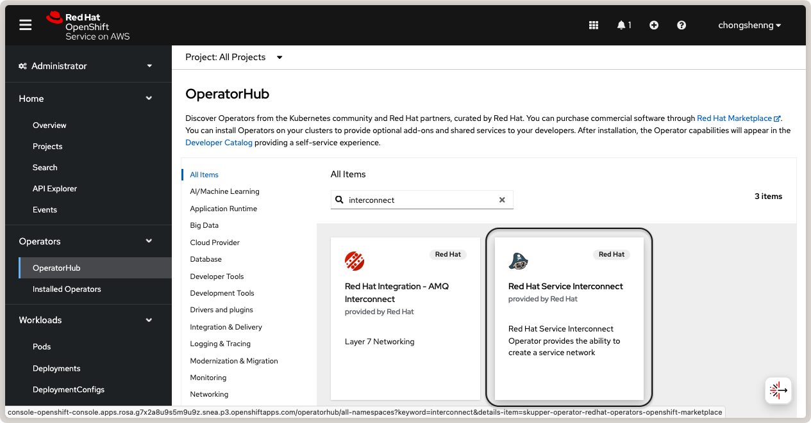
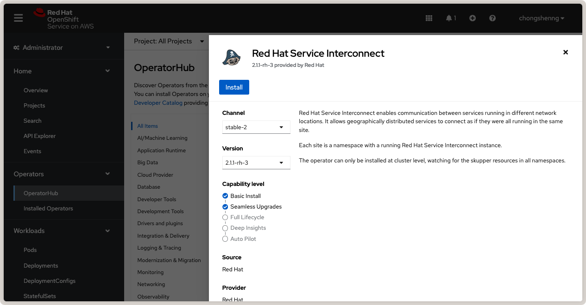

:og:description: Deploy Flower across OpenShift Clusters using Red Hat Service Interconnect for secure, scalable federated AI across environments.
.. meta::
    :description: Deploy Flower across OpenShift Clusters using Red Hat Service Interconnect for secure, scalable federated AI across environments.

###########################################
 Run Flower on Multiple OpenShift Clusters
###########################################

In this guide, you will learn how to deploy Flower in multiple `Red Hat OpenShift (RHOS)
<https://www.redhat.com/en/technologies/cloud-computing/openshift>`_ application
platforms. This deployment pattern is useful when connecting multiple OpenShift clusters
deployed in environments that run critical workloads, such as in secure research
environments (also known as trusted research environments, or `secure data environments
<https://digital.nhs.uk/services/secure-data-environment-service>`_), datacenters,
high-performance computing clusters, or on-premises servers.

.. note::

    This guide assumes you have a working knowledge of OpenShift and have deployed
    Flower in a single OpenShift cluster before. If you are new to OpenShift or Flower,
    please refer to our guide on `how to run Flower on OpenShift
    <how-to-run-flower-on-red-hat-openshift.rst>`_ before proceeding with this
    multi-cluster deployment.

To connect multiple OpenShift clusters, we will use `Red Hat Service Interconnect
<https://www.redhat.com/en/technologies/cloud-computing/service-interconnect>`_. Based
on the open source `Skupper <https://skupper.io/>`_ project, the Service Interconnect
simplifies connections between sites. Applications and services, such as SuperLink and
SuperNodes, can communicate with each other using the interconnect as if they were in
the same network.

Skupper works by creating a site in each cluster, with a router (or routers) that
connect to other sites over the application network. The application network is the
network that connects multiple K8s clusters. So, the cluster where SuperLink is deployed
requires a Skupper site to accept links and route incoming traffic and the cluster where
SuperNode is deployed must have a Skupper site to join the application network and route
outgoing requests via the interconnect.

****************
 Pre-requisites
****************

- Install the Skupper CLI on your local system by following the instructions `on the
  Skupper website
  <https://skupper.io/docs/install/index.html#installing-the-skupper-cli>`_.
- Install Kubectl tools on your local system by following the instructions `on the
  Kubernetes website <https://kubernetes.io/docs/tasks/tools/>`_.

***************************
 Create OpenShift Clusters
***************************

For this guide, we will create two OpenShift clusters using the ``Red Hat OpenShift
Service on AWS (ROSA)``. Follow the steps in our companion guide `here
<how-to-run-flower-on-red-hat-openshift.rst#create-a-red-hat-openshift-cluster-on-aws>`_
on deploying the clusters. In this guide, we will assume that your clusters are deployed
in different AWS regions or availability zones.

Next, deploy SuperLink in the first cluster. For reference, you can follow the
`deployment steps
<how-to-run-flower-on-red-hat-openshift.rst#deploy-flower-superlink-and-supernodes-on-openshift>`_
in our companion guide.

***************************************
 Install Service Interconnect Operator
***************************************

In each OpenShift cluster, install the Red Hat Service Interconnect Operator from the
OperatorHub:

    Search for Red Hat Service Interconnect Operator on OperatorHub.

.. raw:: html

    

    Install Red Hat Service Interconnect Operator from OperatorHub.

**********************
 Create Skupper Sites
**********************

From your local system, you will now create a Skupper site in each OpenShift cluster and
connect the sites to form an application network.

First, set the namespace in your CLI by logging in to your first OpenShift cluster (the
one with SuperLink deployed):

.. code-block:: shell

    oc login --server=<your-openshift-api-endpoint> --web

If successful, you should see a message similar to this:

.. code-block:: console

    $ oc login --server=<your-openshift-api-endpoint> --web
    Opening login URL in the default browser: [...]
    Login successful.

    You have access to 81 projects, the list has been suppressed. You can list all projects with 'oc projects'

    Using project "default".

Now, switch the project to the project name (i.e. namespace) where you deployed
SuperLink:

.. code-block:: shell

    oc project <your-namespace>

In our `previous guide <how-to-run-flower-on-red-hat-openshift>`_, we used the project
name ``flower-openshift-demo``, so let's do that:

.. code-block:: console

    $ oc project flower-openshift-demo
    Now using project "flower-openshift-demo" on server "<your-openshift-api-endpoint>".

.. tip::

    If you are unsure of the project name, you can list all projects you have access to
    using the command ``oc projects``. You can also check that you are in the correct
    context by running ``oc whoami --show-context``.

With the correct namespace set, create a Skupper site in this cluster:

.. code-block:: shell

    skupper site create superlink-interconnect --enable-link-access

This command creates a Skupper site named ``superlink-interconnect`` and the
``--enable-link-access`` option enables external access for links *from* remote sites;
this option is necessary for the site where SuperLink is deployed so that SuperNodes in
other clusters can connect to it. You should see output similar to this:

.. code-block:: console

    $ skupper site create superlink-interconnect --enable-link-access
    Waiting for status...
    Site "superlink-interconnect" is ready.

Finally, repeat the steps above to create a Skupper site in the second OpenShift cluster
(where SuperNode will be deployed). Log in to the second cluster, switch to the correct
namespace, and create the Skupper site:

.. code-block:: shell

    oc login --server=<your-openshift-api-endpoint> --web
    oc project <your-namespace>
    skupper site create supernode-1-interconnect

Note that the namespace can be different from the first cluster and depends on the
*project name* you created in the second cluster. Note also that we do not use the
``--enable-link-access`` option in the Skupper command because this site only needs to
connect *to* the SuperLink site.

********************
 Link Skupper Sites
********************

Now that we have created Skupper sites in both clusters, we will link the sites to form
an application network.

From your local system and in the namespace of the SuperLink cluster, generate a
``Link`` resource as follows:

.. code-block:: shell

    skupper link generate > superlink-interconnect-link.yaml \
        --namespace flower-openshift-demo

.. tip::

    For more information about the concepts of sites and links, please refer to the
    `Skupper Link concepts
    <https://skupperproject.github.io/refdog/concepts/link.html>`_.

This command generates a ``Link`` resource and saves it to the file
``superlink-interconnect-link.yaml``. The ``--namespace`` option specifies the namespace
of the SuperLink cluster.

With the ``Link`` resource generated, switch to the namespace of the SuperNode cluster,
and apply the resource in it:

.. code-block:: shell

    kubectl apply -f superlink-interconnect-link.yaml

You should see output similar to this:

.. code-block:: console

    $ kubectl apply -f superlink-interconnect-link.yaml
    link.skupper.io/link-superlink-interconnect-skupper-router created
    secret/link-superlink-interconnect created

To verify the status of the link, run the following command:

.. code-block:: shell

    skupper link status

You might need to issue the command multiple times before the link is ready:

.. code-block:: console

    $ skupper link status
    NAME                                            STATUS  COST    MESSAGE
    link-superlink-interconnect-skupper-router      Pending 1       Not Operational

    $ skupper link status
    NAME                                            STATUS  COST    MESSAGE
    link-superlink-interconnect-skupper-router      Ready   1       OK

********************
 Create a Connector
********************

A connector binds a local connection endpoint to connectors in remote sites, which in
this case is the SuperNode cluster. This allows SuperLink to communicate with SuperNode.
Listeners and connectors are matched using routing keys. In the first cluster (where
SuperLink is deployed), create a connector using the following command:

.. code-block:: shell

    skupper connector create <name> <port> [--routing-key <name> --workload <workload-name>]

Here, ``<name>`` is a name for the connector, ``<port>`` is the port number that the
connector will listen on, and ``--workload <workload-name>`` is an optional argument
that specifies the name of a workload (i.e. deployment) to associate with the connector.
The ``<name>`` is the default routing key if the ``--routing-key`` option is not
specified.

In our deployment, SuperLink listens on port ``9092`` corresponding to the Fleet API
(for more details, read our reference on `Flower network communication
<ref-flower-network-communication.rst#flower-components-apis>`_). Since we have given
the SuperLink deployment the name ``superlink``, we will use that as the workload name:

.. code-block:: console

    $ skupper connector create fleet-api 9092 --workload deployment/superlink
    Waiting for create to complete...
    Connector "fleet-api" is configured.

*******************
 Create a Listener
*******************

A listener binds a local connection endpoint to connectors in remote sites, which in
this case is the SuperLink cluster. This allows SuperNode to communicate with SuperLink.
On the second cluster (where SuperNode will be deployed), create a listener using the
following command:

.. code-block:: shell

    skupper listener create <name> <port> [options]

The ``<name>`` is the name of the listener resource, and will be the default routing key
and host if the ``--routing-key`` and ``--host`` options are not specified. In our case,
the ``<name>`` must match the name of the connector we created in the SuperLink cluster,
which is ``fleet-api``. The ``<port>`` is the port number that the listener will listen
on, which must also match the port number of the connector (``9092``):

.. code-block:: console

    $ skupper listener create fleet-api 9092
    Waiting for create to complete...
    Listener "fleet-api" is configured.

**************************************************
 Deploy SuperNode in a Separate OpenShift Cluster
**************************************************

With the listener created, we can now deploy SuperNode in the second OpenShift cluster
using the listener service created by Skupper. The listener service is a Kubernetes
service that Skupper automatically creates when you create a listener. You can find the
DNS of the listener service by navigating to the OpenShift console > Networking >
Services, and look for the service named ``fleet-api``. The ``Hostname`` is listed under
the ``Service details`` section.

Copy and paste the following YAML definition for the SuperNode pod.

.. dropdown:: supernode-1-deployment.yaml

    .. code-block:: bash
        :substitutions:

        apiVersion: apps/v1
        kind: Deployment
        metadata:
          name: supernode-1
          namespace: flower-supernode-1
        spec:
          replicas: 1
          selector:
            matchLabels:
              app: supernode-1
          template:
            metadata:
              labels:
                app: supernode-1
            spec:
              # Ensures mounted volumes are writable by the pod's non-root user on OpenShift
              securityContext:
                runAsNonRoot: true
              containers:
              - name: supernode
                image: flwr/supernode:|stable_flwr_version|
                args:
                  - "--insecure"
                  - "--superlink"
                  - "<listener-service-dns>:9092" # Use the listener service DNS
                  - "--clientappio-api-address"
                  - "0.0.0.0:9094"
                ports:
                - containerPort: 9094
                volumeMounts:
                - name: cache-volume
                  mountPath: /app/.cache
                - name: tmp-volume
                  mountPath: /var/tmp
                - name: fab-volume
                  mountPath: /app/.flwr
                - name: config-volume
                  mountPath: /app/.config
              volumes:
              - name: cache-volume
                emptyDir:
                  sizeLimit: 50Mi
              - name: tmp-volume
                emptyDir:
                  sizeLimit: 50Mi
              - name: fab-volume
                emptyDir:
                  sizeLimit: 50Mi
              - name: config-volume
                emptyDir:
                  sizeLimit: 50Mi

Now, when you check the logs of the SuperLink pod in the first OpenShift cluster, you
should see that the SuperNode has successfully connected to it from the remote cluster.

Congratulations! You have successfully deployed and run SuperLink and SuperNode in
different OpenShift clusters. You can further extend your federation by deploying
additional SuperNodes in other clusters by repeating the steps above.

This deployment pattern allows you to scale your Flower deployment across multiple
clusters where secure deployment platforms like OpenShift are required, making it
suitable for critical workloads in research environments, datacenters, and on-premises
servers.

************
 References
************

To learn more about Red Hat Service Interconnect and Skupper concepts, please refer to
the following resources:

- `Red Hat Service Interconnect webpage
  <https://www.redhat.com/en/technologies/cloud-computing/service-interconnect>`_
- `Skupper concepts <https://skupperproject.github.io/refdog/concepts/>`_

For further reading about deploying Flower with Red Hat, Docker, and Kubernetes, check
out our guides below:

- :doc:`How to run Flower on Red Hat OpenShift <how-to-run-flower-on-red-hat-openshift>`
- :doc:`How to run Flower with Docker <docker/index>`
- :doc:`How to run Flower with Helm <helm/index>`

To learn about running Flower on other cloud platforms, check out our guides below:

- :doc:`How to run Flower on Microsoft Azure <how-to-run-flower-on-azure>`
- :doc:`How to run Flower on Google Cloud Platform <how-to-run-flower-on-gcp>`
