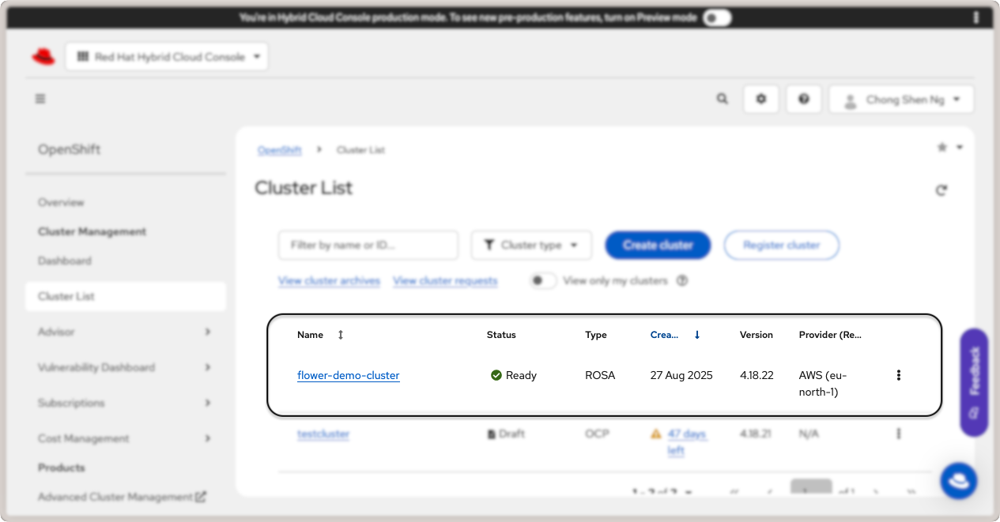

:og:description: A step-by-step guide to learn how to create, deploy and run a Flower app on Red Hat OpenShift using the Red Hat OpenShift Service on AWS.
.. meta::
    :description: A step-by-step guide to learn how to create, deploy and run a Flower app on Red Hat OpenShift using the Red Hat OpenShift Service on AWS.

Run Flower on Red Hat OpenShift
===============================

In this guide, you will learn how to create, deploy, and run a Flower app on the `Red
Hat OpenShift (RHOS)
<https://www.redhat.com/en/technologies/cloud-computing/openshift>`_ application
platform. The platform will be hosted in AWS and we will follow the steps to install the
cluster on installer-provisioned infrastructure using the `Red Hat OpenShift Service on
AWS <https://aws.amazon.com/rosa/>`_.

Login to Red Hat OpenShift Console
----------------------------------

Start by logging in to your `Red Hat Hybrid Cloud Console
<https://console.redhat.com/>`_ and click on ``OpenShift`` link in the ``Red Hat
OpenShift`` card.

.. figure:: ./_static/rhos/rh_console.png
    :align: center
    :width: 90%
    :alt: Red Hat OpenShift link in Red Hat Hybrid Cloud Console

    Red Hat OpenShift link in the cloud console.

This will take you to the OpenShift console. Under ``Overview``, look for the ``Red Hat
OpenShift Service on AWS (ROSA)`` card and click on ``Create Cluster``. You will be
taken to the page to setup a Red Hat OpenShift service on AWS. There are two
pre-requisites that you have to fulfill before you can create a cluster:

1. AWS Pre-requisites - Sets up your AWS account for deploying ROSA.
2. ROSA Pre-requisites - Installs the ROSA CLI tool on your system and login to your Red
   Hat account.

Complete AWS Pre-requisites
~~~~~~~~~~~~~~~~~~~~~~~~~~~

Follow the steps required to fulfill the pre-requisites for AWS to create and manage a
Red Hat OpenShift cluster:

1. Enable RHOS service on AWS (ROSA) in your AWS account.
2. Ensure that you have sufficient service quotas for ROSA.
3. Create a service-linked role for Elastic Load Balancing. This should be automatically
   creatd for you if not present.
4. Link your AWS and Red Hat account.
5. Create AWS Identity and Access Management (IAM) roles. You will need to create an IAM
   user with these required permissions:

   - ``AmazonEC2FullAccess``
   - ``AWSCloudFormationFullAccess``
   - ``IAMFullAccess``
   - ``ServiceQuotasReadOnlyAccess``

For more details, refer to the RHOS getting started guide from your AWS console.

Complete ROSA Pre-requisites
~~~~~~~~~~~~~~~~~~~~~~~~~~~~

Follow the steps shown in the section to download and install the ROSA CLI tool.

Next, install the |aws_cli_link|_ CLI tool for your system. You can alternatively run it
with Docker using the command:

.. code-block:: shell

    docker run --rm -it --volume ~/.aws:/root/.aws public.ecr.aws/aws-cli/aws-cli

The ``--volume ~/.aws:/root/.aws`` option mounts your AWS credentials to the Docker
container. Next, run the following to configure the AWS CLI tool and provide your AWS
credentials for the IAM user you created earlier:

.. code-block:: shell

    ➜ aws configure
    AWS Access Key ID [None]: [...]
    AWS Secret Access Key [None]: [...]
    Default region name [None]: [...]  # your region
    Default output format [None]: table  # the recommended output format

Download and install the ROSA CLI tool by following the instructions for your operating
system. Once you have installed the ROSA CLI tool, login with your Red Hat account:

.. code-block:: shell

    ➜ rosa login --use-auth-code
    I: You will now be redirected to Red Hat SSO login
    I: Token received successfully
    I: Logged in as '[...]' on 'https://api.openshift.com'
    I: To switch accounts, logout from https://sso.redhat.com and run `rosa logout` before attempting to login again

If you are already logged into your Red Hat account on your browser, you will be
redirected back to your terminal.

Then, create the necessary account-wide roles and policies:

.. code-block:: shell

    ➜ rosa create account-roles --mode auto

Finally, create a Virtual Private Network (VPC) for your cluster:

.. code-block:: shell

    ➜ rosa create network
    ...
    INFO[0177] Stack rosa-network-stack-[...] created

With the AWS and ROSA pre-requisites completed, you are now ready to deploy a cluster.

Create a Red Hat OpenShift Cluster on AWS
-----------------------------------------

There are three ways to create the cluster: via ``rosa`` CLI, web interface, or with
Terraform. For this guide, we will use the web interface. Click on the ``Create with web
interface`` button in the ``Deploy with web interface`` card:

.. figure:: ./_static/rhos/rhos_deploy_web_interface.png
    :align: center
    :width: 90%
    :alt: Deploy Red Hat OpenShift cluster with web interface

    Deploy Red Hat OpenShift cluster with web interface.

You will be taken to a series of steps to create a ROSA cluster. In the following, some
key steps are highlighted and we recommend that you follow the official guide in the Red
Hat Cloud Console for more details.

1. **Define Control Plane** - Select the ROSA hosted architecture and click on ``Next``.
2. **Accounts and Roles** - Ensure the infrastructure and billing account details are
   correct and click ``Next``.
3. **Cluster settings**

   1. **Details** - Specify ``flower-demo-cluster`` as the ``Cluster name``. For this
      guide, select version ``4.18.22`` (you may select a newer version that suits your
      requirements). Select the AWS region appropriate for your AWS account.
   2. **Machine Pool** - Select an EC2 compute node instance type that is available in
      your region. In this guide, we use the``eu-north-1`` region, and therefore
      selected ``m6i.2xlarge - 8 vCPU 32 GiB RAM``. Enable autoscaling and set the
      minimum node count to 2 and maximum to 4. This allows the cluster to scale up when
      you deploy the OpenShift platform and OpenShift AI in the same cluster.

4. **Networking**

   1. **Configuration** - Under "Cluster privacy", select ``public`` and leave other
      values as defaults.
   2. **CIDR ranges** - Leave the default CIDR ranges as is.

5. **Cluster roles and policies** - Follow the steps to create a new OIDC config ID.
6. **Cluster updates** - Leave the default settings as is to "Recurring updates".
7. Finally, review the cluster details and click ``Create cluster``.

This will start the cluster creation process and may take several minutes to complete.
You will be able to monitor the installation status of the control plane and machine
pools in the "Overview" tab.

Once your cluster is created, you will be prompted to create an identity provider to
access the cluster. Click on the ``Create identity provider`` link and follow the steps
for your preferred OIDC provider. Grant the user in your OIDC provider the
``cluster-admin`` rights so that you can add apps from the OperatorHub later. To do so,
go to ``Access control``, ``Cluster Roles and Access`` tab, and click on ``Add user``.
Enter the user ID from your OIDC provider and save the changes.

Your cluster is now ready. To view the cluster details, click on the ``Cluster List``
link in the left sidebar. Click on your cluster name (``flower-demo-cluster``) to view
the cluster details:

    Red Hat OpenShift cluster details.

To access the OpenShift web console, click on the ``Open console`` link in the top
right. You will be redirected to your OIDC provider to login. Once logged in, you will
be taken to the OpenShift web console:

.. figure:: ./_static/rhos/rhos_console.png
    :align: center
    :width: 90%
    :alt: Red Hat OpenShift web console

    Red Hat OpenShift web console.

Congratulations! You now have a running Red Hat OpenShift cluster on AWS. Now, let's
walk through how to deploy Flower on your OpenShift cluster.

Deploy Flower SuperLink and SuperNodes on OpenShift
---------------------------------------------------

With the OpenShift cluster active, we can now deploy SuperLink and SuperNode pods and
run a federated workload. In this guide, we will deploy four
pods: 1x SuperLink, 2x SuperNodes, and 1x service pod to route the traffic to the
designated ports in the SuperLink.

First, we need to create an OpenShift project which is equivalent of a Kubernetes
namespace. We will then deploy the SuperLink and SuperNode pods in this project.
Navigate to ``Home`` > ``Projects`` and click on the ``Create Project`` button on the
right. Set ``flower-openshift-demo`` as the project name.

Next, we will add pods. Navigate to ``Workloads`` > ``Pods`` and click on the ``Create
Pod`` button on the right. There are several ways to create a pod, such as using YAML or
JSON definitions. For this guide, we will use the YAML definition. 
Copy and paste the following YAML definition for the SuperLink pod. This manifest is
adapted from our tutorial on :doc:`how to deploy Flower in GCP
<how-to-run-flower-on-gcp>`.

.. dropdown:: superlink-deployment.yaml

    .. code-block:: bash
        :substitutions:

        apiVersion: apps/v1
        kind: Deployment
        metadata:
          name: superlink
          namespace: flower-openshift-demo # The project name from above
        spec:
          replicas: 1
          selector:
            matchLabels:
              app: superlink
          template:
            metadata:
              labels:
                app: superlink
            spec:
              # Ensures mounted volumes are writable by the pod's non-root user on OpenShift
              securityContext:
                runAsNonRoot: true
              containers:
              - name: superlink
                image: flwr/superlink:|stable_flwr_version|
                args:
                  - "--insecure"
                ports:  # which ports to expose/available
                - containerPort: 9092
                - containerPort: 9093
                volumeMounts:
                - name: cache-volume
                  mountPath: /app/.cache
                - name: tmp-volume
                  mountPath: /var/tmp
                - name: fab-volume
                  mountPath: /app/.flwr
                - name: config-volume
                  mountPath: /app/.config
              volumes:
              - name: cache-volume
                emptyDir:
                  sizeLimit: 50Mi
              - name: tmp-volume
                emptyDir:
                  sizeLimit: 50Mi
              - name: fab-volume
                emptyDir:
                  sizeLimit: 50Mi
              - name: config-volume
                emptyDir:
                  sizeLimit: 50Mi

After the SuperLink pod is created, add the service pod following the steps to create a
pod and insert the following YAML definition:

.. dropdown:: superlink-service.yaml

    .. code-block:: bash
        :substitutions:

        apiVersion: v1
        kind: Service
        metadata:
          name: superlink-service
          namespace: flower-openshift-demo
        spec:
          selector:
            app: superlink
          ports:  # like a dynamic IP routing table/mapping that routes traffic to the designated ports
          - protocol: TCP
            port: 9092   # Port for SuperNode connection
            targetPort: 9092  # the SuperLink container port
            name: superlink-fleetapi
          - protocol: TCP
            port: 9093   # Port for Flower app submission
            targetPort: 9093  # the SuperLink container port
            name: superlink-execapi
          type: LoadBalancer  # balances workload, makes the service publicly available

Finally, spin up two SuperNode pods with the following YAML definitions:

.. dropdown:: supernode-1-deployment.yaml

    .. code-block:: bash
        :substitutions:

        apiVersion: apps/v1
        kind: Deployment
        metadata:
          name: supernode-1
          namespace: flower-openshift-demo # The project name from above
        spec:
          replicas: 1
          selector:
            matchLabels:
              app: supernode-1
          template:
            metadata:
              labels:
                app: supernode-1
            spec:
              # Ensures mounted volumes are writable by the pod's non-root user on OpenShift
              securityContext:
                runAsNonRoot: true
              containers:
              - name: supernode
                image: flwr/supernode:|stable_flwr_version|
                args:
                  - "--insecure"
                  - "--superlink"
                  - "superlink-service:9092"
                  - "--clientappio-api-address"
                  - "0.0.0.0:9094"
                ports:
                - containerPort: 9094
                volumeMounts:
                - name: cache-volume
                  mountPath: /app/.cache
                - name: tmp-volume
                  mountPath: /var/tmp
                - name: fab-volume
                  mountPath: /app/.flwr
                - name: config-volume
                  mountPath: /app/.config
              volumes:
              - name: cache-volume
                emptyDir:
                  sizeLimit: 50Mi
              - name: tmp-volume
                emptyDir:
                  sizeLimit: 50Mi
              - name: fab-volume
                emptyDir:
                  sizeLimit: 50Mi
              - name: config-volume
                emptyDir:
                  sizeLimit: 50Mi

.. dropdown:: supernode-2-deployment.yaml

    .. code-block:: bash
        :substitutions:

        apiVersion: apps/v1
        kind: Deployment
        metadata:
          name: supernode-2
          namespace: flower-openshift-demo # The project name from above
        spec:
          replicas: 1
          selector:
            matchLabels:
              app: supernode-2
          template:
            metadata:
              labels:
                app: supernode-2
            spec:
              # Ensures mounted volumes are writable by the pod's non-root user on OpenShift
              securityContext:
                runAsNonRoot: true
              containers:
              - name: supernode
                image: flwr/supernode:|stable_flwr_version|
                args:
                  - "--insecure"
                  - "--superlink"
                  - "superlink-service:9092"
                  - "--clientappio-api-address"
                  - "0.0.0.0:9094"
                ports:
                - containerPort: 9094
                volumeMounts:
                - name: cache-volume
                  mountPath: /app/.cache
                - name: tmp-volume
                  mountPath: /var/tmp
                - name: fab-volume
                  mountPath: /app/.flwr
                - name: config-volume
                  mountPath: /app/.config
              volumes:
              - name: cache-volume
                emptyDir:
                  sizeLimit: 50Mi
              - name: tmp-volume
                emptyDir:
                  sizeLimit: 50Mi
              - name: fab-volume
                emptyDir:
                  sizeLimit: 50Mi
              - name: config-volume
                emptyDir:
                  sizeLimit: 50Mi

To view the status of pods that were just deployed, click on the ``Workloads`` link
in the left panel. You should be able to see three Flower pods in the "Running" status
as shown in the screenshot below:

    Flower SuperLink and SuperNode pods in Red Hat OpenShift.

Click on the SuperLink pod to view the pod details and click on the ``Logs`` tab. You
should be able to view the SuperLink logs showing two connected SuperNodes.

Deploy Red Hat OpenShift AI
---------------------------

WIP

Build a custom OpenShift AI Image with Flower
---------------------------------------------

WIP

Run the Custom OpenShift AI Workbench with Flower
-------------------------------------------------

WIP

Run the Flower App in OpenShift AI
----------------------------------

WIP

.. |aws_cli_link| replace:: ``aws``

.. _aws_cli_link: https://aws.amazon.com/cli/
