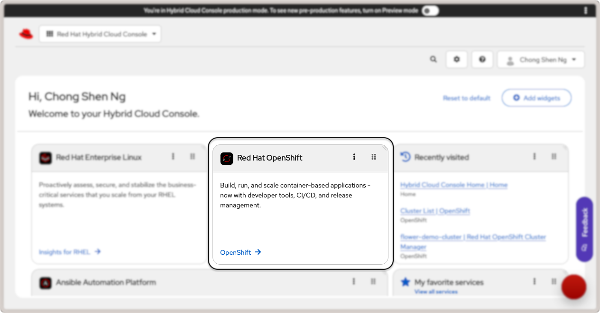
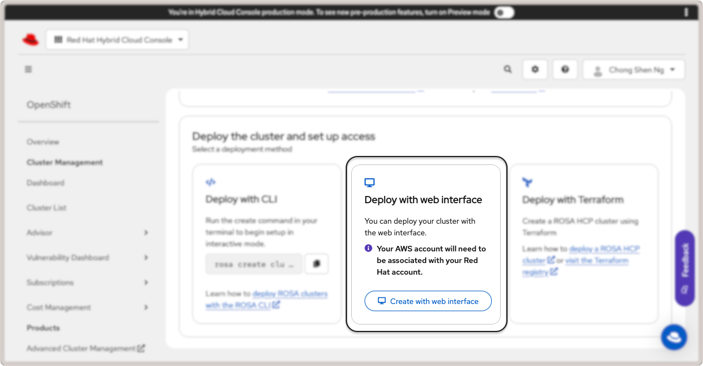
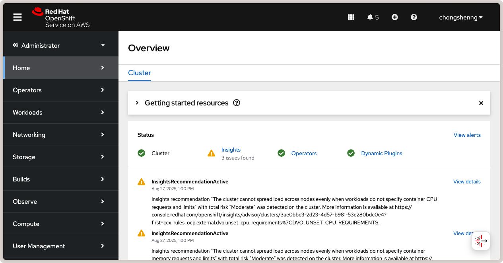

:og:description: A step-by-step guide to learn how to create, deploy and run a Flower app on Red Hat OpenShift using the Red Hat OpenShift Service on AWS.
.. meta::
    :description: A step-by-step guide to learn how to create, deploy and run a Flower app on Red Hat OpenShift using the Red Hat OpenShift Service on AWS.

#################################
 Run Flower on Red Hat OpenShift
#################################

In this guide, you will learn how to create, deploy, and run a Flower app on the `Red
Hat OpenShift (RHOS)
<https://www.redhat.com/en/technologies/cloud-computing/openshift>`_ application
platform. The platform will be hosted in AWS and we will follow the steps to install the
cluster on installer-provisioned infrastructure using the `Red Hat OpenShift Service on
AWS <https://aws.amazon.com/rosa/>`_.

************************************
 Login to Red Hat OpenShift Console
************************************

Start by logging in to your `Red Hat Hybrid Cloud Console
<https://console.redhat.com/>`_ and click on ``OpenShift`` link in the ``Red Hat
OpenShift`` card.

    Red Hat OpenShift link in the cloud console.

This will take you to the OpenShift console. Under ``Overview``, look for the ``Red Hat
OpenShift Service on AWS (ROSA)`` card and click on ``Create Cluster``. You will be
taken to the page to setup a Red Hat OpenShift service on AWS. There are two
pre-requisites that you have to fulfill before you can create a cluster:

1. AWS Pre-requisites - Sets up your AWS account for deploying ROSA.
2. ROSA Pre-requisites - Installs the ROSA CLI tool on your system and login to your Red
   Hat account.

Complete AWS Pre-requisites
===========================

Follow the steps required to fulfill the pre-requisites for AWS to create and manage a
Red Hat OpenShift cluster:

1. Enable RHOS service on AWS (ROSA) in your AWS account.
2. Ensure that you have sufficient service quotas for ROSA.
3. Create a service-linked role for Elastic Load Balancing. This should be automatically
   created for you if not present.
4. Link your AWS and Red Hat account.
5. Create AWS Identity and Access Management (IAM) roles. You will need to create an IAM
   user with these required permissions:

   - ``AmazonEC2FullAccess``
   - ``AWSCloudFormationFullAccess``
   - ``IAMFullAccess``
   - ``ServiceQuotasReadOnlyAccess``

For more details, refer to the RHOS getting started guide from your AWS console.

Complete ROSA Pre-requisites
============================

Follow the steps shown in the section to download and install the ROSA CLI tool.

Next, install the |aws_cli_link|_ CLI tool for your system. You can alternatively run it
with Docker using the command:

.. code-block:: shell

    docker run --rm -it --volume ~/.aws:/root/.aws public.ecr.aws/aws-cli/aws-cli

The ``--volume ~/.aws:/root/.aws`` option mounts your AWS credentials to the Docker
container. Next, run the following to configure the AWS CLI tool and provide your AWS
credentials for the IAM user you created earlier:

.. code-block:: shell

    ➜ aws configure
    AWS Access Key ID [None]: [...]
    AWS Secret Access Key [None]: [...]
    Default region name [None]: [...]  # your region
    Default output format [None]: table  # the recommended output format

Download and install the ROSA CLI tool by following the instructions for your operating
system. Once you have installed the ROSA CLI tool, login with your Red Hat account:

.. code-block:: shell

    ➜ rosa login --use-auth-code
    I: You will now be redirected to Red Hat SSO login
    I: Token received successfully
    I: Logged in as '[...]' on 'https://api.openshift.com'
    I: To switch accounts, logout from https://sso.redhat.com and run `rosa logout` before attempting to login again

If you are already logged into your Red Hat account on your browser, you will be
redirected back to your terminal.

Then, create the necessary account-wide roles and policies:

.. code-block:: shell

    ➜ rosa create account-roles --mode auto

Finally, create a Virtual Private Network (VPC) for your cluster:

.. code-block:: shell

    ➜ rosa create network
    ...
    INFO[0177] Stack rosa-network-stack-[...] created

With the AWS and ROSA pre-requisites completed, you are now ready to deploy a cluster.

*******************************************
 Create a Red Hat OpenShift Cluster on AWS
*******************************************

There are three ways to create the cluster: via ``rosa`` CLI, web interface, or with
Terraform. For this guide, we will use the web interface. Click on the ``Create with web
interface`` button in the ``Deploy with web interface`` card:

    Deploy Red Hat OpenShift cluster with web interface.

You will be taken to a series of steps to create a ROSA cluster. In the following, some
key steps are highlighted and we recommend that you follow the official guide in the Red
Hat Cloud Console for more details.

1. **Define Control Plane** - Select the ROSA hosted architecture and click on ``Next``.
2. **Accounts and Roles** - Ensure the infrastructure and billing account details are
   correct and click ``Next``.
3. **Cluster settings**

   1. **Details** - Specify ``flower-demo-cluster`` as the ``Cluster name``. For this
      guide, select version ``4.18.22`` (you may select a newer version that suits your
      requirements). Select the AWS region appropriate for your AWS account.
   2. **Machine Pool** - Select an EC2 compute node instance type that is available in
      your region. In this guide, we use the ``eu-north-1`` region, and therefore
      selected ``m6i.2xlarge - 8 vCPU 32 GiB RAM``. Enable autoscaling and set the
      minimum node count to 2 and maximum to 4. This allows the cluster to scale up when
      you deploy the OpenShift platform and OpenShift AI in the same cluster.

4. **Networking**

   1. **Configuration** - Under "Cluster privacy", select ``public`` and leave other
      values as defaults.
   2. **CIDR ranges** - Leave the default CIDR ranges as is.

5. **Cluster roles and policies** - Follow the steps to create a new OIDC config ID.
6. **Cluster updates** - Leave the default settings as is to "Recurring updates".
7. Finally, review the cluster details and click ``Create cluster``.

This will start the cluster creation process and may take several minutes to complete.
You will be able to monitor the installation status of the control plane and machine
pools in the "Overview" tab.

Once your cluster is created, you will be prompted to create an identity provider to
access the cluster. Click on the ``Create identity provider`` link and follow the steps
for your preferred OIDC provider. Grant the user in your OIDC provider the
``cluster-admin`` rights so that you can add apps from the OperatorHub later. To do so,
go to ``Access control``, ``Cluster Roles and Access`` tab, and click on ``Add user``.
Enter the user ID from your OIDC provider and save the changes.

Your cluster is now ready. To view the cluster details, click on the ``Cluster List``
link in the left sidebar. Click on your cluster name (``flower-demo-cluster``) to view
the cluster details:

.. figure:: ./_static/rhos/rhos_cluster_details.png
    :align: center
    :width: 90%
    :alt: Red Hat OpenShift cluster details

    Red Hat OpenShift cluster details.

To access the OpenShift web console, click on the ``Open console`` link in the top
right. You will be redirected to your OIDC provider to login. Once logged in, you will
be taken to the OpenShift web console:

    Red Hat OpenShift web console.

Congratulations! You now have a running Red Hat OpenShift cluster on AWS. Now, let's
walk through how to deploy Flower on your OpenShift cluster.

*****************************************************
 Deploy Flower SuperLink and SuperNodes on OpenShift
*****************************************************

With the OpenShift cluster active, we can now deploy SuperLink and SuperNode pods and
run a federated workload. In this guide, we will deploy four pods: 1x SuperLink, 2x
SuperNodes, and 1x service pod to route the traffic to the designated ports in the
SuperLink.

First, we need to create an OpenShift project which is equivalent of a Kubernetes
namespace. We will then deploy the SuperLink and SuperNode pods in this project.
Navigate to ``Home`` > ``Projects`` and click on the ``Create Project`` button on the
right. Set ``flower-openshift-demo`` as the project name.

Next, we will add pods. Navigate to ``Workloads`` > ``Pods`` and click on the ``Create
Pod`` button on the right. There are several ways to create a pod, such as using YAML or
JSON definitions. For this guide, we will use the YAML definition. Copy and paste the
following YAML definition for the SuperLink pod. This manifest is adapted from our
tutorial on :doc:`how to deploy Flower in GCP <how-to-run-flower-on-gcp>`.

.. dropdown:: superlink-deployment.yaml

    .. code-block:: bash
        :substitutions:

        apiVersion: apps/v1
        kind: Deployment
        metadata:
          name: superlink
          namespace: flower-openshift-demo # The project name from above
        spec:
          replicas: 1
          selector:
            matchLabels:
              app: superlink
          template:
            metadata:
              labels:
                app: superlink
            spec:
              # Ensures mounted volumes are writable by the pod's non-root user on OpenShift
              securityContext:
                runAsNonRoot: true
              containers:
                - name: superlink
                  image: flwr/superlink:|stable_flwr_version|
                  args:
                    - "--insecure"
                  ports: # which ports to expose/available
                    - containerPort: 9092
                      name: fleet
                    - containerPort: 9093
                      name: control
                  volumeMounts:
                    - name: cache-volume
                      mountPath: /app/.cache
                    - name: tmp-volume
                      mountPath: /var/tmp
                    - name: fab-volume
                      mountPath: /app/.flwr
                    - name: config-volume
                      mountPath: /app/.config
              volumes:
                - name: cache-volume
                  emptyDir:
                    sizeLimit: 50Mi
                - name: tmp-volume
                  emptyDir:
                    sizeLimit: 50Mi
                - name: fab-volume
                  emptyDir:
                    sizeLimit: 50Mi
                - name: config-volume
                  emptyDir:
                    sizeLimit: 50Mi

After the SuperLink pod is created, add the service pod following the steps to create a
pod and insert the following YAML definition:

.. dropdown:: superlink-service.yaml

    .. code-block:: bash
        :substitutions:

        apiVersion: v1
        kind: Service
        metadata:
          name: superlink-service
          namespace: flower-openshift-demo
        spec:
          selector:
            app: superlink
          ports:  # like a dynamic IP routing table/mapping that routes traffic to the designated ports
          - protocol: TCP
            port: 9092   # Port for SuperNode connection
            targetPort: fleet  # the SuperLink container port
            name: superlink-fleetapi
          - protocol: TCP
            port: 9093   # Port for Flower app submission
            targetPort: control  # the SuperLink container port
            name: superlink-controlapi
          type: LoadBalancer  # balances workload, makes the service publicly available

Finally, spin up two SuperNode pods with the following YAML definitions:

.. dropdown:: supernode-1-deployment.yaml

    .. code-block:: bash
        :substitutions:

        apiVersion: apps/v1
        kind: Deployment
        metadata:
          name: supernode-1
          namespace: flower-openshift-demo # The project name from above
        spec:
          replicas: 1
          selector:
            matchLabels:
              app: supernode-1
          template:
            metadata:
              labels:
                app: supernode-1
            spec:
              # Ensures mounted volumes are writable by the pod's non-root user on OpenShift
              securityContext:
                runAsNonRoot: true
              containers:
              - name: supernode
                image: flwr/supernode:|stable_flwr_version|
                args:
                  - "--insecure"
                  - "--superlink"
                  - "superlink-service:9092"
                  - "--clientappio-api-address"
                  - "0.0.0.0:9094"
                ports:
                - containerPort: 9094
                volumeMounts:
                - name: cache-volume
                  mountPath: /app/.cache
                - name: tmp-volume
                  mountPath: /var/tmp
                - name: fab-volume
                  mountPath: /app/.flwr
                - name: config-volume
                  mountPath: /app/.config
              volumes:
              - name: cache-volume
                emptyDir:
                  sizeLimit: 50Mi
              - name: tmp-volume
                emptyDir:
                  sizeLimit: 50Mi
              - name: fab-volume
                emptyDir:
                  sizeLimit: 50Mi
              - name: config-volume
                emptyDir:
                  sizeLimit: 50Mi

.. dropdown:: supernode-2-deployment.yaml

    .. code-block:: bash
        :substitutions:

        apiVersion: apps/v1
        kind: Deployment
        metadata:
          name: supernode-2
          namespace: flower-openshift-demo # The project name from above
        spec:
          replicas: 1
          selector:
            matchLabels:
              app: supernode-2
          template:
            metadata:
              labels:
                app: supernode-2
            spec:
              # Ensures mounted volumes are writable by the pod's non-root user on OpenShift
              securityContext:
                runAsNonRoot: true
              containers:
              - name: supernode
                image: flwr/supernode:|stable_flwr_version|
                args:
                  - "--insecure"
                  - "--superlink"
                  - "superlink-service:9092"
                  - "--clientappio-api-address"
                  - "0.0.0.0:9094"
                ports:
                - containerPort: 9094
                volumeMounts:
                - name: cache-volume
                  mountPath: /app/.cache
                - name: tmp-volume
                  mountPath: /var/tmp
                - name: fab-volume
                  mountPath: /app/.flwr
                - name: config-volume
                  mountPath: /app/.config
              volumes:
              - name: cache-volume
                emptyDir:
                  sizeLimit: 50Mi
              - name: tmp-volume
                emptyDir:
                  sizeLimit: 50Mi
              - name: fab-volume
                emptyDir:
                  sizeLimit: 50Mi
              - name: config-volume
                emptyDir:
                  sizeLimit: 50Mi

To view the status of pods that were just deployed, click on the ``Workloads`` link in
the left panel. You should be able to see three Flower pods in the "Running" status as
shown in the screenshot below:

.. figure:: ./_static/rhos/rhos_flower_pods.png
    :align: center
    :width: 90%
    :alt: Flower SuperLink and SuperNode pods in Red Hat OpenShift

    Flower SuperLink and SuperNode pods in Red Hat OpenShift.

Click on the SuperLink pod to view the pod details and click on the ``Logs`` tab. You
should be able to view the SuperLink logs showing two connected SuperNodes.

.. tip::

    To shut down the pods, navigate to ``Workloads`` > ``Deployments``, select the
    deployed pods, and click on ``Edit Pod Count`` to set the replica count to 0. Now,
    you can delete the pods by selecting them and clicking on the ``Delete Deployment``
    button.

*****************************
 Deploy Red Hat OpenShift AI
*****************************

To interface with the deployed SuperLink and SuperNode in the OpenShift cluster, we want
to make use of OpenShift AI workbench. So, we need to enable this Operator in the
OpenShift cluster.

First, ensure that the Red Hat OpenShift AI is enabled via the Red Hat OpenShift
console. You may enable a free trial if you do not have a subscription. Navigate to
``Operators`` > ``OperatorHub`` and search for ``Red Hat OpenShift AI``. Click on the
``Red Hat OpenShift AI`` card and then click on the ``Install`` button. Alternatively,
install the OpenShift AI Operator via the OpenShift CLI tool following the official
instructions `here
<https://docs.redhat.com/en/documentation/red_hat_openshift_ai_self-managed/2.23/html/installing_and_uninstalling_openshift_ai_self-managed/installing-and-deploying-openshift-ai_install#installing-openshift-ai-operator-using-cli_operator-install>`_.
Once the installation is complete, you should see a green check mark under the
``Status`` column for the ``Red Hat OpenShift AI`` Operator in the ``Installed
Operators`` tab:

    Red Hat OpenShift AI Operator in OpenShift.

Install Data Science Cluster
============================

After installing the Operator, we need to install the ``DataScienceCluster`` using the
web console. Follow the official steps `in this link
<https://docs.redhat.com/en/documentation/red_hat_openshift_ai_self-managed/2.23/html/installing_and_uninstalling_openshift_ai_self-managed/installing-and-deploying-openshift-ai_install#installing-openshift-ai-components-using-web-console_component-install>`_.
It is also recommended to `disable KServe dependencies
<https://docs.redhat.com/en/documentation/red_hat_openshift_ai_self-managed/2.23/html/installing_and_uninstalling_openshift_ai_self-managed/installing-the-single-model-serving-platform_component-install#disabling-kserve-dependencies_component-install>`_
since we are not serving ML models for inference. In the ``Installed Operators`` tab,
click on ``Red Hat OpenShift AI``, navigate to the ``Data Science Cluster`` tab, and
click on ``Create DataScienceCluster``. Select the YAML view of the configuration and
paste the following YAML definition:

.. dropdown:: rhosai-datasciencecluster.yaml

    .. code-block:: bash
        :substitutions:

        apiVersion: datasciencecluster.opendatahub.io/v1
        kind: DataScienceCluster
        metadata:
          name: default-dsc
          labels:
            app.kubernetes.io/created-by: rhods-operator
            app.kubernetes.io/instance: default-dsc
            app.kubernetes.io/managed-by: kustomize
            app.kubernetes.io/name: datasciencecluster
            app.kubernetes.io/part-of: rhods-operator
        spec:
          components:
            codeflare:
              managementState: Removed
            kserve:
              managementState: Removed
            modelregistry:
              managementState: Removed
            feastoperator:
              managementState: Removed
            trustyai:
              managementState: Removed
            ray:
              managementState: Removed
            kueue:
              managementState: Removed
            workbenches:
              workbenchNamespace: rhods-notebooks
              managementState: Managed
            dashboard:
              managementState: Managed
            modelmeshserving:
              managementState: Removed
            llamastackoperator:
              managementState: Removed
            datasciencepipelines:
              managementState: Removed
            trainingoperator:
              managementState: Removed

Click on ``Create`` to create the Data Science Cluster. If successful, you should see a
``default-dsc`` instance in the ``Data Science Clusters`` tab with a green check mark:

    View of a successfully created Red Hat OpenShift AI Data Science Cluster.

Once the above is complete, you will be able to launch OpenShift AI by clicking on the
grid icon on the top right of the OpenShift console and clicking on the ``Red Hat
OpenShift AI`` link:

    Launch Red Hat OpenShift AI from OpenShift console.

Follow the instructions when prompted to ``Log in with OpenShift``. After logging in,
you will be taken to the OpenShift AI dashboard.

Create a Custom OpenShift AI Image with Flower
==============================================

In OpenShift AI, you will be building and running your Flower app in a workbench, which
is a Jupyter notebook environment. However, the default OpenShift AI workbench image
does not come with Flower installed. Therefore, we will first create a custom OpenShift
AI image with Flower pre-installed. This custom image will then be used to create a
workbench. The steps in this section are adapted from the official Red Hat OpenShift AI
guide for `creating a custom workbench image
<https://docs.redhat.com/en/documentation/red_hat_openshift_ai_self-managed/2.16/html/managing_openshift_ai/creating-custom-workbench-images#creating-a-custom-image-from-default-image_custom-images>`_.

**Pre-requisites**: Given that Red Hat OpenShift AI needs to be able to pull from a
container registry, you will need to create an account on ``quay.io`` if you do not have
one already. Then, create a new repository, e.g., ``flowerlabs/demo``, and make it
public. You will also need to install the `Docker CLI tool
<https://docs.docker.com/get-docker/>`_ on your system. Then, login to your ``quay.io``
account using the command:

.. code-block:: shell

    docker login quay.io

Now, we select a base image for our custom OpenShift AI image. In the Red Hat OpenShift
console, go to ``Builds`` > ``ImageStreams``. You can find the default workbench images
for the ``redhat-ods-applications`` project. Select the ``s2i-minimal-notebook`` and
choose the image tag that you want to use and copy the ``sha256`` identifier. In this
guide, we will use the ``2025.1`` tag.

Next, in your machine, create a Dockerfile with the following contents:

.. dropdown:: Dockerfile

    .. code-block:: bash
        :substitutions:

        FROM quay.io/modh/odh-workbench-jupyter-minimal-cpu-py311-ubi9@sha256:0ea737f6c626d5d01b44fc8c6537a193ad45c378aed9ff98b209968dff418075

        USER 1001

        RUN pip install flwr==|stable_flwr_version|

Build and push the container image to your public repository on ``quay.io``:

.. code-block:: shell

    docker build -t quay.io/flowerlabs/demo/flwr-rhos:0.0.1 . && docker push quay.io/flowerlabs/demo/flwr-rhos:0.0.1

Once the image is pushed, we will configure OpenShift AI to load this custom workbench
image. In the OpenShift AI dashboard, go to ``Settings`` > ``Workbench images`` and
click on ``Import new image``. Set the ``Image location`` to your custom image (e.g.,
``quay.io/flowerlabs/demo/flwr-rhos:0.0.1@sha256[...]``) and give it a name (e.g.,
``flwr-rhos-image``). Take note of the resource name as you will need it in the next
section when creating your workbench. Then, click on ``Import`` to import the image. If
successful, you should see your custom image in the list of workbench images:

    Custom OpenShift AI workbench image with Flower.

Create a Data Science Project
=============================

Now we are ready to create a Data Science project in OpenShift AI and create a workbench
using the custom image we just created from the previous section.

On the left sidebar, click on ``Home``, navigate to the ``Data Science Projects``
section, and click on the ``Create project`` button. Give your project a name, e.g.,
``flower-openshift-demo`` and - if you like, a description. Then, click ``Create``.
Click on your created project to open it.

    Data Science project in Red Hat OpenShift AI.

Navigate to the ``Workbenches`` tab and click on ``Create workbench`` to create a new
workbench. Under "Name and description", provide a name for your workbench, e.g.
``flwr-rhos-demo-workbench``. Under ``Workbench image`` > ``Image selection``, select
the name of the image that you provided earlier (i.e., ``flwr-rhos-image``). Choose a
medium container size and leave other settings as default. Finally, click on ``Create
Workbench``. The status of your workbench should switch to ``Running`` after a few
minutes:

    Running workbench in Red Hat OpenShift AI.

Now, click on your workbench and launch the JupyterLab environment.

************************************
 Run the Flower App in OpenShift AI
************************************

With a running workbench and deployed SuperLink and SuperNode pods in your OpenShift
cluster, you are now ready to run a Flower app! In the JupyterLab environment of your
workbench, let's verify Flower is installed correctly and working as expected: open a
new terminal and run ``flwr --version`` to check the Flower version:

    Verify Flower installation in OpenShift AI workbench.

With Flower running correctly, you can now follow the usual steps of using ``flwr new``
to create a new Flower app from a template, and ``flwr run`` to run your Flower app on
the deployed SuperLink and SuperNode pods. Given that we deployed the OpenShift AI
instance in the same namespace (``flower-openshift-demo``) as the SuperLink in the
OpenShift cluster, the only change you need to make is to define a new SuperLink
connection in the Flower Configuration file:

1. Run ``flwr config list`` to locate the Flower configuration file on your machine and
   view available SuperLink connections.

   .. code-block:: console
       :emphasize-lines: 3

         $ flwr config list

         Flower Config file: /path/to/.flwr/config.toml
         SuperLink connections:
           supergrid
           local (default)

2. Open the Flower Configuration file (``config.toml``) and add a new SuperLink
   connection at the end:

   .. code-block:: toml
       :caption: config.toml

       [superlink.remote]
       address = "superlink-service:9093"  # use the service name created earlier
       insecure = true

And finally, run your Flower app as usual with ``flwr run``:

    Running Flower app in OpenShift AI workbench.

You can also view the logs of the SuperLink pod in the OpenShift console. Navigate to
``Workloads`` > ``Pods``, click on the SuperLink pod, and then click on the ``Logs``:

    SuperLink logs showing connected SuperNodes and running Flower app.

Congratulations! You have successfully created, deployed, and run a Flower app on Red
Hat OpenShift using the Red Hat OpenShift Service on AWS. You can explore running
different Flower apps and federated workloads on your OpenShift cluster, for instance,
:doc:`with PyTorch <tutorial-quickstart-pytorch>`. For further reading about deploying
Flower with Docker and Kubernetes, check out our guides below:

- :doc:`How to run Flower with Docker <docker/index>`
- :doc:`How to run Flower with Helm <helm/index>`

To learn about running Flower on other cloud platforms, check out our guides below:

- :doc:`How to run Flower on Microsoft Azure <how-to-run-flower-on-azure>`
- :doc:`How to run Flower on Google Cloud Platform <how-to-run-flower-on-gcp>`

.. |aws_cli_link| replace:: ``aws``

.. _aws_cli_link: https://aws.amazon.com/cli/
