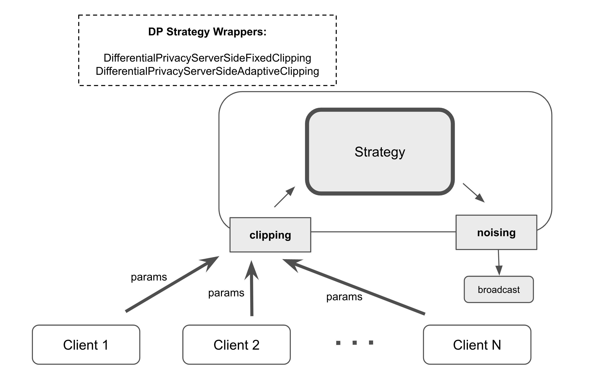
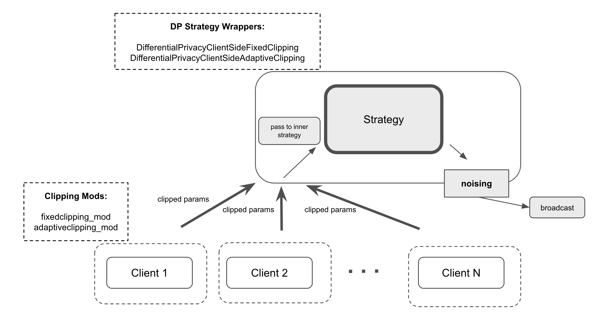
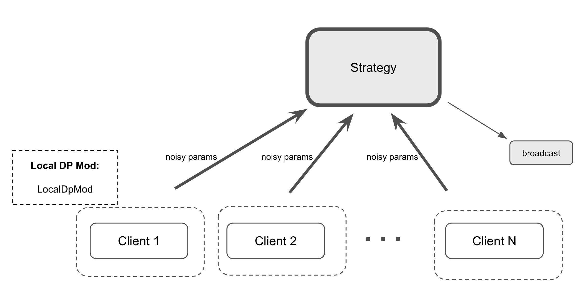

:og:description: Apply differential privacy in Flower with server-side/client-side clipping or local DP techniques to enhance data security in federated learning.
.. meta::
    :description: Apply differential privacy in Flower with server-side/client-side clipping or local DP techniques to enhance data security in federated learning.

.. |fedavg_link| replace:: ``FedAvg``

.. _fedavg_link: ref-api/flwr.serverapp.strategy.FedAvg.html

.. |dpserverfix_link| replace:: ``DifferentialPrivacyServerSideFixedClipping``

.. _dpserverfix_link: ref-api/flwr.serverapp.strategy.DifferentialPrivacyServerSideFixedClipping.html

.. |dpserveradapt_link| replace:: ``DifferentialPrivacyServerSideAdaptiveClipping``

.. _dpserveradapt_link: ref-api/flwr.serverapp.strategy.DifferentialPrivacyServerSideAdaptiveClipping.html

.. |dpclientfix_link| replace:: ``DifferentialPrivacyClientSideFixedClipping``

.. _dpclientfix_link: ref-api/flwr.serverapp.strategy.DifferentialPrivacyClientSideFixedClipping.html

.. |dpclientadapt_link| replace:: ``DifferentialPrivacyClientSideAdaptiveClipping``

.. _dpclientadapt_link: ref-api/flwr.serverapp.strategy.DifferentialPrivacyClientSideAdaptiveClipping.html

.. |fixedclipping_mod_link| replace:: ``fixedclipping_mod``

.. _fixedclipping_mod_link: ref-api/flwr.clientapp.mod.fixedclipping_mod.html

.. |adaptiveclipping_mod_link| replace:: ``adaptiveclipping_mod``

.. _adaptiveclipping_mod_link: ref-api/flwr.clientapp.mod.adaptiveclipping_mod.html

.. |localdp_mod_link| replace:: ``LocalDpMod``

.. _localdp_mod_link: ref-api/flwr.clientapp.mod.localdp_mod.html

##########################
 Use Differential Privacy
##########################

This guide explains how you can utilize differential privacy in the Flower framework. If
you are not yet familiar with differential privacy, you can refer to
:doc:`explanation-differential-privacy`.

.. warning::

    Differential Privacy in Flower is in a preview phase. If you plan to use these
    features in a production environment with sensitive data, feel free contact us to
    discuss your requirements and to receive guidance on how to best use these features.

******************************
 Central Differential Privacy
******************************

This approach consists of two separate phases: clipping of the updates and adding noise
to the aggregated model. For the clipping phase, Flower framework has made it possible
to decide whether to perform clipping on the server side or the client side.

- **Server-side Clipping**: This approach has the advantage of the server enforcing
  uniform clipping across all clients' updates and reducing the communication overhead
  for clipping values. However, it also has the disadvantage of increasing the
  computational load on the server due to the need to perform the clipping operation for
  all clients.
- **Client-side Clipping**: This approach has the advantage of reducing the
  computational overhead on the server. However, it also has the disadvantage of lacking
  centralized control, as the server has less control over the clipping process.

Server-side Clipping
====================

For central DP with server-side clipping, there are two ``Strategy`` classes that act as
wrappers around the actual ``Strategy`` instance (for example, |fedavg_link|_). The two
wrapper classes are |dpserverfix_link|_ and |dpserveradapt_link|_ for fixed and adaptive
clipping.

The code sample below enables the ``FedAvg`` strategy to use server-side fixed clipping
using the ``DifferentialPrivacyServerSideFixedClipping`` wrapper class. The same
approach can be used with ``DifferentialPrivacyServerSideAdaptiveClipping`` by adjusting
the corresponding input parameters.

.. code-block:: python

    from flwr.serverapp.strategy import DifferentialPrivacyClientSideFixedClipping, FedAvg

    # Create the strategy
    strategy = FedAvg(...)

    # Wrap the strategy with the DifferentialPrivacyServerSideFixedClipping wrapper
    dp_strategy = DifferentialPrivacyServerSideFixedClipping(
        strategy,
        cfg.noise_multiplier,
        cfg.clipping_norm,
        cfg.num_sampled_clients,
    )

Client-side Clipping
====================

For central DP with client-side clipping, the server sends the clipping value to
selected clients on each round. Clients can use existing Flower ``Mods`` to perform the
clipping. Two mods are available for fixed and adaptive client-side clipping:
|fixedclipping_mod_link|_ and |adaptiveclipping_mod_link|_ with corresponding
server-side wrappers |dpclientfix_link|_ and |dpclientadapt_link|_.

The code sample below enables the ``FedAvg`` strategy to use differential privacy with
client-side fixed clipping using both the ``DifferentialPrivacyClientSideFixedClipping``
wrapper class and, on the client, ``fixedclipping_mod``:

.. code-block:: python

    from flwr.serverapp.strategy import DifferentialPrivacyClientSideFixedClipping, FedAvg

    # Create the strategy
    strategy = FedAvg(...)

    # Wrap the strategy with the DifferentialPrivacyClientSideFixedClipping wrapper
    dp_strategy = DifferentialPrivacyClientSideFixedClipping(
        strategy,
        cfg.noise_multiplier,
        cfg.clipping_norm,
        cfg.num_sampled_clients,
    )

In addition to the server-side strategy wrapper, the ``ClientApp`` needs to configure
the matching ``fixedclipping_mod`` to perform the client-side clipping:

.. code-block:: python

    from flwr.clientapp import ClientApp
    from flwr.clientapp.mod import fixedclipping_mod

    # Add fixedclipping_mod to the client-side mods
    app = ClientApp(mods=[fixedclipping_mod])

****************************
 Local Differential Privacy
****************************

To utilize local differential privacy (DP) and add noise to the client model parameters
before transmitting them to the server in Flower, you can use the |localdp_mod_link|_.
The following hyperparameters need to be set: clipping norm value, sensitivity, epsilon,
and delta.

Below is a code example that shows how to use ``LocalDpMod``:

.. note::

    Apply the mod only to the functions that require it. For example, to use local DP
    during training, add the mod to the training function with
    ``@app.train(mods=[your_mod])``. Avoid adding it directly to ``ClientApp`` with
    ``ClientApp(mods=[your_mod])``, as this applies the mod to all functions (including
    evaluation), which is generally unnecessary and error-prone.

.. code-block:: python
    :emphasize-lines: 8,12

    from flwr.clientapp import ClientApp
    from flwr.clientapp.mod import LocalDpMod

    # Initialize the client app
    app = ClientApp()

    # Create an instance of the mod with the required params
    local_dp_obj = LocalDpMod(cfg.clipping_norm, cfg.sensitivity, cfg.epsilon, cfg.delta)

    # Add the mod to your training function
    @app.train(mods=[local_dp_obj])
    def train(message, context):
        # Client-side training logic
        ...

Please note that the order of mods, especially those that modify parameters, is
important when using multiple modifiers. Typically, differential privacy (DP) modifiers
should be the last to operate on parameters.

Local Training using Privacy Engines
====================================

For ensuring data instance-level privacy during local model training on the client side,
consider leveraging privacy engines such as Opacus. For examples
of using Flower with these engines, please refer to the Flower examples directory
(`Opacus <https://github.com/adap/flower/tree/main/examples/opacus>`_).
