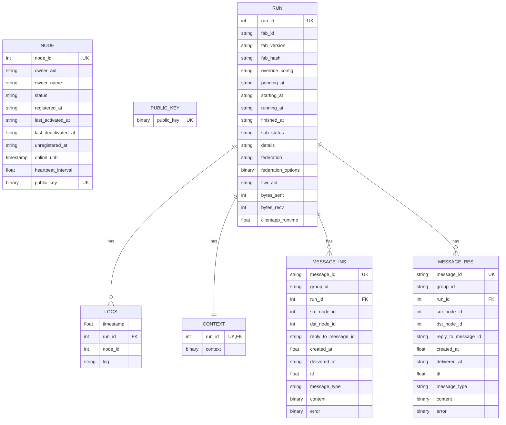

# LinkState SQL Entity Relationship Diagram

This diagram shows the entity relationship diagram for the LinkState SQL schema. It should be updated whenever the schema changes.

```mermaid
erDiagram
    NODE {
        int node_id UK
        string owner_aid
        string owner_name
        string status
        string registered_at
        string last_activated_at
        string last_deactivated_at
        string unregistered_at
        timestamp online_until
        float heartbeat_interval
        binary public_key UK
    }

    PUBLIC_KEY {
        binary public_key UK
    }

    RUN {
        int run_id UK
        string fab_id
        string fab_version
        string fab_hash
        string override_config
        string pending_at
        string starting_at
        string running_at
        string finished_at
        string sub_status
        string details
        string federation
        binary federation_options
        string flwr_aid
        int bytes_sent
        int bytes_recv
        float clientapp_runtime
    }

    LOGS {
        float timestamp
        int run_id FK
        int node_id
        string log
    }

    CONTEXT {
        int run_id UK, FK
        binary context
    }

    MESSAGE_INS {
        string message_id UK
        string group_id
        int run_id FK
        int src_node_id
        int dst_node_id
        string reply_to_message_id
        float created_at
        string delivered_at
        float ttl
        string message_type
        binary content
        binary error
    }

    MESSAGE_RES {
        string message_id UK
        string group_id
        int run_id FK
        int src_node_id
        int dst_node_id
        string reply_to_message_id
        float created_at
        string delivered_at
        float ttl
        string message_type
        binary content
        binary error
    }

    RUN ||--o{ LOGS : has
    RUN ||--|| CONTEXT : has
    RUN ||--o{ MESSAGE_INS : has
    RUN ||--o{ MESSAGE_RES : has
```
