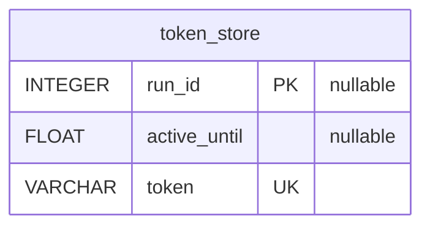

# State Entity Relationship Diagram

## Schema

```mermaid

---
    config:
        layout: elk
---
erDiagram
  token_store {
    INTEGER run_id PK "nullable"
    FLOAT active_until "nullable"
    VARCHAR token UK
  }


```
